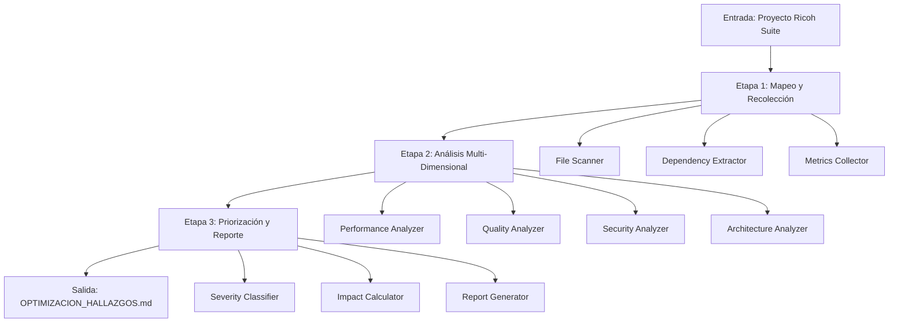

# Design Document: Análisis y Optimización de Código

## Overview

Este documento describe el diseño técnico de un sistema de auditoría automatizada para el proyecto Ricoh Suite. El sistema analizará el código existente (Backend FastAPI + Python, Frontend React + TypeScript) para identificar oportunidades de mejora en rendimiento, mantenibilidad, seguridad y calidad del código.

El auditor es un sistema de análisis estático que no modifica código fuente. Su objetivo es generar un reporte priorizado de hallazgos (`docs/OPTIMIZACION_HALLAZGOS.md`) que permita al equipo de desarrollo planificar mejoras de manera efectiva.

**Principios de diseño:**
- Análisis estático sin ejecución de código
- No modificación de archivos fuente
- Priorización basada en impacto vs esfuerzo
- Reporte accionable con ubicaciones exactas
- Métricas cuantitativas para establecer línea base

## Architecture

El sistema de auditoría sigue una arquitectura de pipeline con tres etapas principales:



**Etapa 1: Mapeo y Recolección**
- Escanea estructura de directorios
- Identifica archivos Python (.py) y TypeScript (.ts, .tsx)
- Extrae dependencias de requirements.txt y package.json
- Recolecta métricas básicas (LOC, número de archivos)

**Etapa 2: Análisis Multi-Dimensional**
- Análisis de Performance (Backend y Frontend)
- Análisis de Calidad de Código
- Análisis de Seguridad
- Análisis de Arquitectura
- Análisis de Dependencias

**Etapa 3: Priorización y Reporte**
- Clasifica hallazgos por severidad (Crítico, Alto, Medio, Bajo)
- Calcula matriz impacto/esfuerzo
- Genera Top 10 de mejoras prioritarias
- Crea plan de refactor de 4 semanas
- Genera reporte markdown estructurado

## Components and Interfaces

### 1. File Scanner

**Responsabilidad:** Mapear la estructura del proyecto e identificar archivos a analizar.

```python
class FileScanner:
    def scan_project(self, root_path: str) -> ProjectStructure:
        """Escanea el proyecto y retorna estructura completa"""
        pass
    
    def find_python_files(self, backend_path: str) -> List[FilePath]:
        """Identifica todos los archivos .py en backend"""
        pass
    
    def find_typescript_files(self, frontend_path: str) -> List[FilePath]:
        """Identifica todos los archivos .ts y .tsx en frontend"""
        pass
    
    def classify_file_size(self, file_path: str) -> FileSize:
        """Clasifica archivo como grande (>300 líneas) o normal"""
        pass
```

### 2. Dependency Extractor

**Responsabilidad:** Extraer y analizar dependencias del proyecto.

```python
class DependencyExtractor:
    def extract_python_deps(self, requirements_path: str) -> List[Dependency]:
        """Extrae dependencias de requirements.txt"""
        pass
    
    def extract_npm_deps(self, package_json_path: str) -> List[Dependency]:
        """Extrae dependencias de package.json"""
        pass
    
    def check_vulnerabilities(self, dependency: Dependency) -> List[Vulnerability]:
        """Verifica vulnerabilidades conocidas (CVE) para una dependencia"""
        pass
```

### 3. Performance Analyzer

**Responsabilidad:** Identificar problemas de rendimiento en Backend y Frontend.

```python
class PerformanceAnalyzer:
    def detect_n_plus_one(self, file_content: str) -> List[Finding]:
        """Detecta patrones N+1 en queries de base de datos"""
        pass
    
    def check_pagination(self, endpoint_code: str) -> Optional[Finding]:
        """Verifica si endpoints que retornan colecciones tienen paginación"""
        pass
    
    def detect_blocking_operations(self, async_route: str) -> List[Finding]:
        """Identifica operaciones bloqueantes en rutas async"""
        pass
    
    def detect_unnecessary_rerenders(self, component_code: str) -> List[Finding]:
        """Identifica componentes React sin memoización apropiada"""
        pass
    
    def check_useeffect_deps(self, component_code: str) -> List[Finding]:
        """Verifica arrays de dependencias en useEffect hooks"""
        pass
```

### 4. Quality Analyzer

**Responsabilidad:** Identificar problemas de mantenibilidad y calidad del código.

```python
class QualityAnalyzer:
    def detect_long_functions(self, file_content: str, language: str) -> List[Finding]:
        """Identifica funciones que exceden límites de líneas"""
        pass
    
    def detect_deep_nesting(self, file_content: str) -> List[Finding]:
        """Identifica bloques con más de 3 niveles de indentación"""
        pass
    
    def detect_code_duplication(self, files: List[FileContent]) -> List[Finding]:
        """Detecta código duplicado con similitud >80%"""
        pass
    
    def check_type_hints(self, python_code: str) -> List[Finding]:
        """Verifica presencia de type hints en funciones Python"""
        pass
    
    def detect_type_any(self, typescript_code: str) -> List[Finding]:
        """Identifica usos de 'any' en TypeScript"""
        pass
    
    def detect_props_drilling(self, component_tree: ComponentTree) -> List[Finding]:
        """Identifica props drilling con >2 niveles de profundidad"""
        pass
```

### 5. Security Analyzer

**Responsabilidad:** Identificar vulnerabilidades y riesgos de seguridad.

```python
class SecurityAnalyzer:
    def detect_hardcoded_secrets(self, file_content: str) -> List[Finding]:
        """Detecta credenciales hardcodeadas en código"""
        pass
    
    def check_sql_injection(self, query_code: str) -> Optional[Finding]:
        """Verifica construcción de queries vulnerables a SQL injection"""
        pass
    
    def check_input_validation(self, endpoint_code: str) -> Optional[Finding]:
        """Verifica que endpoints usen schemas Pydantic para validación"""
        pass
    
    def check_authentication(self, endpoint_code: str) -> Optional[Finding]:
        """Verifica implementación de autenticación en endpoints protegidos"""
        pass
```

### 6. Architecture Analyzer

**Responsabilidad:** Evaluar separación de responsabilidades y organización del código.

```python
class ArchitectureAnalyzer:
    def check_layer_separation(self, backend_structure: ProjectStructure) -> List[Finding]:
        """Verifica separación entre capas API, servicios y repositorio"""
        pass
    
    def detect_business_logic_in_api(self, endpoint_code: str) -> Optional[Finding]:
        """Identifica lógica de negocio implementada directamente en endpoints"""
        pass
    
    def check_component_separation(self, component_code: str) -> Optional[Finding]:
        """Verifica separación entre UI y lógica de negocio en componentes"""
        pass
    
    def detect_api_calls_in_components(self, component_code: str) -> List[Finding]:
        """Identifica llamadas API dispersas en lugar de centralizadas"""
        pass
```

### 7. Severity Classifier

**Responsabilidad:** Clasificar hallazgos por severidad según reglas definidas.

```python
class SeverityClassifier:
    def classify(self, finding: Finding) -> Severity:
        """Clasifica un hallazgo en Crítico, Alto, Medio o Bajo"""
        pass
    
    def apply_rules(self, finding: Finding) -> Severity:
        """Aplica reglas específicas de severidad según tipo de hallazgo"""
        pass
```

**Reglas de clasificación:**
- Crítico: Secrets hardcodeados, funciones >100 líneas, vulnerabilidades CVSS ≥9.0
- Alto: Queries N+1 sin paginación >100 registros, archivos sin tests críticos, endpoints sin manejo de excepciones DB, vulnerabilidades CVSS 7.0-8.9
- Medio: Type 'any' en TypeScript, funciones sin type hints, componentes >200 líneas
- Bajo: TODOs/FIXMEs, console.log en producción, comentarios faltantes

### 8. Impact Calculator

**Responsabilidad:** Calcular impacto y esfuerzo para priorización.

```python
class ImpactCalculator:
    def calculate_impact_score(self, finding: Finding) -> float:
        """Calcula score de impacto basado en severidad y alcance"""
        pass
    
    def calculate_effort_score(self, finding: Finding) -> float:
        """Calcula score de esfuerzo basado en complejidad"""
        pass
    
    def calculate_priority_matrix(self, findings: List[Finding]) -> PriorityMatrix:
        """Genera matriz impacto/esfuerzo para todos los hallazgos"""
        pass
    
    def select_top_10(self, findings: List[Finding]) -> List[Finding]:
        """Selecciona los 10 hallazgos con mayor ratio impacto/esfuerzo"""
        pass
```

**Fórmula de impacto:**
```
impact_score = (severity_weight * 10) + (affected_files_count * 2) + (frequency * 5)

severity_weight:
  - Crítico: 4
  - Alto: 3
  - Medio: 2
  - Bajo: 1
```

**Fórmula de esfuerzo:**
```
effort_score = complexity_factor + (files_to_modify * 2) + (dependencies_count * 3)

complexity_factor:
  - Simple (cambio localizado): 1
  - Moderado (múltiples archivos): 3
  - Complejo (refactor arquitectónico): 5
```

### 9. Report Generator

**Responsabilidad:** Generar el reporte markdown estructurado.

```python
class ReportGenerator:
    def generate_report(self, analysis_result: AnalysisResult) -> str:
        """Genera el reporte completo en formato markdown"""
        pass
    
    def generate_executive_summary(self, findings: List[Finding]) -> str:
        """Genera resumen ejecutivo con tabla de severidades"""
        pass
    
    def generate_top_10(self, top_findings: List[Finding]) -> str:
        """Genera sección Top 10 con mejoras de mayor impacto"""
        pass
    
    def generate_refactor_plan(self, findings: List[Finding]) -> str:
        """Genera plan de refactor de 4 semanas"""
        pass
    
    def generate_metrics_section(self, metrics: CodeMetrics) -> str:
        """Genera sección de métricas cuantitativas"""
        pass
```

### 10. Orchestrator

**Responsabilidad:** Coordinar el flujo completo de auditoría.

```python
class AuditOrchestrator:
    def __init__(self):
        self.file_scanner = FileScanner()
        self.dependency_extractor = DependencyExtractor()
        self.performance_analyzer = PerformanceAnalyzer()
        self.quality_analyzer = QualityAnalyzer()
        self.security_analyzer = SecurityAnalyzer()
        self.architecture_analyzer = ArchitectureAnalyzer()
        self.severity_classifier = SeverityClassifier()
        self.impact_calculator = ImpactCalculator()
        self.report_generator = ReportGenerator()
    
    def run_audit(self, project_path: str) -> Report:
        """Ejecuta auditoría completa y genera reporte"""
        # 1. Mapeo
        structure = self.file_scanner.scan_project(project_path)
        dependencies = self.dependency_extractor.extract_all(structure)
        
        # 2. Análisis
        findings = []
        findings.extend(self.performance_analyzer.analyze(structure))
        findings.extend(self.quality_analyzer.analyze(structure))
        findings.extend(self.security_analyzer.analyze(structure))
        findings.extend(self.architecture_analyzer.analyze(structure))
        
        # 3. Clasificación y priorización
        for finding in findings:
            finding.severity = self.severity_classifier.classify(finding)
        
        priority_matrix = self.impact_calculator.calculate_priority_matrix(findings)
        top_10 = self.impact_calculator.select_top_10(findings)
        
        # 4. Generación de reporte
        report = self.report_generator.generate_report(
            AnalysisResult(
                structure=structure,
                findings=findings,
                top_10=top_10,
                priority_matrix=priority_matrix,
                dependencies=dependencies
            )
        )
        
        return report
```

## Data Models

### ProjectStructure

Representa la estructura completa del proyecto escaneado.

```python
@dataclass
class ProjectStructure:
    """Estructura del proyecto Ricoh Suite"""
    root_path: str
    backend_files: List[PythonFile]
    frontend_files: List[TypeScriptFile]
    backend_dependencies: List[Dependency]
    frontend_dependencies: List[Dependency]
    metrics: CodeMetrics
    
    def get_all_files(self) -> List[SourceFile]:
        """Retorna todos los archivos de código"""
        return self.backend_files + self.frontend_files
```

### SourceFile

Representa un archivo de código fuente con sus métricas.

```python
@dataclass
class SourceFile:
    """Archivo de código fuente"""
    path: str
    language: str  # 'python' | 'typescript'
    lines_of_code: int
    is_large: bool  # True si >300 líneas
    content: str
    ast_tree: Optional[Any]  # AST parseado
    
    def get_functions(self) -> List[Function]:
        """Extrae todas las funciones del archivo"""
        pass
    
    def get_classes(self) -> List[Class]:
        """Extrae todas las clases del archivo"""
        pass

@dataclass
class PythonFile(SourceFile):
    """Archivo Python específico"""
    has_type_hints: bool
    has_docstrings: bool
    imports: List[str]

@dataclass
class TypeScriptFile(SourceFile):
    """Archivo TypeScript específico"""
    is_component: bool  # True si es componente React
    has_tests: bool
    exports: List[str]
```

### Finding

Representa un hallazgo de auditoría.

```python
@dataclass
class Finding:
    """Hallazgo de auditoría"""
    id: str
    category: str  # 'performance' | 'quality' | 'security' | 'architecture'
    subcategory: str  # 'n_plus_one' | 'long_function' | 'hardcoded_secret' | etc.
    severity: Severity
    title: str
    description: str
    file_path: str
    line_number: Optional[int]
    code_snippet: Optional[str]
    recommendation: str
    impact_score: float
    effort_score: float
    priority_ratio: float  # impact_score / effort_score
    
    def to_markdown(self) -> str:
        """Convierte el hallazgo a formato markdown"""
        pass
```

### Severity

Enumeración de niveles de severidad.

```python
class Severity(Enum):
    """Niveles de severidad de hallazgos"""
    CRITICO = "Crítico"
    ALTO = "Alto"
    MEDIO = "Medio"
    BAJO = "Bajo"
    
    def get_emoji(self) -> str:
        """Retorna emoji para representación visual"""
        return {
            Severity.CRITICO: "🔴",
            Severity.ALTO: "🟠",
            Severity.MEDIO: "🟡",
            Severity.BAJO: "🟢"
        }[self]
    
    def get_weight(self) -> int:
        """Retorna peso numérico para cálculos"""
        return {
            Severity.CRITICO: 4,
            Severity.ALTO: 3,
            Severity.MEDIO: 2,
            Severity.BAJO: 1
        }[self]
```

### Dependency

Representa una dependencia del proyecto.

```python
@dataclass
class Dependency:
    """Dependencia de software"""
    name: str
    current_version: str
    latest_version: str
    is_outdated: bool
    vulnerabilities: List[Vulnerability]
    ecosystem: str  # 'python' | 'npm'
    
    def has_critical_vulnerability(self) -> bool:
        """Verifica si tiene vulnerabilidad crítica (CVSS ≥9.0)"""
        return any(v.cvss_score >= 9.0 for v in self.vulnerabilities)

@dataclass
class Vulnerability:
    """Vulnerabilidad de seguridad"""
    cve_id: str
    cvss_score: float
    description: str
    fixed_in_version: Optional[str]
```

### CodeMetrics

Métricas cuantitativas del código.

```python
@dataclass
class CodeMetrics:
    """Métricas del código"""
    # Backend
    backend_total_lines: int
    backend_total_files: int
    backend_large_files: int
    backend_long_functions: int
    backend_dependencies_count: int
    
    # Frontend
    frontend_total_lines: int
    frontend_total_files: int
    frontend_large_components: int
    frontend_dependencies_count: int
    
    # General
    total_outdated_dependencies: int
    total_vulnerabilities: int
    
    def to_table(self) -> str:
        """Convierte métricas a tabla markdown"""
        pass
```

### PriorityMatrix

Matriz de priorización impacto vs esfuerzo.

```python
@dataclass
class PriorityMatrix:
    """Matriz de priorización"""
    high_impact_low_effort: List[Finding]  # Quick wins
    high_impact_high_effort: List[Finding]  # Major projects
    low_impact_low_effort: List[Finding]   # Fill-ins
    low_impact_high_effort: List[Finding]  # Avoid
    
    def to_markdown(self) -> str:
        """Genera representación markdown de la matriz"""
        pass
```

### RefactorPlan

Plan de refactor distribuido en 4 semanas.

```python
@dataclass
class RefactorPlan:
    """Plan de refactor temporal"""
    week_1: List[Finding]  # Crítico
    week_2: List[Finding]  # Alto + Medio
    week_3: List[Finding]  # Medio + Bajo
    week_4: List[Finding]  # Bajo
    
    def calculate_weekly_effort(self, week: int) -> float:
        """Calcula horas de esfuerzo estimadas para una semana"""
        pass
    
    def balance_workload(self) -> None:
        """Balancea carga entre Backend y Frontend por semana"""
        pass
    
    def to_markdown(self) -> str:
        """Genera plan en formato markdown"""
        pass
```

### AnalysisResult

Resultado completo del análisis.

```python
@dataclass
class AnalysisResult:
    """Resultado completo de la auditoría"""
    structure: ProjectStructure
    findings: List[Finding]
    top_10: List[Finding]
    priority_matrix: PriorityMatrix
    dependencies: List[Dependency]
    metrics: CodeMetrics
    refactor_plan: RefactorPlan
    generated_at: datetime
    
    def get_findings_by_severity(self, severity: Severity) -> List[Finding]:
        """Filtra hallazgos por severidad"""
        pass
    
    def get_findings_by_category(self, category: str) -> List[Finding]:
        """Filtra hallazgos por categoría"""
        pass
```


## Correctness Properties

*A property is a characteristic or behavior that should hold true across all valid executions of a system-essentially, a formal statement about what the system should do. Properties serve as the bridge between human-readable specifications and machine-verifiable correctness guarantees.*

### Acceptance Criteria Testing Prework

Antes de definir las propiedades, analizo cada criterio de aceptación para determinar su testabilidad:

**Requirement 1: Mapeo de Estructura del Proyecto**

1.1 THE Auditor SHALL identificar todos los archivos Python en el directorio backend
  Thoughts: Este es un requisito sobre el comportamiento del escáner de archivos. Podemos generar estructuras de directorios aleatorias con archivos Python y verificar que todos sean identificados.
  Testable: yes - property

1.2 THE Auditor SHALL identificar todos los archivos TypeScript y TSX en el directorio frontend
  Thoughts: Similar al anterior, podemos generar estructuras con archivos TS/TSX y verificar identificación completa.
  Testable: yes - property

1.3 THE Auditor SHALL clasificar archivos como Archivo_Grande cuando excedan 300 líneas
  Thoughts: Esta es una regla de clasificación que debe aplicarse a todos los archivos. Podemos generar archivos de diferentes tamaños y verificar la clasificación.
  Testable: yes - property

1.4-1.7 Extracción de dependencias y estructura
  Thoughts: Estos son requisitos de parsing y extracción de información. Son testables mediante round-trip o verificación de completitud.
  Testable: yes - property

**Requirement 2: Análisis de Performance del Backend**

2.1 THE Auditor SHALL identificar patrones Query_N_Plus_1
  Thoughts: Este es un detector de patrones. Podemos generar código con y sin el patrón N+1 y verificar detección correcta.
  Testable: yes - property

2.2-2.6 Verificaciones de performance
  Thoughts: Cada uno es un detector específico que debe funcionar para cualquier código de entrada.
  Testable: yes - property

2.7 WHEN un endpoint procesa más de 100 registros sin paginación, THE Auditor SHALL clasificarlo como severidad Alto
  Thoughts: Esta es una regla de clasificación específica. Es testable como ejemplo específico.
  Testable: yes - example

**Requirement 3: Análisis de Calidad del Código Backend**

3.1-3.7 Detectores de calidad
  Thoughts: Cada detector debe funcionar para cualquier código Python de entrada.
  Testable: yes - property

3.8 WHEN una función excede 100 líneas, THE Auditor SHALL clasificarla como severidad Crítico
  Thoughts: Regla de clasificación específica, testable como ejemplo.
  Testable: yes - example

**Requirement 4: Análisis de Seguridad del Backend**

4.1-4.7 Detectores de seguridad
  Thoughts: Cada detector debe funcionar para cualquier código de entrada.
  Testable: yes - property

4.8 WHEN se detecta un Secret_Hardcodeado, THE Auditor SHALL clasificarlo como severidad Crítico
  Thoughts: Regla de clasificación específica.
  Testable: yes - example

**Requirement 5-6: Análisis de Frontend**

5.1-6.8 Detectores de performance y calidad en Frontend
  Thoughts: Similar a backend, cada detector debe funcionar para cualquier código TypeScript/React.
  Testable: yes - property

**Requirement 7: Análisis de Experiencia de Usuario**

7.1-7.7 Verificaciones de UX
  Thoughts: Estos son detectores de patrones en componentes React. Son testables como propiedades.
  Testable: yes - property

**Requirement 8-9: Análisis de Arquitectura**

8.1-9.7 Verificaciones arquitectónicas
  Thoughts: Estos son detectores de patrones arquitectónicos. Son testables como propiedades.
  Testable: yes - property

**Requirement 10: Análisis del Contrato API**

10.1-10.7 Verificaciones de API
  Thoughts: Cada verificación debe funcionar para cualquier definición de API.
  Testable: yes - property

**Requirement 11: Generación del Reporte**

11.1-11.10 Estructura y contenido del reporte
  Thoughts: Estos son requisitos sobre el formato del reporte generado. Podemos verificar que el reporte contenga todas las secciones requeridas.
  Testable: yes - property

**Requirement 12: Métricas Cuantitativas**

12.1-12.8 Conteo de métricas
  Thoughts: Cada métrica debe calcularse correctamente para cualquier proyecto de entrada.
  Testable: yes - property

**Requirement 13: Restricción de No Modificación**

13.1-13.5 Verificaciones de no modificación
  Thoughts: Podemos verificar que los archivos fuente no cambien después de ejecutar la auditoría.
  Testable: yes - property

**Requirement 14: Análisis de Dependencias**

14.1-14.6 Análisis de dependencias
  Thoughts: Cada análisis debe funcionar para cualquier lista de dependencias.
  Testable: yes - property

14.7 WHEN una dependencia tiene vulnerabilidad crítica (CVSS >= 9.0), THE Auditor SHALL clasificarla como severidad Crítico
  Thoughts: Regla de clasificación específica.
  Testable: yes - example

**Requirement 15: Priorización de Mejoras**

15.1-15.7 Cálculos de priorización
  Thoughts: Los algoritmos de priorización deben funcionar para cualquier conjunto de hallazgos.
  Testable: yes - property

**Requirement 16: Plan de Refactor Temporal**

16.1-16.7 Distribución temporal
  Thoughts: El algoritmo de distribución debe funcionar para cualquier conjunto de hallazgos.
  Testable: yes - property

16.8 WHEN el esfuerzo semanal excede 40 horas, THE Auditor SHALL redistribuir tareas
  Thoughts: Esta es una regla de balanceo específica.
  Testable: yes - example

**Requirement 17: Análisis de Error Handling**

17.1-17.6 Detectores de error handling
  Thoughts: Cada detector debe funcionar para cualquier código de entrada.
  Testable: yes - property

17.7 WHEN un endpoint no maneja excepciones de base de datos, THE Auditor SHALL clasificarlo como severidad Alto
  Thoughts: Regla de clasificación específica.
  Testable: yes - example

**Requirement 18: Análisis de Testing**

18.1-18.6 Detectores de cobertura de tests
  Thoughts: Cada detector debe funcionar para cualquier estructura de proyecto.
  Testable: yes - property

18.7 WHEN un archivo crítico no tiene tests, THE Auditor SHALL clasificarlo como severidad Alto
  Thoughts: Regla de clasificación específica.
  Testable: yes - example

**Requirement 19: Formato del Reporte**

19.1-19.7 Formato markdown
  Thoughts: Podemos verificar que el reporte generado cumpla con el formato especificado.
  Testable: yes - property

**Requirement 20: Análisis de Configuración**

20.1-20.6 Análisis de variables de entorno
  Thoughts: Cada verificación debe funcionar para cualquier configuración.
  Testable: yes - property

20.7 WHEN una variable sensible no tiene valor por defecto seguro, THE Auditor SHALL clasificarlo como severidad Alto
  Thoughts: Regla de clasificación específica.
  Testable: yes - example

### Property Reflection

Revisando todas las propiedades identificadas, encuentro las siguientes redundancias:

1. **Detectores de archivos Python y TypeScript (1.1, 1.2)**: Pueden combinarse en una propiedad general sobre identificación completa de archivos por extensión.

2. **Múltiples detectores de patrones**: Muchos detectores (N+1, funciones largas, secrets, etc.) siguen el mismo patrón: "para cualquier código con/sin patrón X, el detector debe identificarlo correctamente". Estos pueden agruparse por categoría pero mantener propiedades separadas para cada tipo de patrón específico.

3. **Reglas de clasificación de severidad**: Todas las reglas "WHEN X THEN clasificar como severidad Y" son ejemplos específicos que validan el clasificador de severidad. Pueden agruparse en una propiedad general sobre clasificación correcta según reglas.

4. **Métricas de conteo (12.1-12.8)**: Todas siguen el patrón de contar elementos correctamente. Pueden combinarse en una propiedad sobre precisión de conteo de métricas.

5. **Verificaciones de formato de reporte (11.x, 19.x)**: Ambos requisitos hablan sobre el formato del reporte. Pueden combinarse en propiedades sobre completitud y formato correcto del reporte.

Después de la reflexión, mantendré propiedades separadas para cada tipo de detector específico (ya que cada uno tiene lógica diferente), pero combinaré:
- Identificación de archivos en una propiedad general
- Métricas de conteo en propiedades por categoría
- Formato de reporte en propiedades de estructura

### Correctness Properties

### Property 1: Identificación Completa de Archivos por Extensión

*For any* estructura de directorios con archivos de extensiones específicas (.py, .ts, .tsx), el FileScanner debe identificar todos los archivos de esas extensiones sin omitir ninguno ni incluir archivos de otras extensiones.

**Validates: Requirements 1.1, 1.2**

### Property 2: Clasificación Correcta de Tamaño de Archivo

*For any* archivo de código, si el archivo tiene más de 300 líneas entonces debe clasificarse como Archivo_Grande, y si tiene 300 o menos líneas no debe clasificarse como Archivo_Grande.

**Validates: Requirements 1.3**

### Property 3: Extracción Completa de Dependencias

*For any* archivo requirements.txt o package.json válido, el DependencyExtractor debe extraer todas las dependencias listadas con sus versiones correctas.

**Validates: Requirements 1.4, 1.5**

### Property 4: Detección de Patrones N+1

*For any* código Python que contenga un patrón N+1 (iteración sobre colección con query por elemento), el PerformanceAnalyzer debe detectarlo y generar un Finding correspondiente.

**Validates: Requirements 2.1**

### Property 5: Verificación de Paginación en Endpoints

*For any* endpoint que retorne una colección, el PerformanceAnalyzer debe verificar la presencia de paginación y generar un Finding si está ausente.

**Validates: Requirements 2.2**

### Property 6: Detección de Operaciones Bloqueantes en Rutas Async

*For any* ruta async de FastAPI que contenga operaciones bloqueantes síncronas, el PerformanceAnalyzer debe detectarlas y generar Findings correspondientes.

**Validates: Requirements 2.3**

### Property 7: Detección de Funciones Largas

*For any* función en código Python o TypeScript, si la función excede el límite de líneas configurado (50 para Python, 50 para funciones generales), el QualityAnalyzer debe detectarla y generar un Finding.

**Validates: Requirements 3.1**

### Property 8: Detección de Indentación Profunda

*For any* bloque de código con más de 3 niveles de indentación anidada, el QualityAnalyzer debe detectarlo y generar un Finding.

**Validates: Requirements 3.2**

### Property 9: Detección de Código Duplicado

*For any* par de bloques de código con similitud mayor al 80%, el QualityAnalyzer debe detectarlos y generar un Finding indicando la duplicación.

**Validates: Requirements 3.3**

### Property 10: Verificación de Type Hints en Python

*For any* función pública en código Python, si la función carece de type hints en parámetros o retorno, el QualityAnalyzer debe generar un Finding.

**Validates: Requirements 3.5**

### Property 11: Detección de Secrets Hardcodeados

*For any* código que contenga patrones de credenciales hardcodeadas (passwords, API keys, tokens), el SecurityAnalyzer debe detectarlos y generar Findings con severidad Crítico.

**Validates: Requirements 4.4, 4.8**

### Property 12: Detección de Vulnerabilidades SQL Injection

*For any* construcción de query SQL mediante concatenación de strings sin parametrización, el SecurityAnalyzer debe detectarla y generar un Finding.

**Validates: Requirements 4.3**

### Property 13: Verificación de Validación de Inputs

*For any* endpoint de FastAPI, si el endpoint no utiliza schemas Pydantic para validación de inputs, el SecurityAnalyzer debe generar un Finding.

**Validates: Requirements 4.2**

### Property 14: Detección de Re-renders Innecesarios

*For any* componente React que no utilice memoización (React.memo, useMemo, useCallback) donde sería beneficioso, el PerformanceAnalyzer debe detectarlo y generar un Finding.

**Validates: Requirements 5.1, 5.5**

### Property 15: Verificación de Dependencias de useEffect

*For any* hook useEffect en código React, si el array de dependencias está ausente o es incorrecto, el PerformanceAnalyzer debe generar un Finding.

**Validates: Requirements 5.2**

### Property 16: Detección de Type Any en TypeScript

*For any* uso del tipo 'any' en código TypeScript, el QualityAnalyzer debe detectarlo y generar un Finding con severidad Medio.

**Validates: Requirements 6.3, 6.8**

### Property 17: Detección de Props Drilling

*For any* árbol de componentes React donde props se pasan a través de más de 2 niveles de profundidad, el QualityAnalyzer debe detectarlo y generar un Finding.

**Validates: Requirements 6.2**

### Property 18: Detección de Console.log en Producción

*For any* código TypeScript/React que contenga console.log o console.error, el QualityAnalyzer debe detectarlo y generar un Finding.

**Validates: Requirements 6.6**

### Property 19: Verificación de Estados de Loading y Error

*For any* componente que realice llamadas asíncronas, el auditor debe verificar que maneje estados de loading y error apropiadamente.

**Validates: Requirements 7.1, 7.2, 7.5**

### Property 20: Verificación de Separación de Capas

*For any* archivo en la capa de API, si contiene lógica de negocio directamente implementada (en lugar de delegarla a servicios), el ArchitectureAnalyzer debe generar un Finding.

**Validates: Requirements 8.1, 8.2**

### Property 21: Detección de Llamadas API Dispersas

*For any* componente React que realice llamadas API directamente (en lugar de usar servicios centralizados), el ArchitectureAnalyzer debe generar un Finding.

**Validates: Requirements 9.2**

### Property 22: Verificación de Consistencia de Códigos HTTP

*For any* conjunto de endpoints de API, el auditor debe verificar que los códigos de estado HTTP se usen consistentemente según el tipo de operación y resultado.

**Validates: Requirements 10.5**

### Property 23: Completitud del Reporte

*For any* resultado de auditoría, el reporte generado debe contener todas las secciones requeridas: resumen ejecutivo, Top 10, hallazgos por severidad, métricas, y plan de refactor.

**Validates: Requirements 11.1, 11.2, 11.3, 11.4, 11.5, 11.6, 11.7**

### Property 24: Precisión de Métricas de Código

*For any* proyecto analizado, las métricas calculadas (líneas de código, número de archivos, funciones largas, etc.) deben coincidir con el conteo real en el código fuente.

**Validates: Requirements 12.1, 12.2, 12.3, 12.4, 12.5, 12.6, 12.7, 12.8**

### Property 25: No Modificación de Archivos Fuente

*For any* ejecución de auditoría, ningún archivo de código fuente en backend/api, backend/db, o src del Frontend debe ser modificado.

**Validates: Requirements 13.1, 13.2, 13.5**

### Property 26: Detección de Vulnerabilidades en Dependencias

*For any* dependencia con vulnerabilidades conocidas (CVE), el DependencyExtractor debe identificarla y clasificarla según su score CVSS.

**Validates: Requirements 14.3, 14.7**

### Property 27: Cálculo Correcto de Scores de Impacto y Esfuerzo

*For any* hallazgo, los scores de impacto y esfuerzo deben calcularse según las fórmulas definidas basadas en severidad, alcance y complejidad.

**Validates: Requirements 15.1, 15.2**

### Property 28: Selección Correcta del Top 10

*For any* conjunto de hallazgos, los 10 seleccionados para el Top 10 deben ser aquellos con el mayor ratio impacto/esfuerzo.

**Validates: Requirements 15.4**

### Property 29: Distribución Temporal por Severidad

*For any* plan de refactor de 4 semanas, los hallazgos Crítico deben estar en Semana 1, Alto en Semanas 1-2, Medio en Semanas 2-3, y Bajo en Semanas 3-4.

**Validates: Requirements 16.2, 16.3, 16.4, 16.5**

### Property 30: Balanceo de Carga Semanal

*For any* plan de refactor, si el esfuerzo estimado de una semana excede 40 horas, las tareas deben redistribuirse a semanas posteriores.

**Validates: Requirements 16.8**

### Property 31: Detección de Error Handling Inadecuado

*For any* bloque try-except sin logging apropiado o que capture excepciones genéricas, el auditor debe generar un Finding.

**Validates: Requirements 17.1, 17.2**

### Property 32: Identificación de Archivos Sin Tests

*For any* archivo de código crítico (endpoints, servicios, modelos), si no existe un archivo de test correspondiente, el auditor debe generar un Finding.

**Validates: Requirements 18.1, 18.2, 18.7**

### Property 33: Formato Markdown Válido del Reporte

*For any* reporte generado, debe ser markdown válido con tabla de contenidos, tablas para métricas, bloques de código para ejemplos, y emojis para severidades.

**Validates: Requirements 19.1, 19.2, 19.3, 19.4, 19.5**

### Property 34: Verificación de Variables de Entorno Documentadas

*For any* variable de entorno utilizada en el código, debe existir una entrada correspondiente en .env.example.

**Validates: Requirements 20.1**

### Property 35: Detección de Configuraciones Inseguras

*For any* variable de entorno sensible sin valor por defecto seguro, el auditor debe generar un Finding con severidad Alto.

**Validates: Requirements 20.2, 20.7**


## Error Handling

El sistema de auditoría debe manejar errores de manera robusta para garantizar que el análisis se complete incluso cuando encuentre código problemático o archivos corruptos.

### Estrategia de Error Handling

**1. Errores de Parsing**

Cuando el auditor no pueda parsear un archivo (sintaxis inválida, encoding incorrecto):
- Registrar el error con ubicación exacta del archivo
- Continuar con el análisis de otros archivos
- Incluir en el reporte una sección de "Archivos No Analizables"
- Clasificar como severidad Alto si el archivo es crítico

```python
try:
    ast_tree = ast.parse(file_content)
except SyntaxError as e:
    finding = Finding(
        category="parsing_error",
        severity=Severity.ALTO,
        file_path=file_path,
        line_number=e.lineno,
        description=f"No se pudo parsear el archivo: {e.msg}",
        recommendation="Corregir errores de sintaxis antes de continuar análisis"
    )
    findings.append(finding)
```

**2. Errores de Acceso a Archivos**

Cuando el auditor no pueda leer un archivo (permisos, archivo no existe):
- Registrar el error con path del archivo
- Continuar con archivos restantes
- Incluir en reporte como "Archivos Inaccesibles"

```python
try:
    with open(file_path, 'r', encoding='utf-8') as f:
        content = f.read()
except (IOError, PermissionError) as e:
    logger.error(f"No se pudo leer {file_path}: {e}")
    findings.append(Finding(
        category="file_access_error",
        severity=Severity.MEDIO,
        file_path=file_path,
        description=f"Archivo inaccesible: {e}",
        recommendation="Verificar permisos de archivo"
    ))
```

**3. Errores de Análisis de Dependencias**

Cuando no se pueda verificar vulnerabilidades (API externa no disponible):
- Usar caché local si está disponible
- Marcar dependencias como "No Verificadas"
- Continuar con análisis de código
- Incluir advertencia en reporte

```python
try:
    vulnerabilities = await check_vulnerabilities_api(dependency)
except APIError as e:
    logger.warning(f"No se pudo verificar vulnerabilidades para {dependency.name}: {e}")
    dependency.vulnerabilities = []
    dependency.verification_status = "not_verified"
```

**4. Errores de Generación de Reporte**

Cuando falle la generación de una sección del reporte:
- Generar sección con mensaje de error
- Continuar con otras secciones
- Garantizar que el reporte final sea válido aunque incompleto

```python
try:
    top_10_section = self.generate_top_10(findings)
except Exception as e:
    logger.error(f"Error generando Top 10: {e}")
    top_10_section = "## Top 10\n\n⚠️ Error generando esta sección\n"
```

**5. Validación de Salida**

Antes de escribir el reporte final:
- Verificar que el markdown sea válido
- Verificar que todas las secciones requeridas existan
- Verificar que no se hayan modificado archivos fuente
- Generar checksum del reporte para integridad

### Logging y Auditoría

El sistema debe mantener logs detallados de:
- Archivos analizados y tiempo de análisis
- Errores encontrados durante el análisis
- Hallazgos generados por categoría
- Métricas de ejecución (tiempo total, memoria usada)

```python
logger.info(f"Iniciando auditoría de {project_path}")
logger.info(f"Archivos Python encontrados: {len(python_files)}")
logger.info(f"Archivos TypeScript encontrados: {len(ts_files)}")
logger.info(f"Hallazgos generados: {len(findings)}")
logger.info(f"Tiempo total: {elapsed_time:.2f}s")
```

## Testing Strategy

La estrategia de testing para el sistema de auditoría combina unit tests y property-based tests para garantizar la correctitud del análisis.

### Property-Based Testing

Utilizaremos **Hypothesis** para Python como biblioteca de property-based testing. Cada propiedad de correctitud del diseño debe implementarse como un property test.

**Configuración de Hypothesis:**
```python
from hypothesis import given, settings, strategies as st

# Configuración global: mínimo 100 iteraciones por test
settings.register_profile("audit", max_examples=100, deadline=None)
settings.load_profile("audit")
```

**Ejemplo de Property Test:**

```python
# Feature: analisis-optimizacion-codigo, Property 1: Identificación Completa de Archivos por Extensión
@given(
    directory_structure=st.builds(generate_random_directory_structure),
    extensions=st.lists(st.sampled_from(['.py', '.ts', '.tsx']), min_size=1)
)
@settings(max_examples=100)
def test_file_scanner_identifies_all_files_by_extension(directory_structure, extensions):
    """
    Property: For any directory structure with files of specific extensions,
    FileScanner must identify all files of those extensions without omitting any
    or including files of other extensions.
    """
    scanner = FileScanner()
    
    # Crear estructura temporal
    with create_temp_directory(directory_structure) as temp_dir:
        # Escanear
        found_files = scanner.find_files_by_extensions(temp_dir, extensions)
        
        # Verificar completitud
        expected_files = get_expected_files(directory_structure, extensions)
        assert set(found_files) == set(expected_files)
        
        # Verificar que no haya falsos positivos
        for file in found_files:
            assert any(file.endswith(ext) for ext in extensions)
```

**Estrategias de Generación de Datos:**

Para testing efectivo, necesitamos generadores de:
- Estructuras de directorios aleatorias
- Código Python con/sin patrones problemáticos
- Código TypeScript/React con/sin patrones problemáticos
- Archivos de dependencias (requirements.txt, package.json)
- Configuraciones de variables de entorno

```python
# Generador de código Python con función larga
@st.composite
def python_code_with_long_function(draw):
    function_name = draw(st.text(alphabet=st.characters(whitelist_categories=('Lu', 'Ll')), min_size=5))
    num_lines = draw(st.integers(min_value=51, max_value=200))
    
    code = f"def {function_name}():\n"
    for i in range(num_lines):
        code += f"    line_{i} = {i}\n"
    code += "    return True\n"
    
    return code

# Generador de componente React con useEffect sin deps
@st.composite
def react_component_with_missing_deps(draw):
    component_name = draw(st.text(min_size=5))
    has_deps_array = draw(st.booleans())
    
    code = f"function {component_name}() {{\n"
    code += "  const [state, setState] = useState(0);\n"
    if has_deps_array:
        code += "  useEffect(() => {{ console.log(state); }}, []);\n"  # Missing 'state' in deps
    else:
        code += "  useEffect(() => {{ console.log(state); }});\n"  # No deps array
    code += "  return <div>{state}</div>;\n"
    code += "}\n"
    
    return code
```

### Unit Testing

Los unit tests complementan los property tests verificando casos específicos y edge cases.

**Casos de Unit Testing:**

1. **Ejemplos Específicos de Patrones**
```python
def test_detect_n_plus_one_specific_example():
    """Verifica detección de patrón N+1 en ejemplo conocido"""
    code = """
    users = session.query(User).all()
    for user in users:
        posts = session.query(Post).filter(Post.user_id == user.id).all()
    """
    
    analyzer = PerformanceAnalyzer()
    findings = analyzer.detect_n_plus_one(code)
    
    assert len(findings) == 1
    assert findings[0].subcategory == "n_plus_one"
```

2. **Edge Cases**
```python
def test_file_scanner_handles_empty_directory():
    """Verifica que el scanner maneje directorios vacíos correctamente"""
    scanner = FileScanner()
    
    with tempfile.TemporaryDirectory() as temp_dir:
        files = scanner.find_python_files(temp_dir)
        assert files == []

def test_classify_file_size_boundary():
    """Verifica clasificación en el límite exacto de 300 líneas"""
    scanner = FileScanner()
    
    # Exactamente 300 líneas - no debe ser "grande"
    assert scanner.classify_file_size(create_file_with_lines(300)) == FileSize.NORMAL
    
    # 301 líneas - debe ser "grande"
    assert scanner.classify_file_size(create_file_with_lines(301)) == FileSize.LARGE
```

3. **Reglas de Clasificación de Severidad**
```python
def test_severity_classification_hardcoded_secret():
    """Verifica que secrets hardcodeados se clasifiquen como Crítico"""
    finding = Finding(
        category="security",
        subcategory="hardcoded_secret",
        file_path="api/auth.py",
        line_number=42
    )
    
    classifier = SeverityClassifier()
    severity = classifier.classify(finding)
    
    assert severity == Severity.CRITICO

def test_severity_classification_function_over_100_lines():
    """Verifica que funciones >100 líneas se clasifiquen como Crítico"""
    finding = Finding(
        category="quality",
        subcategory="long_function",
        metadata={"lines": 150}
    )
    
    classifier = SeverityClassifier()
    severity = classifier.classify(finding)
    
    assert severity == Severity.CRITICO
```

4. **Formato del Reporte**
```python
def test_report_contains_all_required_sections():
    """Verifica que el reporte contenga todas las secciones requeridas"""
    analysis_result = create_sample_analysis_result()
    generator = ReportGenerator()
    
    report = generator.generate_report(analysis_result)
    
    assert "# Reporte de Optimización" in report
    assert "## Resumen Ejecutivo" in report
    assert "## Top 10" in report
    assert "## Hallazgos por Severidad" in report
    assert "## Métricas del Código" in report
    assert "## Plan de Refactor" in report

def test_report_uses_severity_emojis():
    """Verifica que el reporte use emojis para severidades"""
    finding_critico = Finding(severity=Severity.CRITICO, title="Test")
    generator = ReportGenerator()
    
    markdown = finding_critico.to_markdown()
    
    assert "🔴" in markdown
```

5. **Cálculos de Priorización**
```python
def test_impact_score_calculation():
    """Verifica cálculo correcto de impact score"""
    finding = Finding(
        severity=Severity.CRITICO,
        metadata={
            "affected_files": 5,
            "frequency": 3
        }
    )
    
    calculator = ImpactCalculator()
    score = calculator.calculate_impact_score(finding)
    
    # (4 * 10) + (5 * 2) + (3 * 5) = 40 + 10 + 15 = 65
    assert score == 65.0
```

### Integration Testing

Aunque el sistema es principalmente de análisis estático, necesitamos integration tests para verificar el flujo completo:

```python
def test_full_audit_pipeline():
    """Test de integración del pipeline completo"""
    # Crear proyecto de prueba con patrones conocidos
    test_project = create_test_project_with_known_issues()
    
    # Ejecutar auditoría
    orchestrator = AuditOrchestrator()
    report = orchestrator.run_audit(test_project.path)
    
    # Verificar que se detectaron los problemas conocidos
    assert "n_plus_one_query" in report
    assert "hardcoded_password" in report
    assert "function_too_long" in report
    
    # Verificar que el reporte se generó correctamente
    assert os.path.exists(f"{test_project.path}/docs/OPTIMIZACION_HALLAZGOS.md")
    
    # Verificar que no se modificaron archivos fuente
    assert test_project.source_files_unchanged()
```

### Test Coverage Goals

- Unit tests: 80% de cobertura de código
- Property tests: 100% de las propiedades de correctitud implementadas
- Integration tests: Flujo completo end-to-end
- Edge cases: Todos los casos límite documentados

### Continuous Testing

Los tests deben ejecutarse:
- En cada commit (CI/CD pipeline)
- Antes de generar reportes de auditoría
- Después de modificaciones al sistema de auditoría

```bash
# Ejecutar todos los tests
pytest tests/ --hypothesis-profile=audit -v

# Ejecutar solo property tests
pytest tests/ -m property --hypothesis-profile=audit

# Ejecutar con cobertura
pytest tests/ --cov=src --cov-report=html
```

### Test Data Management

Para property-based testing, necesitamos:
- Generadores de código sintácticamente válido
- Generadores de estructuras de proyecto realistas
- Corpus de ejemplos reales de patrones problemáticos
- Casos de regresión de bugs encontrados

Hypothesis mantendrá automáticamente una base de datos de ejemplos que causaron fallos para regresión testing.

