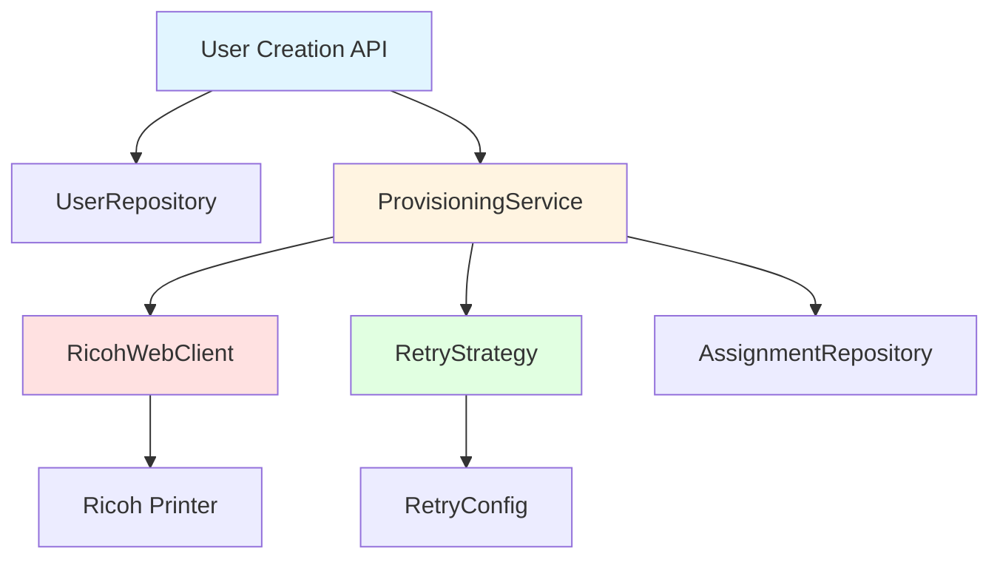
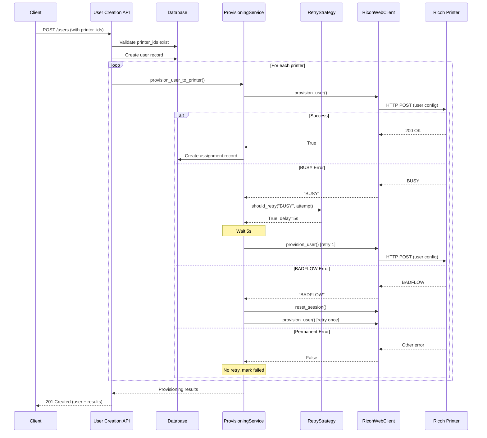

# Design Document: Automatic Retry Provisioning

## Overview

This design implements automatic provisioning of users to Ricoh printers during user creation, with intelligent retry logic to handle temporary device busy states. The current system requires a two-step process: first creating the user in the database, then manually provisioning through the "Administrar Usuario" interface. When provisioning fails due to "device is being used" errors, administrators must retry manually.

This feature enhances the user creation workflow by:
- Accepting printer selection during user creation
- Automatically provisioning users to selected printers after database creation
- Implementing exponential backoff retry logic for transient errors (BUSY, timeouts)
- Distinguishing between retryable and permanent errors (BADFLOW, connection failures)
- Providing detailed feedback on provisioning success/failure per printer
- Maintaining backward compatibility with existing workflows

The design leverages the existing provisioning infrastructure (`ProvisioningService`, `RicohWebClient`) and extends it with configurable retry strategies and enhanced error classification.

## Architecture

### Component Overview



### Request Flow



### Error Classification

The system classifies errors into three categories:

1. **Retryable with Exponential Backoff** (BUSY, Timeout)
   - Device is temporarily unavailable
   - Retry up to 5 times with exponential delays: 5s, 10s, 20s, 40s, 60s

2. **Retryable Once After Session Reset** (BADFLOW)
   - Anti-scraping protection triggered
   - Reset session and retry once
   - If persists, mark as permanent failure

3. **Permanent Failures** (Connection Error, Unknown Errors)
   - Connection errors: retry up to 3 times with 10s delays
   - Other errors: fail immediately without retry

## Components and Interfaces

### 1. API Schema Extensions

**File:** `backend/api/schemas.py`

Add new schema for user creation with printer selection:

```python
class UserCreate(UserBase):
    """Schema for creating a user"""
    codigo_de_usuario: str = Field(..., min_length=4, max_length=8)
    
    # NEW: Optional printer selection
    printer_ids: Optional[List[int]] = Field(
        None, 
        description="List of printer IDs to provision user to"
    )
    
    # ... existing fields ...
    
    @validator('printer_ids')
    def validate_printer_ids(cls, v):
        """Ensure all printer IDs are positive"""
        if v is not None:
            if not all(pid > 0 for pid in v):
                raise ValueError("All printer IDs must be positive integers")
        return v
```

Add new response schema for provisioning results:

```python
class PrinterProvisioningResult(BaseModel):
    """Result of provisioning to a single printer"""
    printer_id: int
    hostname: str
    ip_address: str
    status: Literal['success', 'failed']
    error_message: Optional[str] = None
    retry_attempts: int = 0
    provisioned_at: Optional[str] = None


class UserCreateResponse(UserResponse):
    """Extended response for user creation with provisioning"""
    provisioning_results: Optional['ProvisioningResults'] = None


class ProvisioningResults(BaseModel):
    """Detailed provisioning results"""
    overall_success: bool
    total_printers: int
    successful_count: int
    failed_count: int
    results: List[PrinterProvisioningResult]
    summary_message: str
```

### 2. Retry Strategy Component

**File:** `backend/services/retry_strategy.py` (NEW)

```python
from dataclasses import dataclass
from typing import Optional, Literal
import time
import logging

logger = logging.getLogger(__name__)


@dataclass
class RetryConfig:
    """Configuration for retry behavior"""
    initial_delay: float = 5.0  # seconds
    max_delay: float = 60.0  # seconds
    max_attempts: int = 5
    backoff_multiplier: float = 2.0
    
    # Error-specific configurations
    badflow_max_attempts: int = 1  # Only retry once after session reset
    connection_max_attempts: int = 3
    connection_delay: float = 10.0  # Fixed delay for connection errors


ErrorType = Literal['BUSY', 'BADFLOW', 'TIMEOUT', 'CONNECTION', 'OTHER']


class RetryStrategy:
    """Implements retry logic with exponential backoff"""
    
    def __init__(self, config: Optional[RetryConfig] = None):
        self.config = config or RetryConfig()
        logger.info(f"RetryStrategy initialized: {self.config}")
    
    def should_retry(self, error_type: ErrorType, attempt: int) -> tuple[bool, float]:
        """
        Determine if operation should be retried and calculate delay.
        
        Args:
            error_type: Type of error encountered
            attempt: Current attempt number (1-indexed)
            
        Returns:
            Tuple of (should_retry, delay_seconds)
        """
        if error_type == 'BUSY' or error_type == 'TIMEOUT':
            if attempt >= self.config.max_attempts:
                logger.info(f"Max attempts ({self.config.max_attempts}) reached for {error_type}")
                return False, 0.0
            
            # Exponential backoff: delay = initial * (multiplier ^ (attempt - 1))
            delay = self.config.initial_delay * (self.config.backoff_multiplier ** (attempt - 1))
            delay = min(delay, self.config.max_delay)
            
            logger.info(f"Retry {attempt}/{self.config.max_attempts} for {error_type}, delay={delay}s")
            return True, delay
        
        elif error_type == 'BADFLOW':
            if attempt >= self.config.badflow_max_attempts:
                logger.info(f"BADFLOW persists after session reset, not retrying")
                return False, 0.0
            
            logger.info(f"BADFLOW detected, will reset session and retry once")
            return True, 0.0  # No delay, immediate retry after session reset
        
        elif error_type == 'CONNECTION':
            if attempt >= self.config.connection_max_attempts:
                logger.info(f"Max connection attempts ({self.config.connection_max_attempts}) reached")
                return False, 0.0
            
            logger.info(f"Connection error, retry {attempt}/{self.config.connection_max_attempts}, delay={self.config.connection_delay}s")
            return True, self.config.connection_delay
        
        else:  # 'OTHER'
            logger.info(f"Permanent error type: {error_type}, not retrying")
            return False, 0.0
    
    def execute_with_retry(self, operation, error_classifier, operation_name: str = "operation"):
        """
        Execute an operation with retry logic.
        
        Args:
            operation: Callable that returns result or error indicator
            error_classifier: Callable that takes operation result and returns ErrorType
            operation_name: Name for logging
            
        Returns:
            Tuple of (success: bool, result: any, attempts: int)
        """
        attempt = 0
        last_error_type = None
        
        while True:
            attempt += 1
            logger.info(f"Executing {operation_name}, attempt {attempt}")
            
            result = operation()
            error_type = error_classifier(result)
            
            if error_type is None:
                # Success
                logger.info(f"{operation_name} succeeded on attempt {attempt}")
                return True, result, attempt
            
            last_error_type = error_type
            should_retry, delay = self.should_retry(error_type, attempt)
            
            if not should_retry:
                logger.error(f"{operation_name} failed after {attempt} attempts, error: {error_type}")
                return False, result, attempt
            
            if delay > 0:
                logger.info(f"Waiting {delay}s before retry...")
                time.sleep(delay)


def load_retry_config_from_env() -> RetryConfig:
    """Load retry configuration from environment variables"""
    import os
    
    return RetryConfig(
        initial_delay=float(os.getenv('RETRY_INITIAL_DELAY', '5.0')),
        max_delay=float(os.getenv('RETRY_MAX_DELAY', '60.0')),
        max_attempts=int(os.getenv('RETRY_MAX_ATTEMPTS', '5')),
        backoff_multiplier=float(os.getenv('RETRY_BACKOFF_MULTIPLIER', '2.0')),
        badflow_max_attempts=int(os.getenv('RETRY_BADFLOW_MAX_ATTEMPTS', '1')),
        connection_max_attempts=int(os.getenv('RETRY_CONNECTION_MAX_ATTEMPTS', '3')),
        connection_delay=float(os.getenv('RETRY_CONNECTION_DELAY', '10.0'))
    )
```

### 3. Enhanced Provisioning Service

**File:** `backend/services/provisioning.py` (MODIFIED)

Key modifications to `provision_user_to_printers()`:

```python
from services.retry_strategy import RetryStrategy, load_retry_config_from_env, ErrorType
from typing import Optional

class ProvisioningService:
    
    @staticmethod
    def provision_user_to_printers(
        db: Session,
        user_id: int,
        printer_ids: List[int]
    ) -> Dict:
        """
        Provision a user to multiple printers with intelligent retry logic.
        """
        # Verify user exists
        user = UserRepository.get_by_id(db, user_id)
        if not user:
            raise ValueError(f"User with ID {user_id} not found")
        
        # Verify all printers exist
        printers = []
        for printer_id in printer_ids:
            printer = PrinterRepository.get_by_id(db, printer_id)
            if not printer:
                raise ValueError(f"Printer with ID {printer_id} not found")
            printers.append(printer)
        
        # Initialize retry strategy
        retry_config = load_retry_config_from_env()
        retry_strategy = RetryStrategy(retry_config)
        
        # Decrypt password for provisioning
        encryption_service = get_encryption_service()
        network_password = encryption_service.decrypt(user.network_password_encrypted)
        
        # Build Ricoh payload
        ricoh_payload = {
            "nombre": user.name,
            "codigo_de_usuario": user.codigo_de_usuario,
            "nombre_usuario_inicio_sesion": user.network_username,
            "contrasena_inicio_sesion": network_password,
            "funciones_disponibles": {
                "copiadora": user.func_copier,
                "impresora": user.func_printer,
                "document_server": user.func_document_server,
                "fax": user.func_fax,
                "escaner": user.func_scanner,
                "navegador": user.func_browser
            },
            "carpeta_smb": {
                "protocolo": "SMB",
                "servidor": user.smb_server,
                "puerto": user.smb_port,
                "ruta": user.smb_path
            }
        }
        
        # Provision to each printer sequentially
        ricoh_client = get_ricoh_web_client()
        results = []
        
        logger.info(f"Starting provisioning to {len(printers)} printer(s)...")
        
        for printer in printers:
            result = ProvisioningService._provision_to_single_printer(
                db=db,
                user=user,
                printer=printer,
                ricoh_payload=ricoh_payload,
                ricoh_client=ricoh_client,
                retry_strategy=retry_strategy
            )
            results.append(result)
        
        # Calculate summary
        successful = [r for r in results if r['status'] == 'success']
        failed = [r for r in results if r['status'] == 'failed']
        
        return {
            "overall_success": len(successful) > 0,
            "total_printers": len(printers),
            "successful_count": len(successful),
            "failed_count": len(failed),
            "results": results,
            "summary_message": f"Usuario '{user.name}' provisionado exitosamente a {len(successful)}/{len(printers)} impresora(s)"
        }
    
    @staticmethod
    def _provision_to_single_printer(
        db: Session,
        user,
        printer,
        ricoh_payload: Dict,
        ricoh_client,
        retry_strategy: RetryStrategy
    ) -> Dict:
        """
        Provision user to a single printer with retry logic.
        
        Returns:
            Dict with printer_id, hostname, ip_address, status, error_message, retry_attempts, provisioned_at
        """
        logger.info(f"Provisioning user {user.name} to printer {printer.hostname} ({printer.ip_address})")
        
        start_time = time.time()
        attempt = 0
        last_error = None
        
        while True:
            attempt += 1
            logger.info(f"Attempt {attempt} for printer {printer.ip_address}")
            
            # Attempt provisioning
            result = ricoh_client.provision_user(printer.ip_address, ricoh_payload)
            
            # Classify error
            error_type = ProvisioningService._classify_provisioning_result(result)
            
            if error_type is None:
                # Success!
                elapsed = time.time() - start_time
                logger.info(f"✓ User provisioned to {printer.hostname} after {attempt} attempt(s) in {elapsed:.1f}s")
                
                # Create assignment in database
                AssignmentRepository.create(db, user.id, printer.id)
                
                return {
                    "printer_id": printer.id,
                    "hostname": printer.hostname,
                    "ip_address": printer.ip_address,
                    "status": "success",
                    "error_message": None,
                    "retry_attempts": attempt - 1,
                    "provisioned_at": datetime.utcnow().isoformat()
                }
            
            # Handle BADFLOW with session reset
            if error_type == 'BADFLOW' and attempt == 1:
                logger.warning(f"BADFLOW detected, resetting session...")
                ricoh_client.reset_session()
            
            # Check if should retry
            should_retry, delay = retry_strategy.should_retry(error_type, attempt)
            
            if not should_retry:
                elapsed = time.time() - start_time
                error_msg = ProvisioningService._format_error_message(error_type, result)
                logger.error(f"✗ Provisioning failed to {printer.hostname} after {attempt} attempts in {elapsed:.1f}s: {error_msg}")
                
                return {
                    "printer_id": printer.id,
                    "hostname": printer.hostname,
                    "ip_address": printer.ip_address,
                    "status": "failed",
                    "error_message": error_msg,
                    "retry_attempts": attempt - 1,
                    "provisioned_at": None
                }
            
            # Wait before retry
            if delay > 0:
                logger.info(f"Waiting {delay}s before retry...")
                time.sleep(delay)
    
    @staticmethod
    def _classify_provisioning_result(result) -> Optional[ErrorType]:
        """
        Classify provisioning result into error type.
        
        Args:
            result: Return value from ricoh_client.provision_user()
            
        Returns:
            ErrorType if error, None if success
        """
        if result is True:
            return None  # Success
        elif result == "BUSY":
            return 'BUSY'
        elif result == "BADFLOW":
            return 'BADFLOW'
        elif result is False:
            return 'OTHER'  # Generic failure
        else:
            return 'OTHER'
    
    @staticmethod
    def _format_error_message(error_type: ErrorType, result) -> str:
        """Format user-friendly error message in Spanish"""
        messages = {
            'BUSY': 'La impresora está ocupada. El dispositivo está siendo utilizado por otras funciones.',
            'BADFLOW': 'Error de protección anti-scraping. La sesión con la impresora es inválida.',
            'TIMEOUT': 'Tiempo de espera agotado al conectar con la impresora.',
            'CONNECTION': 'No se pudo conectar con la impresora.',
            'OTHER': 'Error desconocido durante el aprovisionamiento.'
        }
        return messages.get(error_type, 'Error desconocido')
```

### 4. Enhanced Ricoh Web Client

**File:** `backend/services/ricoh_web_client.py` (MODIFIED)

The `RicohWebClient` already returns `"BUSY"` and `"BADFLOW"` strings for these specific errors. We need to ensure it also handles timeouts and connection errors consistently:

```python
# In provision_user() method, add timeout and connection error handling:

def provision_user(self, printer_ip: str, user_config: Dict) -> Union[bool, str]:
    """
    Provision a user to a Ricoh printer via web interface
    
    Returns:
        True if successful
        "BUSY" if printer is busy
        "BADFLOW" if anti-scraping protection triggered
        "TIMEOUT" if connection timeout
        "CONNECTION" if connection error
        False for other errors
    """
    try:
        # ... existing implementation ...
        
    except requests.exceptions.Timeout:
        logger.error(f"✗ Connection timeout to printer at {printer_ip}")
        return "TIMEOUT"
    except requests.exceptions.ConnectionError:
        logger.error(f"✗ Cannot connect to printer at {printer_ip}")
        return "CONNECTION"
    except Exception as e:
        logger.error(f"✗ Error provisioning user to {printer_ip}: {e}")
        return False
```

### 5. Modified User Creation API

**File:** `backend/api/users.py` (MODIFIED)

```python
@router.post("/", response_model=UserCreateResponse, status_code=status.HTTP_201_CREATED)
async def create_user(user: UserCreate, db: Session = Depends(get_db)):
    """
    Create a new user with optional automatic provisioning to printers.
    """
    logger.info(f"📥 Received user creation request")
    logger.info(f"   Name: {user.name}")
    logger.info(f"   Código: {user.codigo_de_usuario}")
    
    # Validate printer IDs if provided
    if user.printer_ids:
        logger.info(f"   Printer IDs: {user.printer_ids}")
        for printer_id in user.printer_ids:
            printer = PrinterRepository.get_by_id(db, printer_id)
            if not printer:
                raise HTTPException(
                    status_code=status.HTTP_400_BAD_REQUEST,
                    detail=f"Printer with ID {printer_id} not found"
                )
    
    # Check if codigo_de_usuario already exists
    existing_codigo = UserRepository.get_by_codigo(db, user.codigo_de_usuario)
    if existing_codigo:
        raise HTTPException(
            status_code=status.HTTP_400_BAD_REQUEST,
            detail=f"User with código de usuario {user.codigo_de_usuario} already exists"
        )
    
    # ... existing credential extraction logic ...
    
    # Encrypt network password
    encryption_service = get_encryption_service()
    encrypted_password = encryption_service.encrypt(raw_password)
    
    try:
        # Create user in database
        new_user = UserRepository.create(
            db,
            name=user.name,
            codigo_de_usuario=user.codigo_de_usuario,
            network_username=network_username,
            network_password_encrypted=encrypted_password,
            smb_server=smb_server,
            smb_port=smb_port,
            smb_path=smb_path,
            func_copier=func_copier,
            func_copier_color=func_copier_color,
            func_printer=func_printer,
            func_printer_color=func_printer_color,
            func_document_server=func_document_server,
            func_fax=func_fax,
            func_scanner=func_scanner,
            func_browser=func_browser,
            empresa=user.empresa,
            centro_costos=user.centro_costos
        )
        logger.info(f"✅ User created successfully: ID={new_user.id}")
        
        # Automatic provisioning if printer IDs provided
        provisioning_results = None
        if user.printer_ids:
            logger.info(f"🔄 Starting automatic provisioning to {len(user.printer_ids)} printer(s)...")
            try:
                provisioning_results = ProvisioningService.provision_user_to_printers(
                    db=db,
                    user_id=new_user.id,
                    printer_ids=user.printer_ids
                )
                logger.info(f"✅ Provisioning completed: {provisioning_results['successful_count']}/{provisioning_results['total_printers']} successful")
            except Exception as prov_error:
                logger.error(f"❌ Provisioning error: {prov_error}")
                # Don't fail user creation if provisioning fails
                provisioning_results = {
                    "overall_success": False,
                    "total_printers": len(user.printer_ids),
                    "successful_count": 0,
                    "failed_count": len(user.printer_ids),
                    "results": [],
                    "summary_message": f"Error durante aprovisionamiento: {str(prov_error)}"
                }
        
        # Build response
        response_data = {
            **new_user.__dict__,
            "provisioning_results": provisioning_results
        }
        
        return response_data
        
    except Exception as e:
        logger.error(f"❌ Error creating user: {e}")
        raise HTTPException(
            status_code=status.HTTP_500_INTERNAL_SERVER_ERROR,
            detail=f"Failed to create user: {str(e)}"
        )
```

## Data Models

### Database Schema

No changes to existing database schema are required. The `UserPrinterAssignment` table already tracks provisioning relationships:

```python
# Existing model in db/models.py
class UserPrinterAssignment(Base):
    __tablename__ = "user_printer_assignments"
    
    id = Column(Integer, primary_key=True, index=True)
    user_id = Column(Integer, ForeignKey("users.id"), nullable=False)
    printer_id = Column(Integer, ForeignKey("printers.id"), nullable=False)
    entry_index = Column(String(10), nullable=True)  # Ricoh entry index
    is_active = Column(Boolean, default=True)
    created_at = Column(DateTime, default=datetime.utcnow)
    
    # Function permissions per printer
    func_copier = Column(Boolean, default=False)
    func_printer = Column(Boolean, default=False)
    func_document_server = Column(Boolean, default=False)
    func_fax = Column(Boolean, default=False)
    func_scanner = Column(Boolean, default=False)
    func_browser = Column(Boolean, default=False)
```

### Configuration Model

Environment variables for retry configuration:

```bash
# Exponential backoff for BUSY/TIMEOUT errors
RETRY_INITIAL_DELAY=5.0          # Initial delay in seconds
RETRY_MAX_DELAY=60.0             # Maximum delay in seconds
RETRY_MAX_ATTEMPTS=5             # Maximum retry attempts
RETRY_BACKOFF_MULTIPLIER=2.0     # Exponential multiplier

# BADFLOW error handling
RETRY_BADFLOW_MAX_ATTEMPTS=1     # Retry once after session reset

# Connection error handling
RETRY_CONNECTION_MAX_ATTEMPTS=3  # Maximum connection retry attempts
RETRY_CONNECTION_DELAY=10.0      # Fixed delay for connection errors
```


## Correctness Properties

*A property is a characteristic or behavior that should hold true across all valid executions of a system—essentially, a formal statement about what the system should do. Properties serve as the bridge between human-readable specifications and machine-verifiable correctness guarantees.*

### Property Reflection

After analyzing all 60 acceptance criteria, I identified several areas of redundancy:

1. **Response Structure Properties (7.1-7.7)**: These all test that the response contains specific fields. They can be combined into a single comprehensive property that validates the complete response structure.

2. **Configuration Properties (6.2-6.5)**: These all test that configuration parameters exist with correct defaults. They can be combined into a single property that validates the entire configuration structure.

3. **Logging Properties (9.1-9.7)**: These all test that specific events are logged. They can be combined into fewer properties that validate logging behavior for different event types.

4. **Database Consistency Properties (10.1-10.2)**: These are inverse statements of the same property - assignments exist if and only if provisioning succeeded.

5. **Retry Behavior Properties (3.1-3.6)**: Several of these overlap in testing retry behavior and can be consolidated.

The following properties represent the unique, non-redundant validation requirements:

### Property 1: Printer ID Validation

*For any* list of printer IDs provided during user creation, the API should validate that all printer IDs exist in the database, and return a 400 error with details if any are invalid.

**Validates: Requirements 1.3, 1.4**

### Property 2: Sequential Provisioning Order

*For any* user creation with multiple printer IDs, the provisioning service should provision to each printer sequentially (one at a time), not in parallel.

**Validates: Requirements 2.2**

### Property 3: Complete Configuration Payload

*For any* user and printer combination, the provisioning payload sent to the Ricoh printer should include all required fields: name, user code, network credentials, SMB settings, and available functions.

**Validates: Requirements 2.3**

### Property 4: Exponential Backoff Calculation

*For any* BUSY or TIMEOUT error, the retry delay should be calculated as `initial_delay * (multiplier ^ (attempt - 1))`, capped at `max_delay`, and should fall within the range [5, 60] seconds.

**Validates: Requirements 3.2, 3.3**

### Property 5: Retry Attempt Limits

*For any* error type, the number of retry attempts should not exceed the configured maximum for that error type (5 for BUSY/TIMEOUT, 1 for BADFLOW, 3 for CONNECTION, 0 for OTHER).

**Validates: Requirements 3.4, 4.1, 4.2, 4.4, 4.5**

### Property 6: Early Termination on Success

*For any* provisioning operation with retries, if any retry attempt succeeds, the system should immediately stop retrying and mark the operation as successful.

**Validates: Requirements 3.5**

### Property 7: Failure After Exhausted Retries

*For any* provisioning operation where all retries are exhausted without success, the system should mark the operation as failed and record the error type and message.

**Validates: Requirements 3.6, 4.6**

### Property 8: BADFLOW Session Reset

*For any* BADFLOW error on the first attempt, the system should reset the session before retrying, and if BADFLOW persists on the second attempt, should fail without further retries.

**Validates: Requirements 4.1, 4.2**

### Property 9: Partial Failure Independence

*For any* user creation with multiple printers, if provisioning fails for one printer, the system should continue attempting provisioning to all remaining printers.

**Validates: Requirements 5.1**

### Property 10: Overall Success Criteria

*For any* user creation with provisioning to multiple printers, the overall_success field should be true if and only if at least one printer was provisioned successfully.

**Validates: Requirements 5.2**

### Property 11: Complete Response Structure

*For any* user creation with provisioning, the response should include: user data, overall_success boolean, total_printers count, successful_count, failed_count, a list of results (each with printer_id, hostname, ip_address, status, error_message, retry_attempts, provisioned_at), and a Spanish summary message.

**Validates: Requirements 7.1, 7.2, 7.3, 7.4, 7.5, 7.6, 7.7**

### Property 12: HTTP 201 on User Creation Success

*For any* user creation request that successfully creates the user in the database, the API should return HTTP 201 status, regardless of whether provisioning succeeded or failed.

**Validates: Requirements 7.8**

### Property 13: Configuration Defaults

*For any* missing or invalid configuration value, the system should use the documented default value (initial_delay=5.0, max_delay=60.0, max_attempts=5, backoff_multiplier=2.0, badflow_max_attempts=1, connection_max_attempts=3, connection_delay=10.0).

**Validates: Requirements 6.6**

### Property 14: Backward Compatibility Without Printer IDs

*For any* user creation request without printer_ids, the system should create the user in the database without attempting provisioning, and return the same response structure as before this feature was implemented.

**Validates: Requirements 1.2, 8.1, 8.5**

### Property 15: Codigo Uniqueness Validation

*For any* user creation request, if a user with the same codigo_de_usuario already exists in the database, the API should return a 400 error and not create the user or attempt provisioning.

**Validates: Requirements 8.3**

### Property 16: Password Encryption

*For any* user creation request, the network password should be encrypted before being stored in the database, and the encrypted value should be decrypted before being sent to printers during provisioning.

**Validates: Requirements 8.4**

### Property 17: Database-Printer Consistency

*For any* user and printer combination, a Printer_Assignment record should exist in the database if and only if the user was successfully provisioned to that printer (after all retries).

**Validates: Requirements 10.1, 10.2**

### Property 18: Assignment Timestamp Accuracy

*For any* successful provisioning operation (including those that succeeded after retries), the Printer_Assignment created_at timestamp should reflect the time when provisioning actually succeeded, not when it was first attempted.

**Validates: Requirements 10.3**

### Property 19: Entry Index Storage

*For any* successful provisioning operation, the Printer_Assignment record should include the entry_index value returned by the Ricoh printer.

**Validates: Requirements 10.4**

### Property 20: Provisioning Before Database Record

*For any* user creation with printer IDs, the user record should be created in the database before any provisioning attempts are made.

**Validates: Requirements 1.5**

### Property 21: No Provisioning on User Creation Failure

*For any* user creation request that fails validation or database insertion, the system should not attempt provisioning to any printers.

**Validates: Requirements 1.6**

### Property 22: Provisioning Status Recording

*For any* provisioning attempt to a printer, the system should record the status (success or failure) and make it available in the response, even if the attempt ultimately fails.

**Validates: Requirements 2.4**

### Property 23: Provisioning Invocation

*For any* user creation with printer IDs, the provisioning service should be invoked for each printer ID provided.

**Validates: Requirements 2.1**

### Property 24: Complete Provisioning Results

*For any* user creation with provisioning, the response should include the complete results for all printers attempted, including both successful and failed provisioning operations.

**Validates: Requirements 2.5, 5.3, 5.4, 5.5**

### Property 25: Retry Logging Completeness

*For any* provisioning operation, the system should log: the start (with user name, code, printer IP), each retry attempt (with attempt number, delay, reason), and the final outcome (success or failure with elapsed time).

**Validates: Requirements 9.1, 9.2, 9.3, 9.4**

### Property 26: Error-Specific Logging

*For any* BUSY error, the system should log the error with printer IP and timestamp; for any BADFLOW error, the system should log the error and the session reset action.

**Validates: Requirements 9.6, 9.7**

### Property 27: Database Transaction Atomicity

*For any* Printer_Assignment creation, the database operation should be atomic (either fully committed or fully rolled back), ensuring consistency even if errors occur during the transaction.

**Validates: Requirements 10.6**

## Error Handling

### Error Classification Strategy

The system implements a three-tier error classification strategy:

1. **Transient Errors (Retry with Exponential Backoff)**
   - `BUSY`: Device is being used by other operations
   - `TIMEOUT`: Connection timeout to printer
   - Strategy: Exponential backoff (5s, 10s, 20s, 40s, 60s)
   - Max attempts: 5

2. **Session Errors (Retry Once After Reset)**
   - `BADFLOW`: Anti-scraping protection triggered
   - Strategy: Reset session, retry once
   - Max attempts: 1 (after reset)

3. **Connection Errors (Fixed Delay Retry)**
   - `CONNECTION`: Cannot connect to printer
   - Strategy: Fixed 10s delay
   - Max attempts: 3

4. **Permanent Errors (No Retry)**
   - `OTHER`: Unknown or unrecoverable errors
   - Strategy: Fail immediately
   - Max attempts: 0

### Error Response Format

All errors include:
- Error type classification
- Human-readable message in Spanish
- Printer identification (ID, hostname, IP)
- Retry attempt count
- Timestamp of failure

### Graceful Degradation

The system implements graceful degradation:
- User creation succeeds even if all provisioning fails (HTTP 201)
- Partial provisioning success is considered overall success
- Failed printers are clearly identified in response
- Administrators can manually retry failed printers through existing interface

### Error Recovery

For recoverable errors:
1. Log the error with full context
2. Determine retry strategy based on error type
3. Wait appropriate delay (if applicable)
4. Reset session if needed (BADFLOW)
5. Retry operation
6. If all retries exhausted, mark as failed and continue to next printer

## Testing Strategy

### Dual Testing Approach

This feature requires both unit tests and property-based tests for comprehensive coverage:

**Unit Tests** focus on:
- Specific examples of error scenarios
- Edge cases (empty printer lists, invalid IDs)
- Integration points between components
- Configuration loading and defaults
- Backward compatibility scenarios

**Property-Based Tests** focus on:
- Universal properties across all inputs
- Retry logic with various error sequences
- Response structure validation
- Database consistency guarantees
- Exponential backoff calculations

### Property-Based Testing Configuration

We will use **Hypothesis** (Python's property-based testing library) for implementing property tests.

Configuration:
- Minimum 100 iterations per property test
- Each test tagged with: `Feature: automatic-retry-provisioning, Property {number}: {property_text}`
- Custom generators for:
  - User data (valid and invalid)
  - Printer ID lists (various sizes, valid/invalid)
  - Error sequences (BUSY, BADFLOW, TIMEOUT, etc.)
  - Configuration values (valid ranges)

### Test Coverage Requirements

1. **API Layer Tests**
   - Request validation (with/without printer_ids)
   - Response structure validation
   - HTTP status codes
   - Backward compatibility

2. **Retry Strategy Tests**
   - Exponential backoff calculation
   - Retry attempt limits
   - Error classification
   - Configuration loading

3. **Provisioning Service Tests**
   - Sequential provisioning order
   - Partial failure handling
   - Database consistency
   - Error recording

4. **Integration Tests**
   - End-to-end user creation with provisioning
   - Mock Ricoh printer responses (BUSY, BADFLOW, success)
   - Database state verification
   - Session management

### Example Property Test Structure

```python
from hypothesis import given, strategies as st
import pytest

@given(
    printer_ids=st.lists(st.integers(min_value=1, max_value=1000), min_size=1, max_size=10),
    error_sequence=st.lists(st.sampled_from(['BUSY', 'TIMEOUT', 'SUCCESS']), min_size=1)
)
def test_property_5_retry_attempt_limits(printer_ids, error_sequence):
    """
    Feature: automatic-retry-provisioning, Property 5: Retry Attempt Limits
    
    For any error type, the number of retry attempts should not exceed 
    the configured maximum for that error type.
    """
    # Test implementation
    pass
```

### Mock Strategy

For testing without real Ricoh printers:
- Mock `RicohWebClient.provision_user()` to return configurable error sequences
- Mock `RicohWebClient.reset_session()` to track session resets
- Use in-memory SQLite database for fast test execution
- Verify database state after each test

### Performance Testing

While not part of correctness properties, we should verify:
- Provisioning to 10 printers completes within reasonable time (< 5 minutes with retries)
- Exponential backoff doesn't cause excessive delays
- Database operations don't become bottleneck

## Implementation Notes

### Phase 1: Core Retry Logic
1. Implement `RetryStrategy` class with exponential backoff
2. Add configuration loading from environment variables
3. Update `RicohWebClient` to return error type strings
4. Add unit tests for retry logic

### Phase 2: Provisioning Service Enhancement
1. Modify `provision_user_to_printers()` to use `RetryStrategy`
2. Implement `_provision_to_single_printer()` with retry loop
3. Add error classification logic
4. Add comprehensive logging
5. Add unit and property tests

### Phase 3: API Integration
1. Add `printer_ids` field to `UserCreate` schema
2. Add provisioning result schemas
3. Modify `create_user()` endpoint to call provisioning
4. Ensure backward compatibility
5. Add integration tests

### Phase 4: Testing and Documentation
1. Implement all property-based tests
2. Add integration tests with mocked printers
3. Update API documentation
4. Add configuration documentation
5. Test backward compatibility thoroughly

### Deployment Considerations

- Environment variables should be set before deployment
- Default values are production-ready (no configuration required)
- Existing user creation flows are unaffected
- Manual provisioning interface remains available
- Database schema requires no changes
- No data migration needed

### Monitoring and Observability

Recommended monitoring:
- Provisioning success rate per printer
- Average retry attempts per provisioning
- Error type distribution (BUSY, BADFLOW, etc.)
- Provisioning duration metrics
- Failed provisioning alerts

Log levels:
- INFO: Provisioning start/end, retry attempts, final outcomes
- DEBUG: HTTP requests/responses, detailed retry logic
- ERROR: Permanent failures, exhausted retries
- WARNING: BADFLOW errors, session resets

