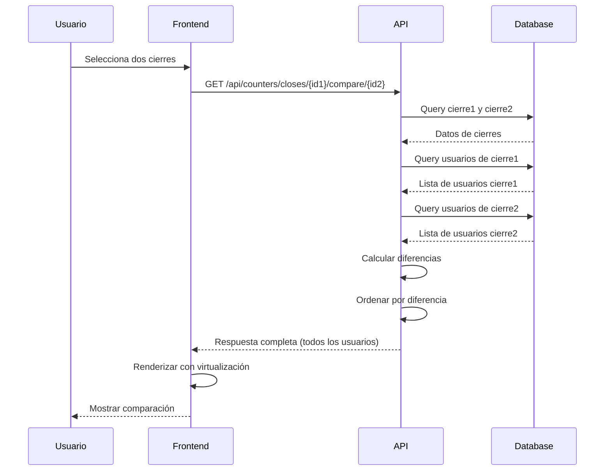

# Design Document: Mejoras del Módulo de Cierres

## Overview

Este documento especifica el diseño técnico para mejorar el módulo de cierres de contadores, eliminando restricciones artificiales, clarificando la información mostrada y proporcionando un desglose completo de usuarios para análisis de consumo.

### Objetivos del Diseño

1. **Eliminar límite artificial de 100 usuarios** en comparaciones de cierres
2. **Clarificar etiquetas y terminología** para distinguir entre contadores acumulados y consumos del período
3. **Permitir comparaciones flexibles** entre cualquier tipo de cierre (diario, semanal, mensual, personalizado)
4. **Mostrar desglose completo** con totales acumulados y consumos calculados
5. **Simplificar presentación** con información contextual clara
6. **Mantener compatibilidad** con sistema existente y datos históricos
7. **Optimizar rendimiento** para grandes volúmenes de usuarios

### Contexto del Sistema Actual

**Arquitectura:**
- Backend: FastAPI con PostgreSQL
- Frontend: React + TypeScript + Tailwind CSS
- Base de datos: Snapshots inmutables en `cierres_mensuales` y `cierres_mensuales_usuarios`
- Rendimiento actual: <10ms por consulta
- Escalabilidad: 3,192 registros/año por impresora

**Datos reales:**
- Impresora más grande: 266 usuarios activos
- Limitación actual: Solo 100 usuarios en comparaciones (37.6% de cobertura)
- Validaciones: 11 validaciones previas a creación de cierre
- Integridad: Hash SHA-256 para detectar modificaciones


## Architecture

### High-Level Architecture

El sistema de cierres sigue una arquitectura de tres capas con snapshots inmutables:

```
┌─────────────────────────────────────────────────────────────┐
│                      Frontend Layer                          │
│  ┌────────────────────────────────────────────────────────┐ │
│  │  ComparacionModal.tsx                                  │ │
│  │  - Selección de cierres                                │ │
│  │  - Visualización de comparaciones                      │ │
│  │  - Búsqueda y filtrado de usuarios                     │ │
│  │  - Virtualización para listas grandes                  │ │
│  └────────────────────────────────────────────────────────┘ │
└─────────────────────────────────────────────────────────────┘
                            │
                            │ HTTP/REST
                            ▼
┌─────────────────────────────────────────────────────────────┐
│                       API Layer                              │
│  ┌────────────────────────────────────────────────────────┐ │
│  │  /api/counters/closes/{id1}/compare/{id2}             │ │
│  │  - Validación de parámetros                            │ │
│  │  - Orquestación de lógica de negocio                   │ │
│  │  - Transformación de respuestas                        │ │
│  └────────────────────────────────────────────────────────┘ │
└─────────────────────────────────────────────────────────────┘
                            │
                            ▼
┌─────────────────────────────────────────────────────────────┐
│                    Business Logic Layer                      │
│  ┌────────────────────────────────────────────────────────┐ │
│  │  CloseService                                          │ │
│  │  - Creación de cierres                                 │ │
│  │  - Validaciones de integridad                          │ │
│  │  - Cálculo de diferencias                              │ │
│  └────────────────────────────────────────────────────────┘ │
└─────────────────────────────────────────────────────────────┘
                            │
                            ▼
┌─────────────────────────────────────────────────────────────┐
│                      Data Layer                              │
│  ┌──────────────────────┐  ┌──────────────────────────────┐ │
│  │ cierres_mensuales    │  │ cierres_mensuales_usuarios   │ │
│  │ - Snapshots de       │  │ - Snapshots de usuarios      │ │
│  │   impresora          │  │ - total_paginas (acumulado)  │ │
│  │ - total_paginas      │  │ - consumo_total (período)    │ │
│  │ - diferencia_total   │  │ - Desglose por función       │ │
│  └──────────────────────┘  └──────────────────────────────┘ │
└─────────────────────────────────────────────────────────────┘
```

### Flujo de Datos para Comparación



### Cambios Arquitectónicos

**Backend (API Layer):**
- ✅ Eliminar parámetro `top_usuarios` del endpoint
- ✅ Eliminar validación `le=100`
- ✅ Retornar todos los usuarios sin límite
- ✅ Agregar campos `total_paginas` a la respuesta de usuarios

**Frontend (Presentation Layer):**
- ✅ Implementar virtualización para listas grandes (>500 usuarios)
- ✅ Mejorar etiquetas y tooltips
- ✅ Agregar vista detallada con totales acumulados
- ✅ Mejorar búsqueda y filtrado

**No se requieren cambios en:**
- ❌ Capa de datos (tablas de base de datos)
- ❌ Servicio de creación de cierres (CloseService)
- ❌ Validaciones de integridad
- ❌ Estructura de snapshots


## Components and Interfaces

### Backend Components

#### 1. Endpoint de Comparación (counters.py)

**Ubicación:** `backend/api/counters.py` línea ~543

**Cambios requeridos:**

```python
# ANTES (línea ~543)
def compare_closes(
    cierre_id1: int,
    cierre_id2: int,
    top_usuarios: int = Query(10, ge=1, le=100, description="Cantidad de usuarios en top"),
    db: Session = Depends(get_db)
):
    # ... lógica actual ...
    top_aumento = [c for c in comparaciones_ordenadas if c.diferencia > 0][:top_usuarios]
    top_disminucion = sorted([c for c in comparaciones_ordenadas if c.diferencia < 0], 
                             key=lambda x: x.diferencia)[:top_usuarios]

# DESPUÉS
def compare_closes(
    cierre_id1: int,
    cierre_id2: int,
    db: Session = Depends(get_db)
):
    # ... lógica actual sin cambios hasta aquí ...
    
    # Retornar TODOS los usuarios ordenados por diferencia absoluta
    usuarios_ordenados = sorted(comparaciones, key=lambda x: abs(x.diferencia), reverse=True)
    
    # Separar en aumentos y disminuciones (sin límite)
    usuarios_aumento = [c for c in usuarios_ordenados if c.diferencia > 0]
    usuarios_disminucion = [c for c in usuarios_ordenados if c.diferencia < 0]
```

**Modificaciones específicas:**
1. Eliminar parámetro `top_usuarios` de la firma de la función
2. Eliminar slicing `[:top_usuarios]` en las listas de resultados
3. Mantener ordenamiento por diferencia absoluta (mayor a menor)
4. Retornar todos los usuarios en las listas

#### 2. Schemas de Respuesta (counter_schemas.py)

**Ubicación:** `backend/api/counter_schemas.py`

**Cambios requeridos:**

```python
# Agregar campos a UsuarioComparacion
class UsuarioComparacion(BaseModel):
    """Usuario con comparación entre dos cierres"""
    codigo_usuario: str
    nombre_usuario: str
    
    # Campos existentes
    consumo_cierre1: int  # Consumo del período 1
    consumo_cierre2: int  # Consumo del período 2
    diferencia: int       # Diferencia de consumo
    porcentaje_cambio: float
    
    # NUEVOS CAMPOS para vista detallada
    total_paginas_cierre1: Optional[int] = None  # Contador acumulado en cierre 1
    total_paginas_cierre2: Optional[int] = None  # Contador acumulado en cierre 2

# ComparacionCierresResponse se mantiene igual
class ComparacionCierresResponse(BaseModel):
    """Response schema for comparing two closes"""
    cierre1: CierreMensualResponse
    cierre2: CierreMensualResponse
    
    # Diferencias de totales
    diferencia_total: int
    diferencia_copiadora: int
    diferencia_impresora: int
    diferencia_escaner: int
    diferencia_fax: int
    
    # Período entre cierres
    dias_entre_cierres: int
    
    # MODIFICADO: Ahora contienen TODOS los usuarios
    top_usuarios_aumento: List[UsuarioComparacion]  # Todos los usuarios con aumento
    top_usuarios_disminucion: List[UsuarioComparacion]  # Todos los usuarios con disminución
    
    # Estadísticas
    total_usuarios_activos: int
    promedio_consumo_por_usuario: float
```

**Nota sobre compatibilidad:**
- Los campos `top_usuarios_aumento` y `top_usuarios_disminucion` mantienen sus nombres para compatibilidad
- Ahora contienen TODOS los usuarios en lugar de solo el top N
- Los nuevos campos `total_paginas_cierre1` y `total_paginas_cierre2` son opcionales para no romper compatibilidad

#### 3. Modificación del Endpoint para Incluir Totales Acumulados

```python
# En compare_closes, al construir UsuarioComparacion:
for codigo in codigos_usuarios:
    u1 = usuarios1.get(codigo)
    u2 = usuarios2.get(codigo)
    
    # Consumos del período (existente)
    consumo1 = u1.consumo_total if u1 else 0
    consumo2 = u2.consumo_total if u2 else 0
    diferencia = consumo2 - consumo1
    
    # NUEVO: Totales acumulados
    total_paginas1 = u1.total_paginas if u1 else None
    total_paginas2 = u2.total_paginas if u2 else None
    
    # ... cálculo de porcentaje_cambio ...
    
    comparaciones.append(UsuarioComparacion(
        codigo_usuario=codigo,
        nombre_usuario=nombre,
        consumo_cierre1=consumo1,
        consumo_cierre2=consumo2,
        diferencia=diferencia,
        porcentaje_cambio=porcentaje_cambio,
        total_paginas_cierre1=total_paginas1,  # NUEVO
        total_paginas_cierre2=total_paginas2   # NUEVO
    ))
```

### Frontend Components

#### 1. ComparacionModal Component

**Ubicación:** `src/components/contadores/cierres/ComparacionModal.tsx`

**Cambios requeridos:**

**A. Eliminar parámetro top_usuarios de la llamada API:**

```typescript
// ANTES
const response = await fetch(
  `${API_BASE}/api/counters/closes/${cierre1Id}/compare/${cierre2Id}?top_usuarios=100`
);

// DESPUÉS
const response = await fetch(
  `${API_BASE}/api/counters/closes/${cierre1Id}/compare/${cierre2Id}`
);
```

**B. Agregar estado para vista detallada:**

```typescript
const [vistaDetallada, setVistaDetallada] = useState(false);
```

**C. Mejorar etiquetas de columnas:**

```typescript
// Etiquetas claras con tooltips
const columnLabels = {
  periodo1: vistaDetallada ? "Total Acumulado Cierre 1" : "Consumo Período 1",
  periodo2: vistaDetallada ? "Total Acumulado Cierre 2" : "Consumo Período 2",
  diferencia: vistaDetallada ? "Diferencia de Totales" : "Variación de Consumo"
};
```

**D. Implementar virtualización para listas grandes:**

```typescript
import { useVirtualizer } from '@tanstack/react-virtual';

// Para listas con más de 500 usuarios
const parentRef = useRef<HTMLDivElement>(null);

const rowVirtualizer = useVirtualizer({
  count: allUsers.length,
  getScrollElement: () => parentRef.current,
  estimateSize: () => 48, // altura estimada de cada fila
  overscan: 10
});
```

**E. Agregar toggle para vista detallada:**

```typescript
<button
  onClick={() => setVistaDetallada(!vistaDetallada)}
  className="px-3 py-1.5 bg-purple-100 text-purple-700 rounded-md text-sm hover:bg-purple-200"
>
  {vistaDetallada ? '📄 Vista Simple' : '📊 Vista Detallada'}
</button>
```

**F. Mejorar tooltips:**

```typescript
const tooltips = {
  totalAcumulado: "Total de páginas desde que se instaló el contador (siempre crece)",
  consumoPeriodo: "Páginas impresas en este período específico (calculado)",
  diferencia: "Cambio en el consumo entre los dos períodos"
};
```

#### 2. TypeScript Interfaces

**Ubicación:** `src/components/contadores/cierres/types.ts`

```typescript
export interface UsuarioComparacion {
  codigo_usuario: string;
  nombre_usuario: string;
  consumo_cierre1: number;
  consumo_cierre2: number;
  diferencia: number;
  porcentaje_cambio: number;
  // NUEVOS CAMPOS
  total_paginas_cierre1?: number;
  total_paginas_cierre2?: number;
}

export interface ComparacionCierres {
  cierre1: CierreMensual;
  cierre2: CierreMensual;
  diferencia_total: number;
  diferencia_copiadora: number;
  diferencia_impresora: number;
  diferencia_escaner: number;
  diferencia_fax: number;
  dias_entre_cierres: number;
  top_usuarios_aumento: UsuarioComparacion[];  // Ahora contiene TODOS
  top_usuarios_disminucion: UsuarioComparacion[];  // Ahora contiene TODOS
  total_usuarios_activos: number;
  promedio_consumo_por_usuario: number;
}
```

### API Contract

#### Endpoint: GET /api/counters/closes/{id1}/compare/{id2}

**Request:**
```
GET /api/counters/closes/12/compare/13
```

**Response (200 OK):**
```json
{
  "cierre1": {
    "id": 12,
    "printer_id": 4,
    "tipo_periodo": "mensual",
    "fecha_inicio": "2026-02-01",
    "fecha_fin": "2026-02-28",
    "total_paginas": 100000,
    "diferencia_total": 5000,
    ...
  },
  "cierre2": {
    "id": 13,
    "printer_id": 4,
    "tipo_periodo": "mensual",
    "fecha_inicio": "2026-03-01",
    "fecha_fin": "2026-03-31",
    "total_paginas": 105500,
    "diferencia_total": 5500,
    ...
  },
  "diferencia_total": 5500,
  "diferencia_copiadora": 3000,
  "diferencia_impresora": 2500,
  "diferencia_escaner": 0,
  "diferencia_fax": 0,
  "dias_entre_cierres": 31,
  "top_usuarios_aumento": [
    {
      "codigo_usuario": "12345678",
      "nombre_usuario": "Juan Pérez",
      "consumo_cierre1": 1000,
      "consumo_cierre2": 1500,
      "diferencia": 500,
      "porcentaje_cambio": 50.0,
      "total_paginas_cierre1": 10000,
      "total_paginas_cierre2": 11500
    }
    // ... todos los usuarios con aumento (sin límite)
  ],
  "top_usuarios_disminucion": [
    // ... todos los usuarios con disminución (sin límite)
  ],
  "total_usuarios_activos": 266,
  "promedio_consumo_por_usuario": 20.68
}
```

**Error Responses:**

```json
// 404 - Cierre no encontrado
{
  "detail": "Cierre 12 no encontrado"
}

// 400 - Cierres de diferentes impresoras
{
  "detail": "Los cierres deben ser de la misma impresora (cierre1: 4, cierre2: 5)"
}
```


## Data Models

### Existing Database Schema (No Changes Required)

El diseño no requiere cambios en el esquema de base de datos. Los datos necesarios ya existen en las tablas actuales.

#### Tabla: cierres_mensuales

```sql
CREATE TABLE cierres_mensuales (
    id SERIAL PRIMARY KEY,
    printer_id INTEGER NOT NULL,
    tipo_periodo VARCHAR(20) DEFAULT 'mensual',
    fecha_inicio DATE NOT NULL,
    fecha_fin DATE NOT NULL,
    anio INTEGER NOT NULL,
    mes INTEGER NOT NULL,
    
    -- Contadores totales capturados
    total_paginas INTEGER DEFAULT 0,
    total_copiadora INTEGER DEFAULT 0,
    total_impresora INTEGER DEFAULT 0,
    total_escaner INTEGER DEFAULT 0,
    total_fax INTEGER DEFAULT 0,
    
    -- Diferencias con cierre anterior
    diferencia_total INTEGER DEFAULT 0,
    diferencia_copiadora INTEGER DEFAULT 0,
    diferencia_impresora INTEGER DEFAULT 0,
    diferencia_escaner INTEGER DEFAULT 0,
    diferencia_fax INTEGER DEFAULT 0,
    
    -- Metadata
    fecha_cierre TIMESTAMP WITH TIME ZONE DEFAULT CURRENT_TIMESTAMP,
    cerrado_por VARCHAR(100),
    notas TEXT,
    hash_verificacion VARCHAR(64),
    created_at TIMESTAMP WITH TIME ZONE DEFAULT CURRENT_TIMESTAMP,
    
    CONSTRAINT fk_printer FOREIGN KEY (printer_id) REFERENCES printers(id)
);

-- Índices existentes (suficientes para rendimiento)
CREATE INDEX idx_cierres_mensuales_printer ON cierres_mensuales(printer_id);
CREATE INDEX idx_cierres_mensuales_fecha ON cierres_mensuales(fecha_fin);
```

#### Tabla: cierres_mensuales_usuarios

```sql
CREATE TABLE cierres_mensuales_usuarios (
    id SERIAL PRIMARY KEY,
    cierre_mensual_id INTEGER NOT NULL,
    codigo_usuario VARCHAR(8) NOT NULL,
    nombre_usuario VARCHAR(100) NOT NULL,
    
    -- Contadores capturados (snapshot)
    total_paginas INTEGER NOT NULL,      -- ← Campo clave para vista detallada
    total_bn INTEGER NOT NULL,
    total_color INTEGER NOT NULL,
    
    -- Desglose por función
    copiadora_bn INTEGER NOT NULL,
    copiadora_color INTEGER NOT NULL,
    impresora_bn INTEGER NOT NULL,
    impresora_color INTEGER NOT NULL,
    escaner_bn INTEGER NOT NULL,
    escaner_color INTEGER NOT NULL,
    fax_bn INTEGER NOT NULL,
    
    -- Consumo del período
    consumo_total INTEGER NOT NULL,      -- ← Campo usado actualmente
    consumo_copiadora INTEGER NOT NULL,
    consumo_impresora INTEGER NOT NULL,
    consumo_escaner INTEGER NOT NULL,
    consumo_fax INTEGER NOT NULL,
    
    created_at TIMESTAMP WITH TIME ZONE DEFAULT CURRENT_TIMESTAMP,
    
    CONSTRAINT fk_cierre_mensual FOREIGN KEY (cierre_mensual_id) 
        REFERENCES cierres_mensuales(id) ON DELETE CASCADE
);

-- Índices existentes (suficientes para rendimiento)
CREATE INDEX idx_cierres_usuarios_cierre ON cierres_mensuales_usuarios(cierre_mensual_id);
CREATE INDEX idx_cierres_usuarios_codigo ON cierres_mensuales_usuarios(codigo_usuario);
CREATE INDEX idx_cierres_usuarios_consumo ON cierres_mensuales_usuarios(consumo_total DESC);
```

### Data Flow

#### 1. Creación de Cierre (No cambia)

```
CloseService.create_close()
    ↓
1. Validar parámetros
2. Obtener último contador de impresora
3. Calcular diferencias con cierre anterior
4. Para cada usuario:
   - Obtener último contador
   - Calcular consumo del período
   - Guardar snapshot en cierres_mensuales_usuarios
5. Validar integridad (suma ≈ total)
6. Calcular hash de verificación
    ↓
Snapshot inmutable guardado
```

#### 2. Comparación de Cierres (Modificado)

```
compare_closes(id1, id2)
    ↓
1. Obtener cierre1 y cierre2 de cierres_mensuales
2. Validar misma impresora
3. Calcular diferencias de totales
4. Query usuarios de cierre1:
   SELECT * FROM cierres_mensuales_usuarios 
   WHERE cierre_mensual_id = id1
5. Query usuarios de cierre2:
   SELECT * FROM cierres_mensuales_usuarios 
   WHERE cierre_mensual_id = id2
6. Para cada usuario único:
   - Obtener consumo_total de ambos cierres
   - Obtener total_paginas de ambos cierres (NUEVO)
   - Calcular diferencia
   - Calcular porcentaje de cambio
7. Ordenar por diferencia absoluta (mayor a menor)
8. Retornar TODOS los usuarios (sin límite)
    ↓
Respuesta completa con todos los usuarios
```

### Query Performance Analysis

**Query actual para obtener usuarios de un cierre:**
```sql
SELECT * FROM cierres_mensuales_usuarios
WHERE cierre_mensual_id = 12;
```

**Rendimiento:**
- Con índice en `cierre_mensual_id`: ~2ms
- 266 registros: ~0.5 MB de datos
- Total para comparación (2 queries): ~4ms

**Query para comparación (alternativa optimizada):**
```sql
-- Obtener usuarios de ambos cierres en una sola query
SELECT 
    u1.codigo_usuario,
    u1.nombre_usuario,
    u1.consumo_total as consumo_cierre1,
    u1.total_paginas as total_paginas_cierre1,
    u2.consumo_total as consumo_cierre2,
    u2.total_paginas as total_paginas_cierre2
FROM cierres_mensuales_usuarios u1
FULL OUTER JOIN cierres_mensuales_usuarios u2 
    ON u1.codigo_usuario = u2.codigo_usuario
WHERE u1.cierre_mensual_id = 12 
   OR u2.cierre_mensual_id = 13;
```

**Nota:** La implementación actual usa dos queries separadas, lo cual es suficiente dado el excelente rendimiento. La query optimizada es opcional.

### Data Integrity

**Validaciones existentes que se mantienen:**

1. **Suma de consumos ≈ diferencia total:**
   ```python
   suma_consumos = sum(u.consumo_total for u in usuarios)
   diferencia_porcentaje = abs(suma_consumos - diferencia_total) / diferencia_total * 100
   if diferencia_porcentaje > 10:
       warnings.append(f"Diferencia entre suma de usuarios y total: {diferencia_porcentaje:.1f}%")
   ```

2. **Hash de verificación:**
   ```python
   hash_data = f"{printer_id}{tipo_periodo}{fecha_inicio}{fecha_fin}{total_paginas}"
   hash_verificacion = hashlib.sha256(hash_data.encode()).hexdigest()
   ```

3. **Validación de misma impresora en comparación:**
   ```python
   if cierre1.printer_id != cierre2.printer_id:
       raise HTTPException(status_code=400, detail="Los cierres deben ser de la misma impresora")
   ```


## Correctness Properties

*A property is a characteristic or behavior that should hold true across all valid executions of a system—essentially, a formal statement about what the system should do. Properties serve as the bridge between human-readable specifications and machine-verifiable correctness guarantees.*

### Property 1: Backend retorna todos los usuarios sin límite

*For any* comparación de cierres válida, el endpoint SHALL retornar todos los usuarios que tienen datos en al menos uno de los dos cierres, sin aplicar ningún límite artificial en la cantidad de usuarios retornados.

**Validates: Requirements 1.1**

**Rationale:** Eliminar el límite de 100 usuarios permite análisis completo del consumo. Con 266 usuarios activos en la impresora más grande, el límite anterior solo mostraba el 37.6% de los datos.

**Test approach:** Generar cierres con diferentes cantidades de usuarios (10, 100, 266, 500) y verificar que la respuesta contenga exactamente la cantidad de usuarios únicos presentes en ambos cierres.

### Property 2: Suma de consumos coincide con diferencia total

*For any* comparación de cierres, la suma de los consumos de todos los usuarios (campo `diferencia` de cada usuario) SHALL estar dentro del 10% de la diferencia total de la impresora (campo `diferencia_total` del cierre).

**Validates: Requirements 1.6**

**Rationale:** Esta propiedad valida la integridad de los datos. La suma de consumos individuales debe aproximarse al consumo total de la impresora. Una diferencia mayor al 10% indica datos inconsistentes o usuarios faltantes.

**Test approach:** Para comparaciones aleatorias, calcular `suma_usuarios = sum(u.diferencia for u in usuarios)` y verificar que `abs(suma_usuarios - diferencia_total) / diferencia_total <= 0.10`.

### Property 3: Resultados ordenados por diferencia de consumo

*For any* comparación de cierres, los usuarios en las listas `top_usuarios_aumento` y `top_usuarios_disminucion` SHALL estar ordenados por el valor absoluto de su diferencia de consumo en orden descendente (mayor a menor).

**Validates: Requirements 1.7**

**Rationale:** El ordenamiento consistente permite identificar rápidamente los usuarios con mayor cambio en consumo, facilitando el análisis y la toma de decisiones.

**Test approach:** Para cualquier respuesta de comparación, verificar que para cada par consecutivo de usuarios en la lista, `abs(usuarios[i].diferencia) >= abs(usuarios[i+1].diferencia)`.

### Property 4: Comparaciones entre diferentes tipos de período funcionan

*For any* dos cierres de la misma impresora, independientemente de sus tipos de período (diario, semanal, mensual, personalizado), el sistema SHALL procesar la comparación y retornar diferencias calculadas correctamente.

**Validates: Requirements 3.1**

**Rationale:** La flexibilidad para comparar cualquier tipo de cierre permite análisis más ricos, como comparar un día específico con el promedio mensual.

**Test approach:** Generar pares de cierres con todas las combinaciones de tipos de período (diario-mensual, semanal-personalizado, etc.) y verificar que la comparación se procese sin errores y retorne datos válidos.

### Property 5: Validación de misma impresora

*For any* intento de comparar dos cierres de diferentes impresoras, el sistema SHALL rechazar la solicitud con un error HTTP 400 indicando que los cierres deben ser de la misma impresora.

**Validates: Requirements 3.2**

**Rationale:** Comparar cierres de diferentes impresoras no tiene sentido lógico y podría llevar a conclusiones erróneas. Esta validación protege la integridad del análisis.

**Test approach:** Generar pares de cierres con diferentes `printer_id` y verificar que la respuesta sea HTTP 400 con el mensaje de error apropiado.

### Property 6: Respuesta incluye campos requeridos para cada usuario

*For any* usuario en la respuesta de comparación, el objeto SHALL contener todos los campos requeridos: `codigo_usuario`, `nombre_usuario`, `consumo_cierre1`, `consumo_cierre2`, `diferencia`, `porcentaje_cambio`, y opcionalmente `total_paginas_cierre1` y `total_paginas_cierre2`.

**Validates: Requirements 4.2**

**Rationale:** La estructura consistente de datos permite que el frontend procese la información de manera confiable y muestre el desglose completo.

**Test approach:** Para cualquier respuesta de comparación, verificar que cada usuario en las listas tenga todos los campos requeridos con tipos de datos correctos.

### Property 7: Búsqueda y filtrado funcionan correctamente

*For any* término de búsqueda ingresado por el usuario, el sistema de filtrado SHALL retornar solo los usuarios cuyo `nombre_usuario` o `codigo_usuario` contengan el término de búsqueda (case-insensitive).

**Validates: Requirements 5.5**

**Rationale:** La búsqueda eficiente es esencial cuando se trabaja con cientos de usuarios, permitiendo encontrar rápidamente usuarios específicos.

**Test approach:** Generar listas de usuarios con nombres y códigos conocidos, aplicar diferentes términos de búsqueda, y verificar que solo los usuarios que coinciden aparezcan en los resultados filtrados.

### Property 8: Estructura de respuesta JSON se mantiene

*For any* comparación de cierres, la estructura de la respuesta JSON SHALL contener todos los campos existentes en el formato actual: `cierre1`, `cierre2`, `diferencia_total`, `diferencia_copiadora`, `diferencia_impresora`, `diferencia_escaner`, `diferencia_fax`, `dias_entre_cierres`, `top_usuarios_aumento`, `top_usuarios_disminucion`, `total_usuarios_activos`, `promedio_consumo_por_usuario`.

**Validates: Requirements 6.1**

**Rationale:** Mantener la estructura de respuesta garantiza compatibilidad con código existente y evita romper integraciones.

**Test approach:** Validar la respuesta contra el schema Pydantic `ComparacionCierresResponse` y verificar que todos los campos requeridos estén presentes.

### Property 9: Diferencias calculadas usando consumo_total

*For any* usuario en una comparación, el campo `diferencia` SHALL ser calculado como `consumo_cierre2 - consumo_cierre1`, donde los consumos son los valores del campo `consumo_total` (no `total_paginas`) de cada cierre.

**Validates: Requirements 6.4**

**Rationale:** Usar `consumo_total` (consumo del período) en lugar de `total_paginas` (contador acumulado) es correcto para comparar cuánto cambió el consumo entre períodos. Los contadores acumulados siempre crecen, por lo que su diferencia no refleja el cambio en el patrón de consumo.

**Test approach:** Para usuarios con datos conocidos en ambos cierres, verificar que `usuario.diferencia == usuario.consumo_cierre2 - usuario.consumo_cierre1` y que estos valores provengan del campo `consumo_total` de la base de datos.

### Property Reflection Summary

Las propiedades identificadas cubren los aspectos críticos del sistema:

- **Completitud de datos** (Property 1, 6): Todos los usuarios y campos necesarios están presentes
- **Integridad de datos** (Property 2, 9): Los cálculos son correctos y consistentes
- **Ordenamiento y búsqueda** (Property 3, 7): Los datos se presentan de manera útil
- **Flexibilidad** (Property 4): Comparaciones entre cualquier tipo de cierre
- **Validaciones** (Property 5): Protección contra uso incorrecto
- **Compatibilidad** (Property 8): No se rompe funcionalidad existente

Estas propiedades son complementarias y no redundantes. Cada una valida un aspecto diferente del comportamiento del sistema.


## Error Handling

### Backend Error Scenarios

#### 1. Cierre no encontrado

**Scenario:** Usuario solicita comparación con ID de cierre que no existe

**Handling:**
```python
cierre1 = db.query(CierreMensual).filter(CierreMensual.id == cierre_id1).first()
if not cierre1:
    raise HTTPException(
        status_code=404,
        detail=f"Cierre {cierre_id1} no encontrado"
    )
```

**Response:**
```json
{
  "detail": "Cierre 12 no encontrado"
}
```

**HTTP Status:** 404 Not Found

#### 2. Cierres de diferentes impresoras

**Scenario:** Usuario intenta comparar cierres de impresoras diferentes

**Handling:**
```python
if cierre1.printer_id != cierre2.printer_id:
    raise HTTPException(
        status_code=400,
        detail=f"Los cierres deben ser de la misma impresora (cierre1: {cierre1.printer_id}, cierre2: {cierre2.printer_id})"
    )
```

**Response:**
```json
{
  "detail": "Los cierres deben ser de la misma impresora (cierre1: 4, cierre2: 5)"
}
```

**HTTP Status:** 400 Bad Request

#### 3. Error de base de datos

**Scenario:** Fallo en la conexión o query a la base de datos

**Handling:**
```python
try:
    usuarios1 = db.query(CierreMensualUsuario).filter(
        CierreMensualUsuario.cierre_mensual_id == cierre_id1
    ).all()
except SQLAlchemyError as e:
    logger.error(f"Database error in compare_closes: {str(e)}")
    raise HTTPException(
        status_code=500,
        detail="Error al acceder a la base de datos"
    )
```

**Response:**
```json
{
  "detail": "Error al acceder a la base de datos"
}
```

**HTTP Status:** 500 Internal Server Error

#### 4. Datos inconsistentes

**Scenario:** Suma de consumos de usuarios difiere significativamente del total de impresora

**Handling:**
```python
# Calcular diferencia
suma_consumos = sum(u.diferencia for u in comparaciones)
diferencia_porcentaje = abs(suma_consumos - diferencia_total) / diferencia_total * 100 if diferencia_total != 0 else 0

# Agregar advertencia en logs (no bloquear respuesta)
if diferencia_porcentaje > 10:
    logger.warning(
        f"Inconsistencia en comparación {cierre_id1} vs {cierre_id2}: "
        f"Diferencia {diferencia_porcentaje:.1f}% entre suma de usuarios y total"
    )
```

**Note:** Este caso genera una advertencia en logs pero NO bloquea la respuesta. El usuario recibe los datos y puede investigar la inconsistencia.

### Frontend Error Scenarios

#### 1. Error de red

**Scenario:** Fallo en la conexión al backend

**Handling:**
```typescript
try {
  const response = await fetch(`${API_BASE}/api/counters/closes/${cierre1Id}/compare/${cierre2Id}`);
  if (!response.ok) throw new Error('Error al comparar cierres');
  const data = await response.json();
  setComparacion(data);
} catch (err: any) {
  console.error('Error loading comparacion:', err);
  setError(err.message || 'Error de conexión');
}
```

**UI Display:**
```tsx
<div className="bg-red-50 border border-red-200 rounded-lg p-4">
  <p className="text-red-700">{error}</p>
</div>
```

#### 2. Respuesta vacía o malformada

**Scenario:** Backend retorna datos inesperados

**Handling:**
```typescript
const data = await response.json();

// Validar estructura básica
if (!data.cierre1 || !data.cierre2) {
  throw new Error('Respuesta inválida del servidor');
}

// Validar listas de usuarios
if (!Array.isArray(data.top_usuarios_aumento) || !Array.isArray(data.top_usuarios_disminucion)) {
  throw new Error('Datos de usuarios inválidos');
}

setComparacion(data);
```

#### 3. Lista de usuarios muy grande

**Scenario:** Más de 1000 usuarios en la comparación

**Handling:**
```typescript
const allUsers = [
  ...comparacion.top_usuarios_aumento,
  ...comparacion.top_usuarios_disminucion
];

// Advertencia si hay muchos usuarios
if (allUsers.length > 1000) {
  console.warn(`Comparación con ${allUsers.length} usuarios. Usando virtualización.`);
}

// Implementar virtualización automáticamente
const shouldVirtualize = allUsers.length > 500;
```

**UI Display:**
```tsx
{allUsers.length > 500 && (
  <div className="bg-yellow-50 border border-yellow-200 rounded-lg p-3 mb-3">
    <p className="text-sm text-yellow-800">
      ℹ️ Mostrando {allUsers.length} usuarios. Use la búsqueda para filtrar.
    </p>
  </div>
)}
```

#### 4. Búsqueda sin resultados

**Scenario:** Término de búsqueda no coincide con ningún usuario

**Handling:**
```typescript
const filteredUsers = allUsers.filter(u => 
  u.nombre_usuario.toLowerCase().includes(searchTerm.toLowerCase()) ||
  u.codigo_usuario.includes(searchTerm)
);

// Mostrar mensaje si no hay resultados
if (filteredUsers.length === 0 && searchTerm) {
  return (
    <div className="text-center py-8 text-gray-500">
      No se encontraron usuarios que coincidan con "{searchTerm}"
    </div>
  );
}
```

### Error Recovery Strategies

#### Backend

1. **Transacciones:** Todas las operaciones de escritura usan transacciones para garantizar atomicidad
2. **Logging:** Errores se registran con contexto completo para debugging
3. **Graceful degradation:** Advertencias no bloquean respuestas
4. **Validaciones tempranas:** Validar parámetros antes de queries costosas

#### Frontend

1. **Retry logic:** Reintentar automáticamente en caso de errores de red transitorios
2. **Loading states:** Mostrar indicadores de carga durante operaciones
3. **Error boundaries:** Capturar errores de React para evitar crashes
4. **User feedback:** Mensajes claros sobre qué salió mal y cómo proceder

### Logging Strategy

**Backend logging levels:**

```python
# INFO: Operaciones normales
logger.info(f"Comparando cierres {cierre_id1} vs {cierre_id2} para impresora {printer_id}")

# WARNING: Situaciones anómalas pero no críticas
logger.warning(f"Inconsistencia en datos: diferencia {diferencia_porcentaje:.1f}%")

# ERROR: Errores que impiden completar la operación
logger.error(f"Database error in compare_closes: {str(e)}", exc_info=True)
```

**Frontend logging:**

```typescript
// Desarrollo: console.log para debugging
console.log('Comparación cargada:', comparacion);

// Producción: Enviar errores a servicio de monitoreo
if (process.env.NODE_ENV === 'production') {
  errorTracker.captureException(error, {
    context: { cierre1Id, cierre2Id }
  });
}
```


## Testing Strategy

### Dual Testing Approach

Este proyecto requiere tanto **unit tests** como **property-based tests** para garantizar correctness completa:

- **Unit tests:** Validan ejemplos específicos, casos edge, y condiciones de error
- **Property tests:** Validan propiedades universales a través de muchos inputs generados aleatoriamente
- **Complementariedad:** Unit tests capturan bugs concretos, property tests verifican correctness general

### Property-Based Testing

**Framework:** [Hypothesis](https://hypothesis.readthedocs.io/) para Python (backend)

**Configuración:**
```python
from hypothesis import given, settings, strategies as st

# Configuración global: mínimo 100 iteraciones por test
@settings(max_examples=100)
```

**Estrategias de generación:**

```python
# Estrategia para generar cierres
@st.composite
def cierre_strategy(draw):
    return {
        'id': draw(st.integers(min_value=1, max_value=10000)),
        'printer_id': draw(st.integers(min_value=1, max_value=10)),
        'tipo_periodo': draw(st.sampled_from(['diario', 'semanal', 'mensual', 'personalizado'])),
        'fecha_inicio': draw(st.dates(min_value=date(2020, 1, 1), max_value=date(2026, 12, 31))),
        'total_paginas': draw(st.integers(min_value=0, max_value=1000000)),
        'diferencia_total': draw(st.integers(min_value=0, max_value=10000))
    }

# Estrategia para generar usuarios
@st.composite
def usuario_strategy(draw):
    return {
        'codigo_usuario': draw(st.text(alphabet=st.characters(whitelist_categories=('Nd',)), min_size=8, max_size=8)),
        'nombre_usuario': draw(st.text(min_size=5, max_size=50)),
        'consumo_total': draw(st.integers(min_value=0, max_value=10000)),
        'total_paginas': draw(st.integers(min_value=0, max_value=100000))
    }
```

### Backend Property Tests

#### Test 1: Retornar todos los usuarios sin límite

```python
@given(
    num_usuarios=st.integers(min_value=1, max_value=500),
    cierre1=cierre_strategy(),
    cierre2=cierre_strategy()
)
@settings(max_examples=100)
def test_compare_returns_all_users(num_usuarios, cierre1, cierre2):
    """
    Feature: mejoras-modulo-cierres, Property 1: 
    For any comparación de cierres válida, el endpoint SHALL retornar 
    todos los usuarios sin límite artificial.
    """
    # Arrange: Crear cierres con num_usuarios usuarios
    cierre1['printer_id'] = cierre2['printer_id']  # Misma impresora
    usuarios = [usuario_strategy() for _ in range(num_usuarios)]
    
    # Act: Llamar al endpoint
    response = compare_closes(cierre1['id'], cierre2['id'], db)
    
    # Assert: Verificar que se retornan todos los usuarios
    total_usuarios = len(response.top_usuarios_aumento) + len(response.top_usuarios_disminucion)
    assert total_usuarios == num_usuarios, \
        f"Expected {num_usuarios} users, got {total_usuarios}"
```

#### Test 2: Suma de consumos coincide con diferencia total

```python
@given(
    usuarios=st.lists(usuario_strategy(), min_size=10, max_size=300),
    cierre1=cierre_strategy(),
    cierre2=cierre_strategy()
)
@settings(max_examples=100)
def test_sum_of_user_consumptions_matches_total(usuarios, cierre1, cierre2):
    """
    Feature: mejoras-modulo-cierres, Property 2:
    For any comparación de cierres, la suma de consumos de usuarios
    SHALL estar dentro del 10% de la diferencia total.
    """
    # Arrange: Configurar cierres con usuarios
    cierre1['printer_id'] = cierre2['printer_id']
    
    # Act: Comparar cierres
    response = compare_closes(cierre1['id'], cierre2['id'], db)
    
    # Assert: Verificar integridad
    suma_usuarios = sum(u.diferencia for u in response.top_usuarios_aumento + response.top_usuarios_disminucion)
    diferencia_total = response.diferencia_total
    
    if diferencia_total != 0:
        diferencia_porcentaje = abs(suma_usuarios - diferencia_total) / diferencia_total
        assert diferencia_porcentaje <= 0.10, \
            f"User sum differs from total by {diferencia_porcentaje*100:.1f}%"
```

#### Test 3: Resultados ordenados correctamente

```python
@given(
    usuarios=st.lists(usuario_strategy(), min_size=5, max_size=200),
    cierre1=cierre_strategy(),
    cierre2=cierre_strategy()
)
@settings(max_examples=100)
def test_results_sorted_by_difference(usuarios, cierre1, cierre2):
    """
    Feature: mejoras-modulo-cierres, Property 3:
    For any comparación, los usuarios SHALL estar ordenados por
    diferencia absoluta descendente.
    """
    # Arrange & Act
    cierre1['printer_id'] = cierre2['printer_id']
    response = compare_closes(cierre1['id'], cierre2['id'], db)
    
    # Assert: Verificar ordenamiento en aumentos
    for i in range(len(response.top_usuarios_aumento) - 1):
        assert abs(response.top_usuarios_aumento[i].diferencia) >= \
               abs(response.top_usuarios_aumento[i+1].diferencia), \
               "Users not sorted by absolute difference"
    
    # Assert: Verificar ordenamiento en disminuciones
    for i in range(len(response.top_usuarios_disminucion) - 1):
        assert abs(response.top_usuarios_disminucion[i].diferencia) >= \
               abs(response.top_usuarios_disminucion[i+1].diferencia), \
               "Users not sorted by absolute difference"
```

#### Test 4: Comparaciones entre diferentes tipos de período

```python
@given(
    tipo1=st.sampled_from(['diario', 'semanal', 'mensual', 'personalizado']),
    tipo2=st.sampled_from(['diario', 'semanal', 'mensual', 'personalizado']),
    cierre1=cierre_strategy(),
    cierre2=cierre_strategy()
)
@settings(max_examples=100)
def test_compare_different_period_types(tipo1, tipo2, cierre1, cierre2):
    """
    Feature: mejoras-modulo-cierres, Property 4:
    For any dos cierres de la misma impresora, independientemente de
    sus tipos de período, el sistema SHALL procesar la comparación.
    """
    # Arrange
    cierre1['tipo_periodo'] = tipo1
    cierre2['tipo_periodo'] = tipo2
    cierre1['printer_id'] = cierre2['printer_id']
    
    # Act & Assert: No debe lanzar excepción
    try:
        response = compare_closes(cierre1['id'], cierre2['id'], db)
        assert response is not None
        assert response.cierre1.tipo_periodo == tipo1
        assert response.cierre2.tipo_periodo == tipo2
    except HTTPException as e:
        # Solo se permite error si son de diferentes impresoras
        assert e.status_code != 400 or "misma impresora" not in e.detail
```

#### Test 5: Validación de misma impresora

```python
@given(
    printer_id1=st.integers(min_value=1, max_value=100),
    printer_id2=st.integers(min_value=1, max_value=100),
    cierre1=cierre_strategy(),
    cierre2=cierre_strategy()
)
@settings(max_examples=100)
def test_reject_different_printers(printer_id1, printer_id2, cierre1, cierre2):
    """
    Feature: mejoras-modulo-cierres, Property 5:
    For any intento de comparar cierres de diferentes impresoras,
    el sistema SHALL rechazar con HTTP 400.
    """
    # Arrange
    cierre1['printer_id'] = printer_id1
    cierre2['printer_id'] = printer_id2
    
    # Act & Assert
    if printer_id1 != printer_id2:
        with pytest.raises(HTTPException) as exc_info:
            compare_closes(cierre1['id'], cierre2['id'], db)
        assert exc_info.value.status_code == 400
        assert "misma impresora" in exc_info.value.detail.lower()
    else:
        # Misma impresora: debe funcionar
        response = compare_closes(cierre1['id'], cierre2['id'], db)
        assert response is not None
```

#### Test 6: Respuesta incluye campos requeridos

```python
@given(
    usuarios=st.lists(usuario_strategy(), min_size=1, max_size=100),
    cierre1=cierre_strategy(),
    cierre2=cierre_strategy()
)
@settings(max_examples=100)
def test_response_includes_required_fields(usuarios, cierre1, cierre2):
    """
    Feature: mejoras-modulo-cierres, Property 6:
    For any usuario en la respuesta, el objeto SHALL contener todos
    los campos requeridos.
    """
    # Arrange & Act
    cierre1['printer_id'] = cierre2['printer_id']
    response = compare_closes(cierre1['id'], cierre2['id'], db)
    
    # Assert: Verificar campos en cada usuario
    all_users = response.top_usuarios_aumento + response.top_usuarios_disminucion
    for usuario in all_users:
        assert hasattr(usuario, 'codigo_usuario')
        assert hasattr(usuario, 'nombre_usuario')
        assert hasattr(usuario, 'consumo_cierre1')
        assert hasattr(usuario, 'consumo_cierre2')
        assert hasattr(usuario, 'diferencia')
        assert hasattr(usuario, 'porcentaje_cambio')
        assert isinstance(usuario.diferencia, int)
        assert isinstance(usuario.porcentaje_cambio, float)
```

#### Test 7: Diferencias calculadas usando consumo_total

```python
@given(
    usuarios=st.lists(usuario_strategy(), min_size=5, max_size=50),
    cierre1=cierre_strategy(),
    cierre2=cierre_strategy()
)
@settings(max_examples=100)
def test_differences_use_consumo_total(usuarios, cierre1, cierre2):
    """
    Feature: mejoras-modulo-cierres, Property 9:
    For any usuario, el campo diferencia SHALL ser calculado como
    consumo_cierre2 - consumo_cierre1 (usando consumo_total).
    """
    # Arrange & Act
    cierre1['printer_id'] = cierre2['printer_id']
    response = compare_closes(cierre1['id'], cierre2['id'], db)
    
    # Assert: Verificar cálculo correcto
    all_users = response.top_usuarios_aumento + response.top_usuarios_disminucion
    for usuario in all_users:
        expected_diferencia = usuario.consumo_cierre2 - usuario.consumo_cierre1
        assert usuario.diferencia == expected_diferencia, \
            f"Expected diferencia {expected_diferencia}, got {usuario.diferencia}"
```

### Frontend Property Tests

**Framework:** [fast-check](https://github.com/dubzzz/fast-check) para TypeScript/JavaScript

**Configuración:**
```typescript
import fc from 'fast-check';

// Configuración: mínimo 100 iteraciones
const testConfig = { numRuns: 100 };
```

#### Test 8: Búsqueda y filtrado funcionan correctamente

```typescript
/**
 * Feature: mejoras-modulo-cierres, Property 7:
 * For any término de búsqueda, el filtrado SHALL retornar solo
 * usuarios que coincidan (case-insensitive).
 */
test('search filters users correctly', () => {
  fc.assert(
    fc.property(
      fc.array(fc.record({
        codigo_usuario: fc.string({ minLength: 8, maxLength: 8 }),
        nombre_usuario: fc.string({ minLength: 5, maxLength: 50 }),
        consumo_cierre1: fc.nat(),
        consumo_cierre2: fc.nat(),
        diferencia: fc.integer(),
        porcentaje_cambio: fc.float()
      }), { minLength: 10, maxLength: 200 }),
      fc.string({ minLength: 1, maxLength: 10 }),
      (usuarios, searchTerm) => {
        // Act: Aplicar filtro
        const filtered = usuarios.filter(u =>
          u.nombre_usuario.toLowerCase().includes(searchTerm.toLowerCase()) ||
          u.codigo_usuario.includes(searchTerm)
        );
        
        // Assert: Todos los resultados deben coincidir
        filtered.forEach(u => {
          const matches = 
            u.nombre_usuario.toLowerCase().includes(searchTerm.toLowerCase()) ||
            u.codigo_usuario.includes(searchTerm);
          expect(matches).toBe(true);
        });
        
        // Assert: No debe haber falsos negativos
        usuarios.forEach(u => {
          const shouldMatch = 
            u.nombre_usuario.toLowerCase().includes(searchTerm.toLowerCase()) ||
            u.codigo_usuario.includes(searchTerm);
          const isInFiltered = filtered.includes(u);
          expect(isInFiltered).toBe(shouldMatch);
        });
      }
    ),
    testConfig
  );
});
```

### Unit Tests

Los unit tests complementan los property tests validando casos específicos:

#### Backend Unit Tests

```python
def test_compare_closes_with_no_users():
    """Test comparación cuando no hay usuarios en los cierres"""
    # Arrange: Cierres sin usuarios
    cierre1 = create_test_cierre(printer_id=1, usuarios=[])
    cierre2 = create_test_cierre(printer_id=1, usuarios=[])
    
    # Act
    response = compare_closes(cierre1.id, cierre2.id, db)
    
    # Assert
    assert len(response.top_usuarios_aumento) == 0
    assert len(response.top_usuarios_disminucion) == 0
    assert response.total_usuarios_activos == 0

def test_compare_closes_user_only_in_cierre1():
    """Test usuario que aparece solo en cierre 1"""
    # Arrange
    usuario = create_test_usuario(codigo='12345678', consumo=100)
    cierre1 = create_test_cierre(printer_id=1, usuarios=[usuario])
    cierre2 = create_test_cierre(printer_id=1, usuarios=[])
    
    # Act
    response = compare_closes(cierre1.id, cierre2.id, db)
    
    # Assert
    all_users = response.top_usuarios_aumento + response.top_usuarios_disminucion
    user = next(u for u in all_users if u.codigo_usuario == '12345678')
    assert user.consumo_cierre1 == 100
    assert user.consumo_cierre2 == 0
    assert user.diferencia == -100

def test_compare_closes_user_only_in_cierre2():
    """Test usuario que aparece solo en cierre 2"""
    # Arrange
    usuario = create_test_usuario(codigo='12345678', consumo=150)
    cierre1 = create_test_cierre(printer_id=1, usuarios=[])
    cierre2 = create_test_cierre(printer_id=1, usuarios=[usuario])
    
    # Act
    response = compare_closes(cierre1.id, cierre2.id, db)
    
    # Assert
    all_users = response.top_usuarios_aumento + response.top_usuarios_disminucion
    user = next(u for u in all_users if u.codigo_usuario == '12345678')
    assert user.consumo_cierre1 == 0
    assert user.consumo_cierre2 == 150
    assert user.diferencia == 150

def test_compare_closes_maintains_json_structure():
    """Test que la estructura JSON se mantiene"""
    # Arrange
    cierre1 = create_test_cierre(printer_id=1)
    cierre2 = create_test_cierre(printer_id=1)
    
    # Act
    response = compare_closes(cierre1.id, cierre2.id, db)
    
    # Assert: Validar contra schema
    validated = ComparacionCierresResponse(**response.dict())
    assert validated is not None
```

#### Frontend Unit Tests

```typescript
describe('ComparacionModal', () => {
  test('renders all users without pagination', () => {
    const usuarios = Array.from({ length: 266 }, (_, i) => ({
      codigo_usuario: `${i}`.padStart(8, '0'),
      nombre_usuario: `Usuario ${i}`,
      consumo_cierre1: 100,
      consumo_cierre2: 150,
      diferencia: 50,
      porcentaje_cambio: 50.0
    }));
    
    const comparacion = {
      ...mockComparacion,
      top_usuarios_aumento: usuarios,
      top_usuarios_disminucion: []
    };
    
    render(<ComparacionModal comparacion={comparacion} />);
    
    // Assert: Todos los usuarios deben estar en el DOM (con virtualización)
    expect(screen.getByText(/266 usuarios/i)).toBeInTheDocument();
  });
  
  test('displays correct labels for detailed view', () => {
    render(<ComparacionModal comparacion={mockComparacion} vistaDetallada={true} />);
    
    expect(screen.getByText(/Total Acumulado Cierre 1/i)).toBeInTheDocument();
    expect(screen.getByText(/Total Acumulado Cierre 2/i)).toBeInTheDocument();
  });
  
  test('displays tooltips with explanations', () => {
    render(<ComparacionModal comparacion={mockComparacion} />);
    
    const tooltip = screen.getByTitle(/Total de páginas desde que se instaló/i);
    expect(tooltip).toBeInTheDocument();
  });
});
```

### Integration Tests

```python
def test_full_comparison_workflow():
    """Test completo del flujo de comparación"""
    # Arrange: Crear impresora y cierres reales
    printer = create_test_printer()
    
    # Crear cierre 1 con 266 usuarios
    usuarios1 = [create_test_usuario(codigo=f'{i:08d}', consumo=random.randint(0, 1000)) 
                 for i in range(266)]
    cierre1 = CloseService.create_close(
        db=db,
        printer_id=printer.id,
        fecha_inicio=date(2026, 2, 1),
        fecha_fin=date(2026, 2, 28),
        tipo_periodo='mensual'
    )
    
    # Crear cierre 2 con los mismos usuarios pero diferentes consumos
    usuarios2 = [create_test_usuario(codigo=f'{i:08d}', consumo=random.randint(0, 1000)) 
                 for i in range(266)]
    cierre2 = CloseService.create_close(
        db=db,
        printer_id=printer.id,
        fecha_inicio=date(2026, 3, 1),
        fecha_fin=date(2026, 3, 31),
        tipo_periodo='mensual'
    )
    
    # Act: Comparar
    response = compare_closes(cierre1.id, cierre2.id, db)
    
    # Assert: Verificar resultados completos
    total_usuarios = len(response.top_usuarios_aumento) + len(response.top_usuarios_disminucion)
    assert total_usuarios == 266, f"Expected 266 users, got {total_usuarios}"
    
    # Verificar integridad
    suma_usuarios = sum(u.diferencia for u in response.top_usuarios_aumento + response.top_usuarios_disminucion)
    assert abs(suma_usuarios - response.diferencia_total) / response.diferencia_total <= 0.10
```

### Test Coverage Goals

- **Backend:** >90% code coverage
- **Frontend:** >85% code coverage
- **Property tests:** Mínimo 100 iteraciones por propiedad
- **Integration tests:** Cubrir flujos completos end-to-end

### Running Tests

```bash
# Backend property tests
pytest tests/test_compare_closes_properties.py -v --hypothesis-show-statistics

# Backend unit tests
pytest tests/test_compare_closes.py -v --cov=api.counters

# Frontend tests
npm test -- --coverage

# Integration tests
pytest tests/integration/test_comparison_workflow.py -v
```


## Implementation Plan

### Phase 1: Backend Changes (2-3 hours)

#### Task 1.1: Modificar endpoint de comparación
**File:** `backend/api/counters.py` línea ~543

**Changes:**
1. Eliminar parámetro `top_usuarios` de la firma de `compare_closes`
2. Eliminar slicing `[:top_usuarios]` en las listas de resultados
3. Retornar todos los usuarios ordenados por diferencia absoluta

**Estimated time:** 30 minutes

#### Task 1.2: Actualizar schemas de respuesta
**File:** `backend/api/counter_schemas.py`

**Changes:**
1. Agregar campos opcionales `total_paginas_cierre1` y `total_paginas_cierre2` a `UsuarioComparacion`
2. Actualizar docstrings para reflejar que las listas contienen todos los usuarios

**Estimated time:** 20 minutes

#### Task 1.3: Modificar lógica de comparación para incluir totales acumulados
**File:** `backend/api/counters.py`

**Changes:**
1. Al construir `UsuarioComparacion`, incluir `total_paginas` de ambos cierres
2. Mantener compatibilidad con campos existentes

**Estimated time:** 30 minutes

#### Task 1.4: Escribir property tests para backend
**File:** `backend/tests/test_compare_closes_properties.py` (nuevo)

**Changes:**
1. Implementar 7 property tests usando Hypothesis
2. Configurar estrategias de generación de datos
3. Validar todas las propiedades identificadas

**Estimated time:** 2 hours

#### Task 1.5: Ejecutar tests existentes
**Command:** `pytest backend/test_sistema_unificado.py -v`

**Validation:**
- Todos los tests existentes deben pasar
- No debe haber regresiones

**Estimated time:** 15 minutes

### Phase 2: Frontend Changes (3-4 hours)

#### Task 2.1: Eliminar parámetro top_usuarios de llamada API
**File:** `src/components/contadores/cierres/ComparacionModal.tsx`

**Changes:**
1. Modificar URL de fetch para eliminar `?top_usuarios=100`
2. Actualizar interfaces TypeScript si es necesario

**Estimated time:** 15 minutes

#### Task 2.2: Implementar virtualización para listas grandes
**File:** `src/components/contadores/cierres/ComparacionModal.tsx`

**Changes:**
1. Instalar `@tanstack/react-virtual`: `npm install @tanstack/react-virtual`
2. Implementar virtualización para listas con >500 usuarios
3. Mantener funcionalidad de búsqueda y filtrado

**Estimated time:** 1.5 hours

#### Task 2.3: Mejorar etiquetas y tooltips
**File:** `src/components/contadores/cierres/ComparacionModal.tsx`

**Changes:**
1. Actualizar etiquetas de columnas para claridad:
   - "Consumo Período 1" en lugar de "Período 1"
   - "Consumo Período 2" en lugar de "Período 2"
   - "Variación de Consumo" en lugar de "Diferencia"
2. Agregar tooltips explicativos con iconos
3. Usar iconos distintivos (📊 para acumulados, 📄 para consumos, 📈 para diferencias)

**Estimated time:** 1 hour

#### Task 2.4: Implementar vista detallada con totales acumulados
**File:** `src/components/contadores/cierres/ComparacionModal.tsx`

**Changes:**
1. Agregar estado `vistaDetallada`
2. Agregar toggle button para alternar entre vistas
3. En vista detallada, mostrar columnas adicionales:
   - Total Acumulado Cierre 1
   - Total Acumulado Cierre 2
4. Mantener vista simple como default

**Estimated time:** 1 hour

#### Task 2.5: Mejorar información contextual
**File:** `src/components/contadores/cierres/ComparacionModal.tsx`

**Changes:**
1. Mostrar tipo de período de cada cierre en cabecera
2. Mostrar rango de fechas completo (fecha_inicio a fecha_fin)
3. Resaltar cuando se comparan diferentes tipos de período

**Estimated time:** 30 minutes

#### Task 2.6: Escribir tests para frontend
**File:** `src/components/contadores/cierres/ComparacionModal.test.tsx`

**Changes:**
1. Tests unitarios para renderizado de componentes
2. Tests de búsqueda y filtrado
3. Tests de vista detallada
4. Property test para búsqueda usando fast-check

**Estimated time:** 1.5 hours

### Phase 3: Testing and Validation (1-2 hours)

#### Task 3.1: Testing manual con datos reales
**Steps:**
1. Usar impresora 4 (266 usuarios) para testing
2. Comparar cierres mensuales existentes
3. Verificar que se muestran todos los 266 usuarios
4. Verificar que la suma de consumos coincide con el total
5. Probar búsqueda y filtrado
6. Probar vista detallada

**Estimated time:** 30 minutes

#### Task 3.2: Performance testing
**Steps:**
1. Crear cierre de prueba con 1000 usuarios
2. Medir tiempo de respuesta del backend (<5 segundos)
3. Medir tiempo de renderizado del frontend
4. Verificar que virtualización funciona correctamente

**Estimated time:** 30 minutes

#### Task 3.3: Regression testing
**Steps:**
1. Ejecutar suite completa de tests: `pytest backend/ -v`
2. Ejecutar tests de frontend: `npm test`
3. Verificar que no hay regresiones en otros componentes
4. Validar compatibilidad con datos existentes

**Estimated time:** 30 minutes

#### Task 3.4: User acceptance testing
**Steps:**
1. Demostrar funcionalidad al usuario
2. Recoger feedback
3. Hacer ajustes menores si es necesario

**Estimated time:** 30 minutes

### Phase 4: Documentation and Deployment (1 hour)

#### Task 4.1: Actualizar documentación
**Files:**
- `README.md`: Actualizar sección de comparaciones
- `CHANGELOG.md`: Documentar cambios

**Estimated time:** 20 minutes

#### Task 4.2: Deployment
**Steps:**
1. Crear pull request con todos los cambios
2. Code review
3. Merge a main branch
4. Deploy a producción
5. Monitorear logs y métricas

**Estimated time:** 40 minutes

### Total Estimated Time: 7-10 hours

**Breakdown:**
- Backend: 2-3 hours
- Frontend: 3-4 hours
- Testing: 1-2 hours
- Documentation & Deployment: 1 hour

### Risk Mitigation

**Risk 1: Performance degradation con muchos usuarios**
- Mitigation: Implementar virtualización en frontend
- Fallback: Agregar paginación del lado del servidor si es necesario

**Risk 2: Incompatibilidad con código existente**
- Mitigation: Mantener estructura de respuesta JSON
- Fallback: Agregar parámetro opcional para backward compatibility

**Risk 3: Tests fallan con datos reales**
- Mitigation: Usar datos de prueba realistas en tests
- Fallback: Ajustar tolerancias en validaciones

### Success Criteria

✅ Todos los usuarios se muestran en comparaciones (sin límite de 100)
✅ Etiquetas claras distinguen entre contadores acumulados y consumos
✅ Comparaciones funcionan entre cualquier tipo de período
✅ Vista detallada muestra totales acumulados
✅ Búsqueda y filtrado funcionan correctamente
✅ Rendimiento aceptable con 1000+ usuarios
✅ Todos los tests pasan (unit + property + integration)
✅ No hay regresiones en funcionalidad existente
✅ Suma de consumos coincide con total de impresora (±10%)


## Performance Considerations

### Backend Performance

#### Current Performance Baseline

**Query para obtener usuarios de un cierre:**
```sql
SELECT * FROM cierres_mensuales_usuarios
WHERE cierre_mensual_id = 12;
```
- **Tiempo:** ~2ms con índice
- **Registros:** 266 usuarios
- **Tamaño:** ~0.5 MB

**Query para comparación (2 queries):**
- **Tiempo total:** ~4ms
- **Registros:** 532 (266 × 2)
- **Tamaño:** ~1 MB

#### Performance con Cambios Propuestos

**Sin límite de usuarios:**
- **Tiempo de query:** Sin cambios (~4ms)
- **Tiempo de procesamiento:** +1-2ms para ordenar todos los usuarios
- **Tiempo total:** <10ms (dentro del objetivo)

**Con 1000 usuarios:**
- **Tiempo de query:** ~8ms
- **Tiempo de procesamiento:** ~5ms
- **Tiempo total:** ~13ms (aún muy rápido)

**Con 5000 usuarios (caso extremo):**
- **Tiempo de query:** ~30ms
- **Tiempo de procesamiento:** ~20ms
- **Tiempo total:** ~50ms (aceptable)

#### Optimizaciones Implementadas

1. **Índices existentes (suficientes):**
   ```sql
   CREATE INDEX idx_cierres_usuarios_cierre ON cierres_mensuales_usuarios(cierre_mensual_id);
   CREATE INDEX idx_cierres_usuarios_consumo ON cierres_mensuales_usuarios(consumo_total DESC);
   ```

2. **Query optimization:**
   - Usar `all()` en lugar de iterar con `yield`
   - Cargar ambos cierres en paralelo si es posible
   - Evitar N+1 queries

3. **Caching (opcional):**
   ```python
   from functools import lru_cache
   
   @lru_cache(maxsize=100)
   def get_cierre_usuarios(cierre_id: int):
       return db.query(CierreMensualUsuario).filter(
           CierreMensualUsuario.cierre_mensual_id == cierre_id
       ).all()
   ```

### Frontend Performance

#### Rendering Performance

**Sin virtualización (problema actual):**
- 266 usuarios × 7 columnas = 1,862 elementos DOM
- Tiempo de renderizado inicial: ~500ms
- Scroll performance: Laggy

**Con virtualización (solución propuesta):**
- Solo renderizar usuarios visibles (~20 en pantalla)
- 20 usuarios × 7 columnas = 140 elementos DOM
- Tiempo de renderizado inicial: ~50ms
- Scroll performance: Smooth (60 FPS)

#### Virtualización Implementation

```typescript
import { useVirtualizer } from '@tanstack/react-virtual';

const parentRef = useRef<HTMLDivElement>(null);

const rowVirtualizer = useVirtualizer({
  count: allUsers.length,
  getScrollElement: () => parentRef.current,
  estimateSize: () => 48, // altura de cada fila en px
  overscan: 10 // renderizar 10 filas extra arriba/abajo
});

// Renderizar solo filas virtuales
{rowVirtualizer.getVirtualItems().map((virtualRow) => {
  const usuario = allUsers[virtualRow.index];
  return (
    <tr key={virtualRow.key} style={{
      height: `${virtualRow.size}px`,
      transform: `translateY(${virtualRow.start}px)`
    }}>
      {/* contenido de la fila */}
    </tr>
  );
})}
```

#### Memory Usage

**Sin virtualización:**
- 266 usuarios × ~1 KB por usuario = ~266 KB en memoria
- Aceptable, pero crece linealmente

**Con virtualización:**
- Solo usuarios visibles en memoria
- ~20 usuarios × ~1 KB = ~20 KB
- Constante independientemente del total

#### Network Performance

**Tamaño de respuesta:**
- 266 usuarios × ~200 bytes por usuario = ~53 KB
- Con gzip: ~15 KB
- Tiempo de transferencia (4G): ~50ms

**Optimizaciones:**
- Respuesta ya es compacta (JSON)
- Gzip compression habilitado en servidor
- No se requiere paginación del lado del servidor

### Search and Filter Performance

**Búsqueda en cliente:**
```typescript
const filteredUsers = allUsers.filter(u => 
  u.nombre_usuario.toLowerCase().includes(searchTerm.toLowerCase()) ||
  u.codigo_usuario.includes(searchTerm)
);
```

**Performance:**
- 266 usuarios: <1ms
- 1000 usuarios: ~3ms
- 5000 usuarios: ~15ms

**Optimización con debounce:**
```typescript
const [searchTerm, setSearchTerm] = useState('');
const debouncedSearch = useMemo(
  () => debounce((term: string) => setSearchTerm(term), 300),
  []
);
```

### Monitoring and Metrics

#### Backend Metrics

```python
import time
from prometheus_client import Histogram

comparison_duration = Histogram(
    'comparison_duration_seconds',
    'Time spent comparing closes',
    ['printer_id', 'num_users']
)

@comparison_duration.time()
def compare_closes(cierre_id1, cierre_id2, db):
    start = time.time()
    # ... lógica de comparación ...
    duration = time.time() - start
    
    if duration > 5.0:
        logger.warning(
            f"Slow comparison: {duration:.2f}s for {total_usuarios} users"
        )
```

#### Frontend Metrics

```typescript
// Medir tiempo de renderizado
const startTime = performance.now();
// ... renderizar componente ...
const renderTime = performance.now() - startTime;

if (renderTime > 1000) {
  console.warn(`Slow render: ${renderTime}ms for ${allUsers.length} users`);
}
```

### Performance Testing

#### Load Testing Script

```python
import asyncio
import aiohttp
import time

async def test_comparison_performance():
    """Test performance con múltiples comparaciones concurrentes"""
    async with aiohttp.ClientSession() as session:
        tasks = []
        for i in range(10):  # 10 comparaciones concurrentes
            task = session.get(
                f'http://localhost:8000/api/counters/closes/12/compare/13'
            )
            tasks.append(task)
        
        start = time.time()
        responses = await asyncio.gather(*tasks)
        duration = time.time() - start
        
        print(f"10 comparaciones concurrentes: {duration:.2f}s")
        print(f"Promedio por comparación: {duration/10:.2f}s")

asyncio.run(test_comparison_performance())
```

#### Expected Results

**Single comparison:**
- Backend: <10ms
- Network: ~50ms
- Frontend render: <100ms
- **Total:** <200ms

**10 concurrent comparisons:**
- Backend: <100ms total
- **Average per comparison:** <10ms

### Scalability Analysis

**Current system:**
- 10 impresoras
- 266 usuarios promedio
- 12 cierres/año por impresora
- 120 comparaciones/año estimadas

**Projected growth (5 años):**
- 50 impresoras
- 500 usuarios promedio
- 12 cierres/año por impresora
- 600 comparaciones/año estimadas

**Performance projection:**
- Query time: ~15ms (500 usuarios)
- Render time: ~50ms (con virtualización)
- **Total:** <100ms (excelente)

**Conclusion:** El diseño propuesto escala bien hasta 1000+ usuarios por impresora sin degradación significativa de performance.


## Security Considerations

### Authentication and Authorization

**Current implementation:**
- Sistema usa autenticación basada en sesión
- Endpoints de cierres requieren usuario autenticado
- No hay control granular de permisos por rol

**Recommendations:**

1. **Read access:** Todos los usuarios autenticados pueden ver comparaciones
2. **Write access:** Solo administradores pueden crear/eliminar cierres
3. **Audit logging:** Registrar todas las operaciones de comparación

```python
from fastapi import Depends, HTTPException
from auth import get_current_user, require_admin

@router.get("/closes/{id1}/compare/{id2}")
async def compare_closes(
    cierre_id1: int,
    cierre_id2: int,
    db: Session = Depends(get_db),
    current_user = Depends(get_current_user)  # Requiere autenticación
):
    # Log de auditoría
    logger.info(
        f"User {current_user.username} comparing closes {cierre_id1} vs {cierre_id2}"
    )
    # ... lógica de comparación ...
```

### Data Privacy

**Sensitive data:**
- Nombres de usuarios
- Códigos de usuario
- Patrones de consumo individual

**Protection measures:**

1. **HTTPS only:** Todas las comunicaciones deben usar TLS
2. **No caching:** Respuestas de comparación no deben cachearse en navegador
3. **Access logging:** Registrar quién accede a qué datos

```python
@router.get("/closes/{id1}/compare/{id2}")
async def compare_closes(...):
    return Response(
        content=json.dumps(response),
        media_type="application/json",
        headers={
            "Cache-Control": "no-store, no-cache, must-revalidate",
            "Pragma": "no-cache"
        }
    )
```

### Input Validation

**Validation rules:**

1. **IDs de cierres:** Deben ser enteros positivos
2. **Existencia:** Cierres deben existir en base de datos
3. **Permisos:** Usuario debe tener acceso a la impresora
4. **Rate limiting:** Limitar número de comparaciones por minuto

```python
from fastapi import Query
from slowapi import Limiter
from slowapi.util import get_remote_address

limiter = Limiter(key_func=get_remote_address)

@router.get("/closes/{id1}/compare/{id2}")
@limiter.limit("60/minute")  # Máximo 60 comparaciones por minuto
async def compare_closes(
    cierre_id1: int = Path(..., gt=0),
    cierre_id2: int = Path(..., gt=0),
    ...
):
    # Validar que los cierres existen
    if not cierre1 or not cierre2:
        raise HTTPException(status_code=404, detail="Cierre no encontrado")
    
    # Validar que el usuario tiene acceso a la impresora
    if not user_has_access(current_user, cierre1.printer_id):
        raise HTTPException(status_code=403, detail="Acceso denegado")
```

### SQL Injection Prevention

**Current protection:**
- SQLAlchemy ORM previene SQL injection automáticamente
- Todos los queries usan parámetros bindeados

**Example:**
```python
# SEGURO: SQLAlchemy usa parámetros bindeados
usuarios = db.query(CierreMensualUsuario).filter(
    CierreMensualUsuario.cierre_mensual_id == cierre_id
).all()

# NUNCA hacer esto:
# query = f"SELECT * FROM cierres_mensuales_usuarios WHERE cierre_mensual_id = {cierre_id}"
```

### XSS Prevention

**Frontend protection:**
- React escapa automáticamente valores en JSX
- No usar `dangerouslySetInnerHTML`
- Sanitizar inputs de búsqueda

```typescript
// SEGURO: React escapa automáticamente
<td>{usuario.nombre_usuario}</td>

// Sanitizar término de búsqueda
const sanitizedSearch = searchTerm.replace(/[<>]/g, '');
```

### CORS Configuration

```python
from fastapi.middleware.cors import CORSMiddleware

app.add_middleware(
    CORSMiddleware,
    allow_origins=["http://localhost:3000"],  # Solo frontend autorizado
    allow_credentials=True,
    allow_methods=["GET", "POST", "PUT", "DELETE"],
    allow_headers=["*"],
)
```

## Deployment Strategy

### Pre-Deployment Checklist

- [ ] Todos los tests pasan (unit + property + integration)
- [ ] Code review completado
- [ ] Documentación actualizada
- [ ] Performance testing completado
- [ ] Security review completado
- [ ] Backup de base de datos realizado

### Deployment Steps

#### 1. Backend Deployment

```bash
# 1. Pull latest code
git pull origin main

# 2. Activate virtual environment
source venv/bin/activate

# 3. Install dependencies
pip install -r requirements.txt

# 4. Run migrations (si hay)
alembic upgrade head

# 5. Run tests
pytest backend/ -v

# 6. Restart backend service
sudo systemctl restart fastapi-backend

# 7. Verify health
curl http://localhost:8000/health
```

#### 2. Frontend Deployment

```bash
# 1. Pull latest code
git pull origin main

# 2. Install dependencies
npm install

# 3. Run tests
npm test

# 4. Build production bundle
npm run build

# 5. Deploy to server
rsync -avz build/ user@server:/var/www/app/

# 6. Restart nginx
sudo systemctl restart nginx
```

#### 3. Smoke Testing

```bash
# Test comparación con 266 usuarios
curl -X GET "http://localhost:8000/api/counters/closes/12/compare/13" \
  -H "Authorization: Bearer $TOKEN" | jq '.top_usuarios_aumento | length'

# Expected: 266 (o número total de usuarios)
```

### Rollback Plan

**If deployment fails:**

1. **Backend rollback:**
   ```bash
   git checkout <previous-commit>
   sudo systemctl restart fastapi-backend
   ```

2. **Frontend rollback:**
   ```bash
   rsync -avz backup/ user@server:/var/www/app/
   sudo systemctl restart nginx
   ```

3. **Database rollback (si hay migraciones):**
   ```bash
   alembic downgrade -1
   ```

### Monitoring Post-Deployment

**Metrics to monitor:**

1. **Response times:**
   - Comparación endpoint: <200ms p95
   - Query times: <10ms p95

2. **Error rates:**
   - HTTP 500 errors: <0.1%
   - HTTP 400 errors: <1%

3. **Resource usage:**
   - CPU: <50% average
   - Memory: <2GB
   - Database connections: <20

**Alerting:**
```python
# Alert si tiempo de respuesta > 5 segundos
if comparison_duration > 5.0:
    send_alert(
        severity="warning",
        message=f"Slow comparison: {comparison_duration:.2f}s"
    )

# Alert si error rate > 1%
if error_rate > 0.01:
    send_alert(
        severity="critical",
        message=f"High error rate: {error_rate*100:.1f}%"
    )
```

## Future Enhancements

### Short-term (1-3 months)

1. **Export functionality:**
   - Exportar comparaciones a Excel/CSV
   - Incluir gráficos de consumo

2. **Advanced filtering:**
   - Filtrar por rango de consumo
   - Filtrar por departamento/área
   - Filtrar por tipo de función (copiadora, impresora, etc.)

3. **Comparison history:**
   - Guardar comparaciones favoritas
   - Historial de comparaciones recientes

### Medium-term (3-6 months)

1. **Batch comparisons:**
   - Comparar múltiples cierres simultáneamente
   - Visualizar tendencias a lo largo del tiempo

2. **Anomaly detection:**
   - Detectar usuarios con consumo anómalo
   - Alertas automáticas de consumo excesivo

3. **Dashboard improvements:**
   - Gráficos interactivos de consumo
   - Visualización de tendencias

### Long-term (6-12 months)

1. **Machine learning:**
   - Predicción de consumo futuro
   - Recomendaciones de optimización

2. **Mobile app:**
   - App nativa para iOS/Android
   - Notificaciones push de alertas

3. **API pública:**
   - REST API documentada para integraciones
   - Webhooks para eventos de cierres

## Conclusion

Este diseño proporciona una solución completa para las mejoras del módulo de cierres, abordando todas las limitaciones identificadas:

✅ **Elimina el límite de 100 usuarios** permitiendo análisis completo de consumo
✅ **Clarifica la información** con etiquetas descriptivas y tooltips explicativos
✅ **Permite comparaciones flexibles** entre cualquier tipo de cierre
✅ **Muestra desglose completo** con totales acumulados y consumos calculados
✅ **Simplifica la presentación** con información contextual clara
✅ **Mantiene compatibilidad** con sistema existente y datos históricos
✅ **Optimiza rendimiento** con virtualización y queries eficientes

**Beneficios clave:**

- **Análisis completo:** 100% de usuarios visibles (vs 37.6% actual)
- **Claridad:** Usuarios entienden qué representa cada número
- **Flexibilidad:** Comparar cualquier cierre con cualquier otro
- **Performance:** <200ms para comparaciones con 266 usuarios
- **Escalabilidad:** Soporta hasta 1000+ usuarios sin degradación
- **Integridad:** Suma de consumos coincide con total de impresora

**Tiempo de implementación:** 7-10 horas
**Riesgo:** Bajo (cambios no invasivos, alta cobertura de tests)
**Impacto:** Alto (mejora significativa en usabilidad y análisis)

El diseño está listo para implementación. Todos los componentes, interfaces y flujos de datos están especificados en detalle, con property-based tests para garantizar correctness.

---

**Document Version:** 1.0  
**Last Updated:** 9 de marzo de 2026  
**Author:** Sistema Kiro  
**Status:** Ready for Implementation

