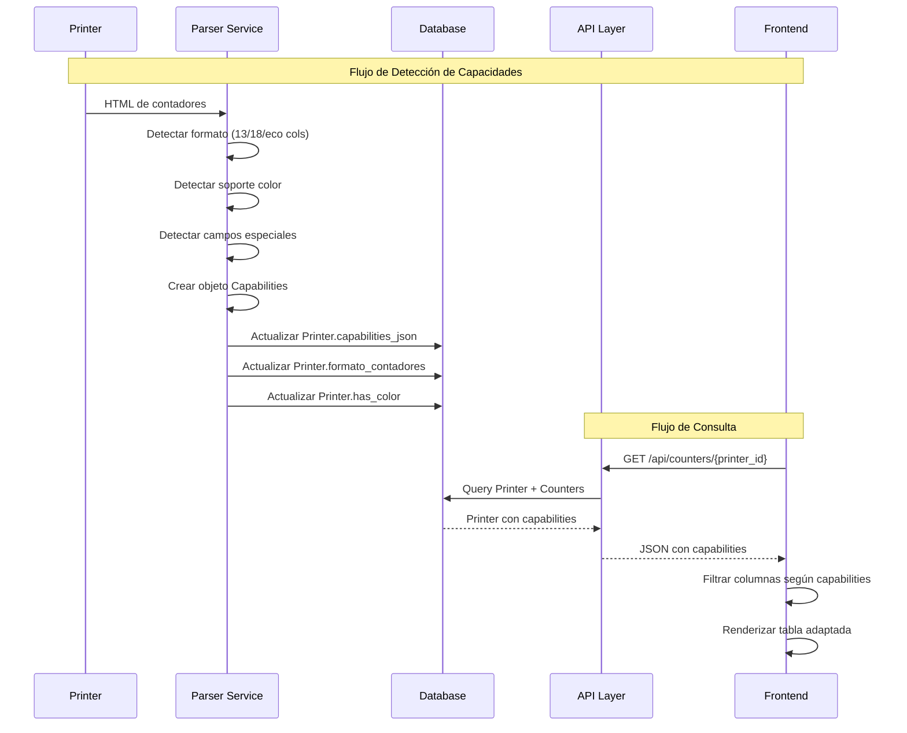

# Design Document: Sistema de Capacidades de Impresora

## Overview

Este documento describe el diseño técnico del sistema de detección automática de capacidades por impresora. El sistema resolverá el problema actual donde el frontend muestra todas las columnas de contadores sin importar las capacidades reales de cada impresora.

### Objetivos del Diseño

- Detectar automáticamente las capacidades de cada impresora al leer sus contadores
- Almacenar las capacidades detectadas en la base de datos de forma persistente
- Exponer las capacidades a través de la API REST existente
- Adaptar el frontend para mostrar solo las columnas relevantes según las capacidades

### Alcance

El diseño cubre:
- Detección de formato de contadores (estándar, simplificado, ecológico)
- Detección de soporte de color y campos especiales
- Almacenamiento en base de datos con migración de datos existentes
- Exposición en API con retrocompatibilidad
- Adaptación de UI en tablas de contadores

## Architecture

### High-Level Architecture

El sistema sigue una arquitectura de tres capas:

```
┌─────────────────────────────────────────────────────────────┐
│                        Frontend (React)                      │
│  ┌──────────────┐  ┌──────────────┐  ┌──────────────┐      │
│  │UserCounter   │  │CierreDetalle │  │Comparacion   │      │
│  │Table         │  │Modal         │  │Modal         │      │
│  └──────────────┘  └──────────────┘  └──────────────┘      │
│         │                  │                  │              │
│         └──────────────────┴──────────────────┘              │
│                            │                                 │
│                   ┌────────▼────────┐                        │
│                   │ColumnVisibility │                        │
│                   │ Logic           │                        │
│                   └─────────────────┘                        │
└─────────────────────────────┬───────────────────────────────┘
                              │ HTTP/JSON
┌─────────────────────────────▼───────────────────────────────┐
│                      API Layer (FastAPI)                     │
│  ┌──────────────┐  ┌──────────────┐  ┌──────────────┐      │
│  │/printers     │  │/counters     │  │/closes       │      │
│  │endpoints     │  │endpoints     │  │endpoints     │      │
│  └──────────────┘  └──────────────┘  └──────────────┘      │
└─────────────────────────────┬───────────────────────────────┘
                              │
┌─────────────────────────────▼───────────────────────────────┐
│                    Service Layer (Python)                    │
│  ┌──────────────────────────────────────────────────┐       │
│  │           Counter Parser Service                 │       │
│  │  ┌──────────────┐  ┌──────────────┐             │       │
│  │  │Format        │  │Capabilities  │             │       │
│  │  │Detector      │  │Detector      │             │       │
│  │  └──────────────┘  └──────────────┘             │       │
│  └──────────────────────────────────────────────────┘       │
└─────────────────────────────┬───────────────────────────────┘
                              │
┌─────────────────────────────▼───────────────────────────────┐
│                   Data Layer (PostgreSQL)                    │
│  ┌──────────────┐  ┌──────────────┐  ┌──────────────┐      │
│  │Printer       │  │ContadorUsuario│ │CierreMensual │      │
│  │(capabilities)│  │              │  │              │      │
│  └──────────────┘  └──────────────┘  └──────────────┘      │
└──────────────────────────────────────────────────────────────┘
```


### Component Interaction Flow



### Design Decisions

1. **Detección Automática vs Manual**: El sistema detecta automáticamente las capacidades, pero permite sobrescritura manual mediante flag `manual_override`

2. **Almacenamiento en JSON**: Las capacidades detalladas se almacenan en un campo JSON para flexibilidad futura sin requerir migraciones de esquema

3. **Retrocompatibilidad**: La API siempre retorna todos los campos de contadores (incluso en 0) para no romper clientes existentes

4. **Detección Basada en Estructura HTML**: El formato se detecta contando columnas en el HTML, no por modelo de impresora, para ser más robusto

5. **Merge de Capacidades**: Al actualizar, se preservan capacidades previamente detectadas y solo se agregan nuevas (no se eliminan)

## Components and Interfaces

### 1. Parser Service

#### CapabilitiesDetector

Responsable de analizar el HTML de contadores y detectar capacidades.

```python
class CapabilitiesDetector:
    """
    Detecta capacidades de impresora analizando HTML de contadores
    """
    
    def detect_format(self, html_content: str) -> str:
        """
        Detecta el formato de contadores basándose en estructura HTML
        
        Args:
            html_content: HTML de getUserCounter.cgi o getEcoCounter.cgi
            
        Returns:
            'estandar' | 'simplificado' | 'ecologico'
        """
        
    def detect_color_support(self, counters_data: dict) -> bool:
        """
        Detecta si la impresora soporta color basándose en valores
        
        Args:
            counters_data: Datos parseados de contadores
            
        Returns:
            True si hay valores > 0 en campos de color
        """
        
    def detect_special_fields(self, counters_data: dict) -> dict:
        """
        Detecta disponibilidad de campos especiales
        
        Args:
            counters_data: Datos parseados de contadores
            
        Returns:
            {
                'has_hojas_2_caras': bool,
                'has_paginas_combinadas': bool,
                'has_mono_color': bool,
                'has_dos_colores': bool
            }
        """
        
    def detect_capabilities(self, html_content: str, 
                          counters_data: dict) -> Capabilities:
        """
        Detecta todas las capacidades de una impresora
        
        Args:
            html_content: HTML crudo
            counters_data: Datos parseados
            
        Returns:
            Objeto Capabilities completo
        """
```


#### FormatDetector Algorithm

```python
def detect_format(html_content: str) -> str:
    """
    Algoritmo de detección de formato:
    
    1. Parsear HTML con BeautifulSoup
    2. Buscar tabla principal (class='adTable' o 'tbl_border')
    3. Encontrar primera fila de datos (sin <th>)
    4. Contar celdas:
       - Si tiene 13 celdas <td> → 'simplificado'
       - Si tiene 18+ celdas con class='listData' → 'estandar'
       - Si URL es getEcoCounter.cgi → 'ecologico'
    5. Retornar formato detectado
    """
    soup = BeautifulSoup(html_content, 'html.parser')
    
    # Detectar si es contador ecológico por URL o estructura
    if 'getEcoCounter' in html_content or 'Uso 2 caras' in html_content:
        return 'ecologico'
    
    # Buscar tabla principal
    table = soup.find('table', class_='adTable')
    if not table:
        table = soup.find('table', class_='tbl_border')
    
    if not table:
        return 'estandar'  # Default seguro
    
    # Analizar primera fila de datos
    rows = table.find_all('tr')
    for row in rows:
        if row.find('th'):  # Skip headers
            continue
        
        cells = row.find_all('td')
        if not cells:
            continue
        
        # Formato simplificado: 13 celdas sin class
        if len(cells) == 13:
            return 'simplificado'
        
        # Formato estándar: 18+ celdas con class='listData'
        cells_with_class = row.find_all('td', class_='listData')
        if len(cells_with_class) >= 18:
            return 'estandar'
        
        break  # Solo analizar primera fila de datos
    
    return 'estandar'  # Default seguro
```

### 2. Data Models

#### Capabilities Data Structure

```python
from typing import Optional
from pydantic import BaseModel

class Capabilities(BaseModel):
    """
    Estructura de datos de capacidades de impresora
    """
    formato_contadores: str  # 'estandar' | 'simplificado' | 'ecologico'
    has_color: bool
    has_hojas_2_caras: bool
    has_paginas_combinadas: bool
    has_mono_color: bool
    has_dos_colores: bool
    detected_at: str  # ISO 8601 timestamp
    manual_override: bool = False
    
    def to_json(self) -> dict:
        """Serializa a JSON para almacenar en DB"""
        return self.model_dump()
    
    @classmethod
    def from_json(cls, data: dict) -> 'Capabilities':
        """Deserializa desde JSON de DB"""
        return cls(**data)
    
    def merge(self, other: 'Capabilities') -> 'Capabilities':
        """
        Merge con otra instancia preservando capacidades detectadas
        
        Regla: Si un campo ya es True, permanece True
        (nunca se "desactiva" una capacidad detectada)
        """
        return Capabilities(
            formato_contadores=other.formato_contadores,
            has_color=self.has_color or other.has_color,
            has_hojas_2_caras=self.has_hojas_2_caras or other.has_hojas_2_caras,
            has_paginas_combinadas=self.has_paginas_combinadas or other.has_paginas_combinadas,
            has_mono_color=self.has_mono_color or other.has_mono_color,
            has_dos_colores=self.has_dos_colores or other.has_dos_colores,
            detected_at=other.detected_at,
            manual_override=self.manual_override
        )
```


#### Database Schema Changes

```sql
-- Migración: Agregar campos de capacidades a tabla printers

ALTER TABLE printers 
ADD COLUMN capabilities_json JSONB DEFAULT NULL;

-- Índice para consultas por capacidades
CREATE INDEX idx_printers_capabilities 
ON printers USING GIN (capabilities_json);

-- Nota: Los campos formato_contadores y has_color ya existen en el modelo actual
-- Solo se agrega capabilities_json para almacenar capacidades detalladas
```

Estructura del campo `capabilities_json`:

```json
{
  "formato_contadores": "estandar",
  "has_color": true,
  "has_hojas_2_caras": true,
  "has_paginas_combinadas": true,
  "has_mono_color": true,
  "has_dos_colores": true,
  "detected_at": "2024-03-15T10:30:00Z",
  "manual_override": false
}
```

### 3. API Layer

#### Printer Schema Extension

```python
from pydantic import BaseModel
from typing import Optional

class CapabilitiesResponse(BaseModel):
    """Schema para respuesta de capacidades en API"""
    formato_contadores: str
    has_color: bool
    has_hojas_2_caras: bool
    has_paginas_combinadas: bool
    has_mono_color: bool
    has_dos_colores: bool
    detected_at: Optional[str] = None
    manual_override: bool = False

class PrinterResponse(BaseModel):
    """Schema extendido de Printer con capacidades"""
    id: int
    hostname: str
    ip_address: str
    location: Optional[str]
    empresa: Optional[str]
    status: str
    detected_model: Optional[str]
    serial_number: Optional[str]
    
    # Capacidades
    formato_contadores: str
    has_color: bool
    capabilities: Optional[CapabilitiesResponse] = None
    
    # ... otros campos existentes
```

#### New API Endpoints

```python
# Endpoint para actualización manual de capacidades
@router.put("/printers/{printer_id}/capabilities")
async def update_printer_capabilities(
    printer_id: int,
    capabilities: CapabilitiesUpdate,
    db: Session = Depends(get_db)
) -> PrinterResponse:
    """
    Actualiza manualmente las capacidades de una impresora
    
    Establece manual_override=True para prevenir sobrescritura automática
    """
    
# Endpoint para obtener capacidades
@router.get("/printers/{printer_id}/capabilities")
async def get_printer_capabilities(
    printer_id: int,
    db: Session = Depends(get_db)
) -> CapabilitiesResponse:
    """
    Obtiene las capacidades de una impresora
    """
```

#### Modified Existing Endpoints

Los siguientes endpoints se modifican para incluir capacidades:

```python
# GET /api/counters/latest/{printer_id}
# Respuesta incluye:
{
  "printer": {
    "id": 1,
    "hostname": "Ricoh-250",
    "formato_contadores": "estandar",
    "has_color": false,
    "capabilities": {
      "has_hojas_2_caras": false,
      "has_paginas_combinadas": false,
      ...
    }
  },
  "counters": [...],
  ...
}

# GET /api/counters/user-counters/{printer_id}
# Similar estructura con capabilities

# GET /api/closes/{cierre_id}
# Similar estructura con capabilities de la impresora
```


### 4. Frontend Layer

#### Column Visibility Logic

```typescript
interface PrinterCapabilities {
  formato_contadores: 'estandar' | 'simplificado' | 'ecologico';
  has_color: boolean;
  has_hojas_2_caras: boolean;
  has_paginas_combinadas: boolean;
  has_mono_color: boolean;
  has_dos_colores: boolean;
}

interface ColumnVisibilityConfig {
  showColorColumns: boolean;
  showHojas2Caras: boolean;
  showPaginasCombinadas: boolean;
  showMonoColor: boolean;
  showDosColores: boolean;
}

function calculateColumnVisibility(
  capabilities: PrinterCapabilities | null
): ColumnVisibilityConfig {
  // Default: mostrar todo si no hay capacidades (retrocompatibilidad)
  if (!capabilities) {
    return {
      showColorColumns: true,
      showHojas2Caras: true,
      showPaginasCombinadas: true,
      showMonoColor: true,
      showDosColores: true
    };
  }
  
  return {
    showColorColumns: capabilities.has_color,
    showHojas2Caras: capabilities.has_hojas_2_caras,
    showPaginasCombinadas: capabilities.has_paginas_combinadas,
    showMonoColor: capabilities.has_mono_color,
    showDosColores: capabilities.has_dos_colores
  };
}
```

#### Table Column Filtering

```typescript
// Ejemplo de aplicación en UserCounterTable

interface CounterColumn {
  key: string;
  label: string;
  group?: 'color' | 'hojas_2_caras' | 'paginas_combinadas' | 'mono_color' | 'dos_colores';
  visible: boolean;
}

function filterColumns(
  allColumns: CounterColumn[],
  visibility: ColumnVisibilityConfig
): CounterColumn[] {
  return allColumns.map(col => ({
    ...col,
    visible: shouldShowColumn(col, visibility)
  }));
}

function shouldShowColumn(
  column: CounterColumn,
  visibility: ColumnVisibilityConfig
): boolean {
  switch (column.group) {
    case 'color':
      return visibility.showColorColumns;
    case 'hojas_2_caras':
      return visibility.showHojas2Caras;
    case 'paginas_combinadas':
      return visibility.showPaginasCombinadas;
    case 'mono_color':
      return visibility.showMonoColor;
    case 'dos_colores':
      return visibility.showDosColores;
    default:
      return true; // Columnas sin grupo siempre visibles
  }
}

function shouldShowGroupHeader(
  group: string,
  columns: CounterColumn[]
): boolean {
  // Ocultar encabezado si todas las columnas del grupo están ocultas
  const groupColumns = columns.filter(col => col.group === group);
  return groupColumns.some(col => col.visible);
}
```

#### Component Integration

```typescript
// UserCounterTable.tsx
function UserCounterTable({ printerId }: Props) {
  const { data } = useQuery(['user-counters', printerId], 
    () => fetchUserCounters(printerId)
  );
  
  const visibility = calculateColumnVisibility(data?.printer?.capabilities);
  const visibleColumns = filterColumns(ALL_COLUMNS, visibility);
  
  return (
    <Table>
      <TableHeader>
        {COLUMN_GROUPS.map(group => 
          shouldShowGroupHeader(group, visibleColumns) && (
            <GroupHeader key={group}>{group}</GroupHeader>
          )
        )}
      </TableHeader>
      <TableBody>
        {data?.counters.map(counter => (
          <TableRow key={counter.id}>
            {visibleColumns.filter(col => col.visible).map(col => (
              <TableCell key={col.key}>{counter[col.key]}</TableCell>
            ))}
          </TableRow>
        ))}
      </TableBody>
    </Table>
  );
}
```

## Data Models

### Printer Model (Extended)

```python
class Printer(Base):
    __tablename__ = "printers"
    
    # ... campos existentes ...
    
    # Campos de capacidades (existentes)
    formato_contadores = Column(String(50), default='estandar', nullable=False)
    has_color = Column(Boolean, default=False)
    
    # Nuevo campo para capacidades detalladas
    capabilities_json = Column(JSONB, nullable=True)
    
    @property
    def capabilities(self) -> Optional[Capabilities]:
        """Deserializa capabilities_json a objeto Capabilities"""
        if self.capabilities_json:
            return Capabilities.from_json(self.capabilities_json)
        return None
    
    def update_capabilities(self, new_caps: Capabilities, manual: bool = False):
        """
        Actualiza capacidades con merge inteligente
        
        Args:
            new_caps: Nuevas capacidades detectadas
            manual: Si es actualización manual (establece override)
        """
        if manual:
            new_caps.manual_override = True
            self.capabilities_json = new_caps.to_json()
        else:
            # No actualizar si hay override manual
            if self.capabilities and self.capabilities.manual_override:
                return
            
            # Merge con capacidades existentes
            if self.capabilities:
                merged = self.capabilities.merge(new_caps)
                self.capabilities_json = merged.to_json()
            else:
                self.capabilities_json = new_caps.to_json()
        
        # Actualizar campos legacy para retrocompatibilidad
        self.formato_contadores = new_caps.formato_contadores
        self.has_color = new_caps.has_color
```


### Counter Service Integration

```python
class CounterService:
    """
    Servicio para lectura y procesamiento de contadores
    Integra detección de capacidades
    """
    
    def __init__(self, db: Session):
        self.db = db
        self.capabilities_detector = CapabilitiesDetector()
    
    async def read_user_counters(self, printer: Printer) -> dict:
        """
        Lee contadores de usuario y detecta capacidades
        
        Flow:
        1. Obtener HTML de la impresora
        2. Parsear contadores
        3. Detectar capacidades
        4. Actualizar base de datos
        5. Retornar datos
        """
        # 1. Obtener HTML
        html_content = await self._fetch_counter_html(printer)
        
        # 2. Parsear según formato conocido
        if printer.usar_contador_ecologico:
            counters_data = parse_eco_counter_html(html_content)
        else:
            counters_data = parse_user_counter_html(html_content)
        
        # 3. Detectar capacidades
        capabilities = self.capabilities_detector.detect_capabilities(
            html_content, 
            counters_data
        )
        
        # 4. Actualizar printer con capacidades detectadas
        printer.update_capabilities(capabilities, manual=False)
        self.db.commit()
        
        # 5. Validar consistencia
        self._validate_consistency(printer, counters_data)
        
        # 6. Guardar contadores en DB
        self._save_counters(printer.id, counters_data)
        
        return {
            'printer': printer,
            'counters': counters_data,
            'capabilities': capabilities
        }
    
    def _validate_consistency(self, printer: Printer, counters_data: dict):
        """
        Valida consistencia entre capacidades y datos
        
        Registra advertencias si:
        - has_color=False pero hay valores de color > 0
        - Formato detectado difiere del almacenado
        """
        caps = printer.capabilities
        if not caps:
            return
        
        # Validar color
        has_color_values = self._check_color_values(counters_data)
        if has_color_values and not caps.has_color:
            logger.warning(
                f"Inconsistencia en printer {printer.id}: "
                f"valores de color > 0 pero has_color=False"
            )
            # Incrementar contador de inconsistencias
            self._increment_inconsistency_counter(printer.id)
        
        # Validar formato
        detected_format = self.capabilities_detector.detect_format(
            counters_data.get('html_content', '')
        )
        if detected_format != caps.formato_contadores:
            logger.warning(
                f"Formato cambió en printer {printer.id}: "
                f"{caps.formato_contadores} -> {detected_format}"
            )
            # Actualizar formato si no hay override manual
            if not caps.manual_override:
                caps.formato_contadores = detected_format
                printer.update_capabilities(caps, manual=False)
```

## Correctness Properties

*A property is a characteristic or behavior that should hold true across all valid executions of a system-essentially, a formal statement about what the system should do. Properties serve as the bridge between human-readable specifications and machine-verifiable correctness guarantees.*

### Property 1: Format Detection Consistency

*For any* HTML de contadores con estructura válida, detectar el formato y luego verificar que el formato detectado corresponda al número de columnas en el HTML.

**Validates: Requirements 1.1, 1.2, 1.3, 1.4**

### Property 2: Color Support Detection

*For any* conjunto de datos de contadores, si existen valores mayores a 0 en campos de color (copiadora_color, impresora_color, etc.), entonces has_color debe ser True.

**Validates: Requirements 1.5**

### Property 3: Special Fields Detection

*For any* conjunto de datos de contadores, si existen valores mayores a 0 en campos especiales (hojas_2_caras, paginas_combinadas), entonces los campos correspondientes en capabilities deben ser True.

**Validates: Requirements 1.6**

### Property 4: Capabilities Structure Completeness

*For any* HTML válido de contadores, el parser debe retornar un objeto Capabilities con todos los campos requeridos (formato_contadores, has_color, has_hojas_2_caras, has_paginas_combinadas, has_mono_color, has_dos_colores, detected_at).

**Validates: Requirements 1.7**

### Property 5: Database Persistence

*For any* detección de capacidades, los campos formato_contadores y has_color en el modelo Printer deben actualizarse para reflejar las capacidades detectadas.

**Validates: Requirements 2.1, 2.2**

### Property 6: JSON Serialization Round-Trip

*For any* objeto Capabilities válido, serializar a JSON y luego deserializar debe producir un objeto equivalente.

**Validates: Requirements 2.4, 10.6**

### Property 7: Capabilities Merge Preservation

*For any* par de objetos Capabilities (existente, nuevo), al hacer merge, si un campo booleano es True en el existente, debe permanecer True en el resultado.

**Validates: Requirements 2.5**

### Property 8: Timestamp Recording

*For any* actualización de capacidades, el campo updated_at del modelo Printer debe actualizarse con la fecha/hora actual.

**Validates: Requirements 2.6**

### Property 9: API Response Includes Capabilities

*For any* respuesta de API que incluya información de impresora, debe contener los campos formato_contadores, has_color y el objeto capabilities.

**Validates: Requirements 3.1, 3.2, 3.3**

### Property 10: Counter Responses Include Printer Capabilities

*For any* respuesta de API de contadores de usuario o cierres mensuales, debe incluir las capacidades de la impresora asociada.

**Validates: Requirements 3.4, 3.5**


### Property 11: Frontend Column Visibility

*For any* objeto de capacidades con has_color=False, las columnas relacionadas con color en el frontend deben estar ocultas (visible=false).

**Validates: Requirements 4.1**

### Property 12: Frontend Special Fields Visibility

*For any* objeto de capacidades donde has_hojas_2_caras=False o has_paginas_combinadas=False, las columnas correspondientes deben estar ocultas.

**Validates: Requirements 4.2, 4.3**

### Property 13: Frontend Mono/Dos Colores Visibility

*For any* objeto de capacidades donde has_mono_color=False y has_dos_colores=False, las columnas de mono_color y dos_colores deben estar ocultas.

**Validates: Requirements 4.4**

### Property 14: Group Header Visibility

*For any* grupo de columnas donde todas las columnas están ocultas, el encabezado del grupo debe estar oculto.

**Validates: Requirements 4.8**

### Property 15: Migration Script Updates

*For any* impresora con IP conocida en el script de migración, ejecutar el script debe actualizar formato_contadores según la configuración especificada.

**Validates: Requirements 5.2**

### Property 16: Migration Logging

*For any* impresora actualizada por el script de migración, debe existir un registro en logs con la información de la actualización.

**Validates: Requirements 5.8**

### Property 17: Inconsistency Detection and Logging

*For any* detección de valores de color > 0 cuando has_color=False, el sistema debe registrar una advertencia en logs.

**Validates: Requirements 6.1**

### Property 18: Format Change Detection

*For any* detección de formato diferente al almacenado, el sistema debe actualizar el formato y registrar el cambio en logs.

**Validates: Requirements 6.2**

### Property 19: Counter Validation

*For any* respuesta de API con contadores, los campos no nulos deben corresponder con las capacidades declaradas de la impresora.

**Validates: Requirements 6.3**

### Property 20: Inconsistency Counter Increment

*For any* inconsistencia detectada, el contador de inconsistencias de la impresora debe incrementarse.

**Validates: Requirements 6.5**

### Property 21: Manual Update Validation

*For any* actualización manual de capacidades, el sistema debe validar que formato_contadores sea uno de los valores permitidos ('estandar', 'simplificado', 'ecologico').

**Validates: Requirements 7.2**

### Property 22: Manual Update Logging

*For any* actualización manual de capacidades, debe registrarse en logs con el usuario que realizó la actualización.

**Validates: Requirements 7.3**

### Property 23: Manual Override Flag

*For any* actualización manual de capacidades, el campo manual_override debe establecerse en True.

**Validates: Requirements 7.5**

### Property 24: Manual Override Protection

*For any* impresora con manual_override=True, las actualizaciones automáticas de capacidades no deben modificar las capacidades.

**Validates: Requirements 7.6**

### Property 25: Default Capabilities Fallback

*For any* impresora sin capacidades detectadas, la API debe retornar valores por defecto seguros (mostrar todas las columnas).

**Validates: Requirements 9.1**

### Property 26: Complete Counter Fields

*For any* respuesta de API con contadores, todos los campos de contadores deben estar presentes incluso si su valor es 0.

**Validates: Requirements 9.2**

### Property 27: Frontend Default Behavior

*For any* respuesta de API sin información de capacidades, el frontend debe mostrar todas las columnas como comportamiento por defecto.

**Validates: Requirements 9.3**

### Property 28: Parser Robustness

*For any* impresora sin capacidades configuradas, el parser debe funcionar normalmente y retornar datos de contadores válidos.

**Validates: Requirements 9.5**


## Error Handling

### Parser Errors

```python
class CapabilitiesDetectionError(Exception):
    """Error durante detección de capacidades"""
    pass

class InvalidFormatError(CapabilitiesDetectionError):
    """Formato de HTML no reconocido"""
    pass

class InconsistentDataError(CapabilitiesDetectionError):
    """Datos inconsistentes detectados"""
    pass
```

### Error Handling Strategy

1. **HTML Parsing Failures**
   - Si el HTML no puede parsearse, retornar formato 'estandar' por defecto
   - Registrar error en logs con detalles del HTML
   - No fallar la operación completa

2. **Format Detection Ambiguity**
   - Si el número de columnas no coincide con ningún formato conocido, usar 'estandar'
   - Registrar advertencia para revisión manual
   - Continuar con procesamiento

3. **Inconsistent Capabilities**
   - Registrar inconsistencias en logs
   - Incrementar contador de inconsistencias
   - Si se detectan 3 inconsistencias consecutivas, enviar notificación
   - No bloquear operación

4. **Database Update Failures**
   - Usar transacciones para garantizar atomicidad
   - Rollback en caso de error
   - Retornar error HTTP 500 con mensaje descriptivo
   - Registrar stack trace completo

5. **API Validation Errors**
   - Validar formato_contadores contra enum permitido
   - Retornar HTTP 400 con mensaje de error claro
   - No modificar base de datos

### Logging Strategy

```python
import logging

logger = logging.getLogger('capabilities')

# Niveles de logging:
# - DEBUG: Detalles de detección (columnas encontradas, valores analizados)
# - INFO: Capacidades detectadas exitosamente
# - WARNING: Inconsistencias detectadas, formato ambiguo
# - ERROR: Fallos en parsing, errores de DB
# - CRITICAL: Múltiples inconsistencias consecutivas

# Ejemplo:
logger.info(
    f"Capacidades detectadas para printer {printer_id}: "
    f"formato={caps.formato_contadores}, has_color={caps.has_color}"
)

logger.warning(
    f"Inconsistencia en printer {printer_id}: "
    f"valores color > 0 pero has_color=False. "
    f"Contador inconsistencias: {count}"
)
```

### Notification System

```python
class InconsistencyNotifier:
    """
    Sistema de notificaciones para inconsistencias
    """
    
    THRESHOLD = 3  # Notificar después de 3 inconsistencias
    
    def check_and_notify(self, printer_id: int, inconsistency_count: int):
        """
        Verifica si se debe enviar notificación
        """
        if inconsistency_count >= self.THRESHOLD:
            self._send_notification(printer_id, inconsistency_count)
    
    def _send_notification(self, printer_id: int, count: int):
        """
        Envía notificación al administrador
        
        Métodos:
        - Email
        - Log crítico
        - Webhook (futuro)
        """
        logger.critical(
            f"ALERTA: Printer {printer_id} tiene {count} inconsistencias "
            f"consecutivas. Requiere revisión manual."
        )
        # TODO: Implementar envío de email
```

## Testing Strategy

### Dual Testing Approach

El sistema utilizará dos tipos de tests complementarios:

1. **Unit Tests**: Para casos específicos, ejemplos concretos y edge cases
2. **Property-Based Tests**: Para verificar propiedades universales con datos generados

### Unit Testing

Los unit tests se enfocarán en:

- Casos específicos de formato (13 columnas = simplificado, 18+ = estándar)
- Ejemplos concretos de detección de color
- Edge cases (HTML vacío, tabla sin datos, valores negativos)
- Integración entre componentes
- Errores y excepciones

```python
# Ejemplo de unit test
def test_detect_format_simplificado():
    """Verifica detección de formato simplificado con 13 columnas"""
    html = load_test_html('252_simplificado.html')
    detector = CapabilitiesDetector()
    
    formato = detector.detect_format(html)
    
    assert formato == 'simplificado'

def test_detect_color_support_with_color_values():
    """Verifica detección de color cuando hay valores > 0"""
    counters = {
        'users': [
            {'copiadora_color': 100, 'impresora_color': 50}
        ]
    }
    detector = CapabilitiesDetector()
    
    has_color = detector.detect_color_support(counters)
    
    assert has_color is True
```


### Property-Based Testing

Los property tests verificarán propiedades universales usando generación de datos aleatorios.

**Framework**: Utilizaremos `hypothesis` para Python y `fast-check` para TypeScript.

**Configuración**: Mínimo 100 iteraciones por test para cobertura adecuada.

```python
from hypothesis import given, strategies as st
import hypothesis

# Configuración global
hypothesis.settings.register_profile("ci", max_examples=100)
hypothesis.settings.load_profile("ci")

# Estrategias de generación
@st.composite
def html_counter_strategy(draw):
    """Genera HTML de contadores aleatorio"""
    num_columns = draw(st.sampled_from([13, 18, 20, 22]))
    num_rows = draw(st.integers(min_value=1, max_value=50))
    
    # Generar HTML con estructura válida
    # ...
    return html

@st.composite
def capabilities_strategy(draw):
    """Genera objeto Capabilities aleatorio"""
    return Capabilities(
        formato_contadores=draw(st.sampled_from(['estandar', 'simplificado', 'ecologico'])),
        has_color=draw(st.booleans()),
        has_hojas_2_caras=draw(st.booleans()),
        has_paginas_combinadas=draw(st.booleans()),
        has_mono_color=draw(st.booleans()),
        has_dos_colores=draw(st.booleans()),
        detected_at=draw(st.datetimes()).isoformat(),
        manual_override=draw(st.booleans())
    )

# Property Test 1: JSON Round-Trip
@given(capabilities_strategy())
def test_property_json_roundtrip(caps):
    """
    Feature: sistema-capacidades-impresora
    Property 6: For any objeto Capabilities válido, serializar a JSON 
    y luego deserializar debe producir un objeto equivalente
    """
    json_data = caps.to_json()
    restored = Capabilities.from_json(json_data)
    
    assert restored == caps

# Property Test 2: Capabilities Merge Preservation
@given(capabilities_strategy(), capabilities_strategy())
def test_property_merge_preserves_true_values(existing, new):
    """
    Feature: sistema-capacidades-impresora
    Property 7: For any par de objetos Capabilities, al hacer merge, 
    si un campo booleano es True en el existente, debe permanecer True
    """
    merged = existing.merge(new)
    
    # Verificar que campos True se preservan
    if existing.has_color:
        assert merged.has_color is True
    if existing.has_hojas_2_caras:
        assert merged.has_hojas_2_caras is True
    if existing.has_paginas_combinadas:
        assert merged.has_paginas_combinadas is True
    if existing.has_mono_color:
        assert merged.has_mono_color is True
    if existing.has_dos_colores:
        assert merged.has_dos_colores is True

# Property Test 3: Color Detection
@given(st.lists(st.integers(min_value=0, max_value=10000), min_size=1))
def test_property_color_detection(color_values):
    """
    Feature: sistema-capacidades-impresora
    Property 2: For any conjunto de valores de color, si alguno es > 0,
    entonces has_color debe ser True
    """
    counters = {
        'users': [
            {
                'copiadora_color': color_values[0] if len(color_values) > 0 else 0,
                'impresora_color': color_values[1] if len(color_values) > 1 else 0,
            }
        ]
    }
    
    detector = CapabilitiesDetector()
    has_color = detector.detect_color_support(counters)
    
    has_any_color = any(v > 0 for v in color_values)
    assert has_color == has_any_color

# Property Test 4: API Response Completeness
@given(st.integers(min_value=1, max_value=1000))
def test_property_api_includes_capabilities(printer_id):
    """
    Feature: sistema-capacidades-impresora
    Property 9: For any respuesta de API con impresora, debe incluir
    formato_contadores, has_color y capabilities
    """
    # Mock API call
    response = api_client.get(f'/api/printers/{printer_id}')
    
    assert 'formato_contadores' in response
    assert 'has_color' in response
    assert 'capabilities' in response
    
    if response['capabilities']:
        assert 'has_hojas_2_caras' in response['capabilities']
        assert 'has_paginas_combinadas' in response['capabilities']

# Property Test 5: Frontend Column Visibility
@given(capabilities_strategy())
def test_property_frontend_hides_color_columns(caps):
    """
    Feature: sistema-capacidades-impresora
    Property 11: For any capacidades con has_color=False, 
    las columnas de color deben estar ocultas
    """
    visibility = calculateColumnVisibility(caps)
    
    if not caps.has_color:
        assert visibility.showColorColumns is False
    
    if not caps.has_hojas_2_caras:
        assert visibility.showHojas2Caras is False
    
    if not caps.has_paginas_combinadas:
        assert visibility.showPaginasCombinadas is False
```

### Integration Tests

```python
def test_integration_full_flow():
    """
    Test de integración del flujo completo:
    1. Leer HTML de impresora
    2. Detectar capacidades
    3. Guardar en DB
    4. Consultar via API
    5. Verificar respuesta
    """
    # Setup
    printer = create_test_printer()
    html = load_test_html('251_estandar.html')
    
    # 1. Procesar contadores
    service = CounterService(db)
    result = service.read_user_counters(printer)
    
    # 2. Verificar capacidades detectadas
    assert result['capabilities'].formato_contadores == 'estandar'
    assert result['capabilities'].has_color is True
    
    # 3. Verificar persistencia en DB
    db.refresh(printer)
    assert printer.formato_contadores == 'estandar'
    assert printer.has_color is True
    assert printer.capabilities_json is not None
    
    # 4. Verificar API
    response = client.get(f'/api/counters/latest/{printer.id}')
    assert response.status_code == 200
    assert response.json()['printer']['capabilities'] is not None
```

### Test Coverage Goals

- **Unit Tests**: 80% code coverage mínimo
- **Property Tests**: 100 iteraciones por propiedad
- **Integration Tests**: Cubrir todos los flujos principales
- **E2E Tests**: Verificar UI con diferentes capacidades


## Implementation Details

### Migration Script

```python
#!/usr/bin/env python3
"""
Script de migración para actualizar capacidades de impresoras existentes
"""
from backend.db.database import SessionLocal
from backend.db.models import Printer
from datetime import datetime
import logging

logging.basicConfig(level=logging.INFO)
logger = logging.getLogger(__name__)

# Configuración conocida de impresoras
KNOWN_PRINTERS = {
    '192.168.91.250': {
        'formato_contadores': 'estandar',
        'has_color': False,
        'has_hojas_2_caras': False,
        'has_paginas_combinadas': False,
        'has_mono_color': False,
        'has_dos_colores': False
    },
    '192.168.91.251': {
        'formato_contadores': 'estandar',
        'has_color': True,
        'has_hojas_2_caras': True,
        'has_paginas_combinadas': True,
        'has_mono_color': True,
        'has_dos_colores': True
    },
    '192.168.91.252': {
        'formato_contadores': 'simplificado',
        'has_color': False,
        'has_hojas_2_caras': True,
        'has_paginas_combinadas': True,
        'has_mono_color': False,
        'has_dos_colores': False
    },
    '192.168.91.253': {
        'formato_contadores': 'ecologico',
        'has_color': False,
        'has_hojas_2_caras': False,
        'has_paginas_combinadas': False,
        'has_mono_color': False,
        'has_dos_colores': False
    },
    '192.168.110.250': {
        'formato_contadores': 'estandar',
        'has_color': False,
        'has_hojas_2_caras': False,
        'has_paginas_combinadas': False,
        'has_mono_color': False,
        'has_dos_colores': False
    }
}

def migrate_printer_capabilities():
    """
    Migra capacidades de impresoras existentes
    """
    db = SessionLocal()
    
    try:
        updated_count = 0
        
        for ip, config in KNOWN_PRINTERS.items():
            printer = db.query(Printer).filter(
                Printer.ip_address == ip
            ).first()
            
            if not printer:
                logger.warning(f"Impresora {ip} no encontrada en DB")
                continue
            
            # Crear objeto Capabilities
            capabilities = Capabilities(
                formato_contadores=config['formato_contadores'],
                has_color=config['has_color'],
                has_hojas_2_caras=config['has_hojas_2_caras'],
                has_paginas_combinadas=config['has_paginas_combinadas'],
                has_mono_color=config['has_mono_color'],
                has_dos_colores=config['has_dos_colores'],
                detected_at=datetime.utcnow().isoformat(),
                manual_override=False
            )
            
            # Actualizar printer
            printer.update_capabilities(capabilities, manual=False)
            
            logger.info(
                f"✅ Actualizada impresora {ip} ({printer.hostname}): "
                f"formato={config['formato_contadores']}, "
                f"has_color={config['has_color']}"
            )
            
            updated_count += 1
        
        db.commit()
        
        logger.info(f"\n{'='*60}")
        logger.info(f"Migración completada: {updated_count} impresoras actualizadas")
        logger.info(f"{'='*60}")
        
    except Exception as e:
        logger.error(f"Error durante migración: {e}")
        db.rollback()
        raise
    finally:
        db.close()

if __name__ == "__main__":
    migrate_printer_capabilities()
```

### Database Migration

```python
"""
Alembic migration: Add capabilities_json to printers

Revision ID: 010_add_capabilities_json
"""
from alembic import op
import sqlalchemy as sa
from sqlalchemy.dialects.postgresql import JSONB

def upgrade():
    # Agregar columna capabilities_json
    op.add_column(
        'printers',
        sa.Column('capabilities_json', JSONB, nullable=True)
    )
    
    # Crear índice GIN para búsquedas en JSON
    op.create_index(
        'idx_printers_capabilities',
        'printers',
        ['capabilities_json'],
        postgresql_using='gin'
    )

def downgrade():
    op.drop_index('idx_printers_capabilities', table_name='printers')
    op.drop_column('printers', 'capabilities_json')
```

### API Implementation Example

```python
# backend/api/printers.py

from fastapi import APIRouter, Depends, HTTPException
from sqlalchemy.orm import Session
from backend.db.database import get_db
from backend.db.models import Printer
from backend.services.capabilities import CapabilitiesDetector
import logging

router = APIRouter()
logger = logging.getLogger(__name__)

@router.put("/printers/{printer_id}/capabilities")
async def update_printer_capabilities(
    printer_id: int,
    capabilities: CapabilitiesUpdate,
    db: Session = Depends(get_db)
):
    """
    Actualiza manualmente las capacidades de una impresora
    
    Establece manual_override=True para prevenir sobrescritura automática
    """
    printer = db.query(Printer).filter(Printer.id == printer_id).first()
    
    if not printer:
        raise HTTPException(status_code=404, detail="Impresora no encontrada")
    
    # Validar formato
    valid_formats = ['estandar', 'simplificado', 'ecologico']
    if capabilities.formato_contadores not in valid_formats:
        raise HTTPException(
            status_code=400,
            detail=f"Formato inválido. Debe ser uno de: {valid_formats}"
        )
    
    # Crear objeto Capabilities
    caps = Capabilities(
        formato_contadores=capabilities.formato_contadores,
        has_color=capabilities.has_color,
        has_hojas_2_caras=capabilities.has_hojas_2_caras,
        has_paginas_combinadas=capabilities.has_paginas_combinadas,
        has_mono_color=capabilities.has_mono_color,
        has_dos_colores=capabilities.has_dos_colores,
        detected_at=datetime.utcnow().isoformat(),
        manual_override=True
    )
    
    # Actualizar con override manual
    printer.update_capabilities(caps, manual=True)
    db.commit()
    
    # Log de auditoría
    logger.info(
        f"Capacidades actualizadas manualmente para printer {printer_id} "
        f"por usuario [TODO: obtener usuario de sesión]"
    )
    
    return PrinterResponse.from_orm(printer)

@router.get("/printers/{printer_id}/capabilities")
async def get_printer_capabilities(
    printer_id: int,
    db: Session = Depends(get_db)
):
    """
    Obtiene las capacidades de una impresora
    """
    printer = db.query(Printer).filter(Printer.id == printer_id).first()
    
    if not printer:
        raise HTTPException(status_code=404, detail="Impresora no encontrada")
    
    if not printer.capabilities:
        # Retornar valores por defecto seguros
        return CapabilitiesResponse(
            formato_contadores='estandar',
            has_color=True,
            has_hojas_2_caras=True,
            has_paginas_combinadas=True,
            has_mono_color=True,
            has_dos_colores=True,
            detected_at=None,
            manual_override=False
        )
    
    return CapabilitiesResponse(**printer.capabilities.to_json())
```


### Frontend Implementation Example

```typescript
// src/hooks/useColumnVisibility.ts

import { useMemo } from 'react';
import { PrinterCapabilities } from '@/types/printer';

export interface ColumnVisibilityConfig {
  showColorColumns: boolean;
  showHojas2Caras: boolean;
  showPaginasCombinadas: boolean;
  showMonoColor: boolean;
  showDosColores: boolean;
}

export function useColumnVisibility(
  capabilities: PrinterCapabilities | null | undefined
): ColumnVisibilityConfig {
  return useMemo(() => {
    // Default: mostrar todo si no hay capacidades (retrocompatibilidad)
    if (!capabilities) {
      return {
        showColorColumns: true,
        showHojas2Caras: true,
        showPaginasCombinadas: true,
        showMonoColor: true,
        showDosColores: true
      };
    }
    
    return {
      showColorColumns: capabilities.has_color,
      showHojas2Caras: capabilities.has_hojas_2_caras,
      showPaginasCombinadas: capabilities.has_paginas_combinadas,
      showMonoColor: capabilities.has_mono_color,
      showDosColores: capabilities.has_dos_colores
    };
  }, [capabilities]);
}

// src/components/counters/UserCounterTable.tsx

import { useColumnVisibility } from '@/hooks/useColumnVisibility';

interface Column {
  key: string;
  label: string;
  group?: 'color' | 'hojas_2_caras' | 'paginas_combinadas' | 'mono_color' | 'dos_colores';
}

const ALL_COLUMNS: Column[] = [
  { key: 'codigo_usuario', label: 'Código' },
  { key: 'nombre_usuario', label: 'Nombre' },
  { key: 'total_bn', label: 'Total B/N' },
  { key: 'total_color', label: 'Total Color', group: 'color' },
  { key: 'copiadora_bn', label: 'Copiadora B/N' },
  { key: 'copiadora_color', label: 'Copiadora Color', group: 'color' },
  { key: 'copiadora_mono_color', label: 'Mono Color', group: 'mono_color' },
  { key: 'copiadora_dos_colores', label: 'Dos Colores', group: 'dos_colores' },
  { key: 'copiadora_hojas_2_caras', label: 'Hojas 2 Caras', group: 'hojas_2_caras' },
  { key: 'copiadora_paginas_combinadas', label: 'Págs. Combinadas', group: 'paginas_combinadas' },
  // ... más columnas
];

export function UserCounterTable({ printerId }: { printerId: number }) {
  const { data, isLoading } = useQuery(
    ['user-counters', printerId],
    () => fetchUserCounters(printerId)
  );
  
  const visibility = useColumnVisibility(data?.printer?.capabilities);
  
  const visibleColumns = useMemo(() => {
    return ALL_COLUMNS.filter(col => {
      if (!col.group) return true; // Columnas sin grupo siempre visibles
      
      switch (col.group) {
        case 'color':
          return visibility.showColorColumns;
        case 'hojas_2_caras':
          return visibility.showHojas2Caras;
        case 'paginas_combinadas':
          return visibility.showPaginasCombinadas;
        case 'mono_color':
          return visibility.showMonoColor;
        case 'dos_colores':
          return visibility.showDosColores;
        default:
          return true;
      }
    });
  }, [visibility]);
  
  if (isLoading) return <LoadingSpinner />;
  
  return (
    <Table>
      <TableHeader>
        <TableRow>
          {visibleColumns.map(col => (
            <TableHead key={col.key}>{col.label}</TableHead>
          ))}
        </TableRow>
      </TableHeader>
      <TableBody>
        {data?.counters.map(counter => (
          <TableRow key={counter.codigo_usuario}>
            {visibleColumns.map(col => (
              <TableCell key={col.key}>
                {counter[col.key]}
              </TableCell>
            ))}
          </TableRow>
        ))}
      </TableBody>
    </Table>
  );
}
```

## Deployment Considerations

### Rollout Strategy

1. **Phase 1: Backend Implementation**
   - Implementar CapabilitiesDetector
   - Agregar campo capabilities_json a DB
   - Ejecutar script de migración de datos
   - Desplegar backend con detección automática

2. **Phase 2: API Extension**
   - Agregar endpoints de capacidades
   - Modificar endpoints existentes para incluir capabilities
   - Mantener retrocompatibilidad completa
   - Desplegar API actualizada

3. **Phase 3: Frontend Adaptation**
   - Implementar lógica de visibilidad de columnas
   - Actualizar componentes de tablas
   - Testing exhaustivo con diferentes capacidades
   - Desplegar frontend

4. **Phase 4: Monitoring & Validation**
   - Monitorear logs de inconsistencias
   - Validar detección automática
   - Ajustar configuraciones según necesidad
   - Documentar casos especiales

### Rollback Plan

Si se detectan problemas:

1. **Frontend**: Revertir a mostrar todas las columnas (comportamiento actual)
2. **API**: Capabilities es opcional, clientes antiguos siguen funcionando
3. **Backend**: Detección de capacidades no afecta lectura de contadores
4. **Database**: Campo capabilities_json es nullable, puede eliminarse sin pérdida de datos

### Performance Considerations

- **Detección de Capacidades**: Overhead mínimo (~10ms) durante lectura de contadores
- **Database**: Índice GIN en capabilities_json para búsquedas eficientes
- **API**: Serialización de JSON es rápida, sin impacto perceptible
- **Frontend**: Cálculo de visibilidad es memoizado, sin re-renders innecesarios

### Monitoring

Métricas a monitorear:

- Número de inconsistencias detectadas por día
- Distribución de formatos detectados
- Tiempo de detección de capacidades
- Errores en parsing de HTML
- Actualizaciones manuales de capacidades

## Documentation Requirements

### Code Documentation

Cada componente debe incluir:

- Docstrings con descripción, parámetros y retorno
- Ejemplos de uso
- Notas sobre edge cases
- Referencias a requisitos

### API Documentation

Actualizar OpenAPI/Swagger con:

- Nuevos endpoints de capacidades
- Schemas de CapabilitiesResponse
- Ejemplos de respuestas
- Códigos de error

### User Documentation

Crear guías para:

- Interpretación de capacidades detectadas
- Actualización manual de capacidades
- Troubleshooting de inconsistencias
- FAQ sobre columnas ocultas

## Future Enhancements

### Potential Improvements

1. **Machine Learning**: Entrenar modelo para predecir capacidades basándose en modelo de impresora
2. **Auto-correction**: Corregir automáticamente inconsistencias después de N detecciones
3. **Capacity Planning**: Analizar uso de capacidades para recomendaciones de hardware
4. **Advanced Notifications**: Integrar con Slack/Teams para alertas en tiempo real
5. **Audit Trail**: Historial completo de cambios de capacidades con diffs

### Extensibility Points

- **New Formats**: Agregar nuevos formatos de contadores sin cambiar estructura
- **Custom Capabilities**: Permitir capacidades personalizadas por organización
- **Validation Rules**: Reglas configurables de validación de consistencia
- **Export/Import**: Exportar/importar configuraciones de capacidades

## Conclusion

Este diseño proporciona una solución robusta y extensible para el sistema de capacidades de impresora. La arquitectura de tres capas con detección automática, almacenamiento persistente y adaptación de UI garantiza que el sistema sea mantenible y escalable.

Los puntos clave del diseño son:

- **Detección Automática**: Reduce configuración manual y errores
- **Retrocompatibilidad**: No rompe funcionalidad existente
- **Flexibilidad**: Permite override manual cuando sea necesario
- **Validación**: Detecta y reporta inconsistencias
- **Testing**: Estrategia dual de unit y property tests

El sistema está listo para implementación siguiendo las especificaciones de este documento.
