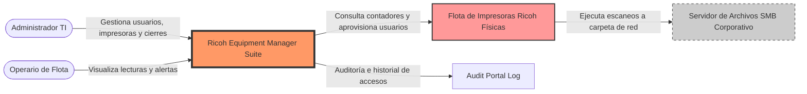
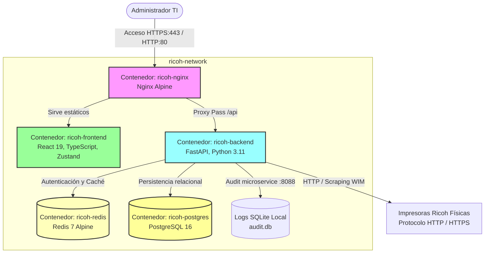
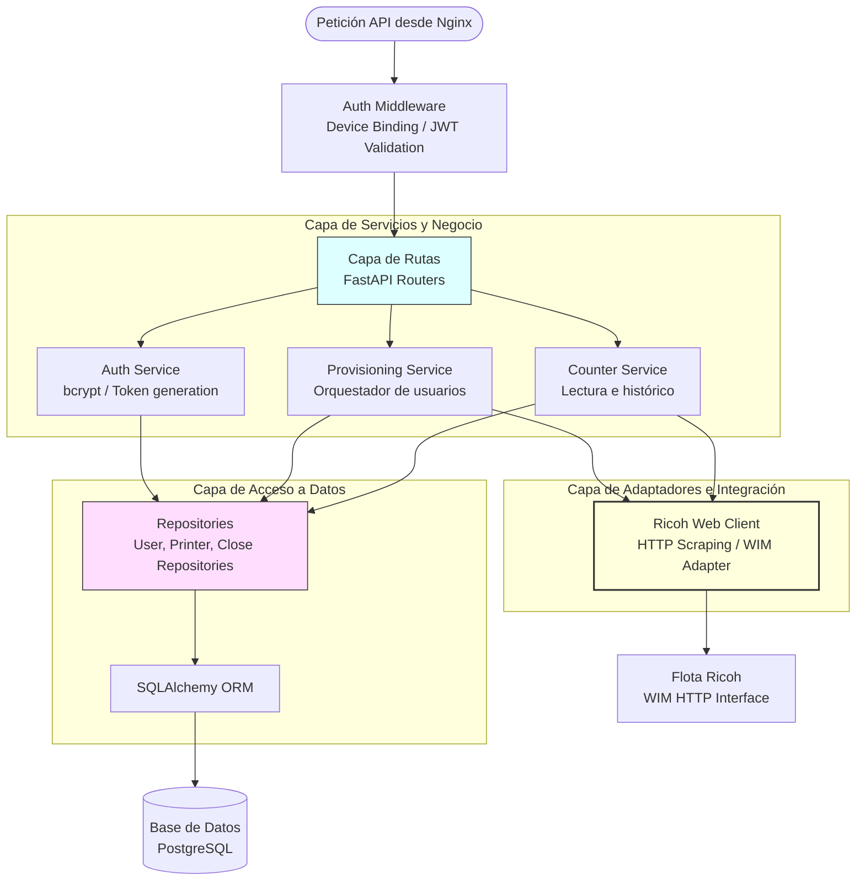

# ️ Diagrama de Arquitectura - Modelo C4

Este documento detalla la arquitectura de **Ricoh Equipment Manager** estructurada bajo la metodología del **Modelo C4** (Contexto, Contenedores y Componentes) para facilitar el entendimiento técnico a gran escala.

---

##  Nivel 1: Diagrama de Contexto del Sistema

Muestra cómo interactúa el sistema **Ricoh Equipment Manager** con los usuarios y la infraestructura física externa de la organización.

---

##  Nivel 2: Diagrama de Contenedores

Muestra las tecnologías y fronteras de los contenedores Docker orquestados que conforman el sistema.

---

## ️ Nivel 3: Diagrama de Componentes (Backend FastAPI)

Detalla cómo interactúan los diferentes módulos de software internos dentro del contenedor `ricoh-backend`.

