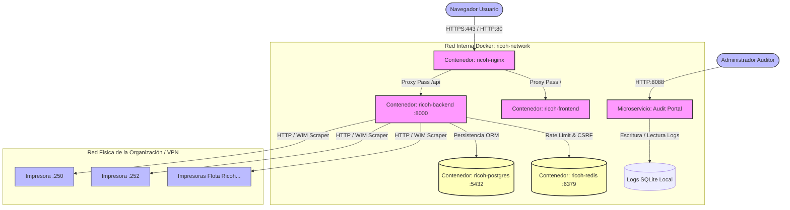

# ️ Infraestructura y Stack Tecnológico de Producción

Este documento detalla la topología de red, contenedores, persistencia de datos, mecánicas de seguridad y el stack de tecnologías utilizadas en el entorno de producción de **Ricoh Equipment Manager**.

---

##  1. Arquitectura de Red y Topología de Servicios

El sistema se despliega mediante **Docker Compose** en una máquina host virtualizada (Servidor de producción `192.168.91.131`). Los servicios están aislados en una red interna virtual privada y solo se exponen al exterior los puertos necesarios para la interacción web, la auditoría y la comunicación con la flota física de impresoras Ricoh.

---

## ️ 2. Stack Tecnológico de Producción

###  Backend & APIs (FastAPI)
*   **Intérprete**: Python 3.11-slim (optimizado para reducir tamaño de imagen).
*   **API Framework**: FastAPI v0.109.0.
*   **Servidor ASGI**: Uvicorn v0.27.0 (ejecutado con 4 workers en producción para concurrencia multihilo).
*   **Mecanismo de Scraping / Automatización Ricoh**:
    *   `Requests` + `BeautifulSoup4` para lectura rápida de páginas de estado y contadores de tóner / papel.
    *   `Selenium` + `Google Chrome Headless` (incluido en la imagen Docker de backend) para acciones complejas de aprovisionamiento en impresoras que requieren Javascript interactivo.
*   **Microservicio de Auditoría**: Audit Portal ligero corriendo en el puerto `8088` mediante Uvicorn independiente.

### ️ Frontend (React & SPA)
*   **Librería Principal**: React 19.2.0.
*   **Lenguaje**: TypeScript v5.9.3 (tipado estricto en toda la aplicación).
*   **Herramienta de Compilación (Bundler)**: Vite v7.3.1 (configurado con optimizaciones de minificación esbuild que eliminan automáticamente sentencias de depuración `console.log` y `debugger` en producción).
*   **Gestión de Estado**: Zustand v5.0.11 + Context API de React.
*   **Estilos y Layout**: Tailwind CSS (arquitectura responsiva para resoluciones móviles y pantallas de escritorio Full HD).

### ️ Motores de Persistencia y Caché
*   **Base de Datos Principal**: PostgreSQL 16 (Alpine). Contiene la configuración global del sistema:
    *   Empresas (Multi-tenancy).
    *   Usuarios administradores.
    *   Impresoras registradas de la red.
    *   Asignaciones activas / inactivas de usuarios en impresoras.
    *   Historial de cierres mensuales, semanales y consumos globales.
*   **Caché en Memoria**: Redis 7 (Alpine). Utilizado como almacén de datos temporal de alto rendimiento para:
    *   Fichas de rate limiting (prevención de ataques DDoS / Fuerza bruta).
    *   Tokens de validación CSRF (Cross-Site Request Forgery).
*   **Base de Datos de Auditoría**: SQLite local (`audit.db` montado en un volumen persistente). Registra de forma aislada los eventos de acceso de administradores, inicios de sesión y logs de seguridad para no sobrecargar el motor Postgres principal.

---

##  3. Configuración y Despliegue de Contenedores (Docker)

En producción, la infraestructura está compuesta por 5 contenedores Docker orquestados:

### 1. `ricoh-nginx` (Proxy Inverso y Servidor Web)
*   **Función**: Puerta de enlace única para tráfico web HTTP (80) y HTTPS (443).
*   **Responsabilidades**:
    *   Terminación de certificado SSL/TLS.
    *   Enrutamiento de `/` hacia el contenedor del Frontend.
    *   Enrutamiento de `/api` hacia el contenedor del Backend.
    *   Servicio de cabeceras de seguridad HTTP (HSTS, X-Frame-Options, Content-Security-Policy).
*   **Persistencia**: Volumen `ricoh-nginx-cache` para optimizar carga y `ricoh-nginx-logs` para bitácoras del servidor web.

### 2. `ricoh-frontend`
*   **Función**: Servidor ligero de archivos estáticos (Nginx Alpine) que distribuye el bundle compilado de React.
*   **Seguridad**: Aislado del exterior, Nginx reverse proxy es el único que puede comunicarse con él.

### 3. `ricoh-backend`
*   **Función**: Ejecuta la API de FastAPI (puerto 8000) y el portal de logs (puerto 8088).
*   **Mecanismo Concurrente**: Utiliza hilos aislados (`ThreadPoolExecutor`) y sesiones HTTP `requests.Session` thread-local por impresora para realizar sincronizaciones paralelas sin mezclar cookies de sesión WIM.
*   **Persistencia**: Volumen `ricoh-backend-logs` para registro persistente del portal de auditoría.

### 4. `ricoh-postgres`
*   **Función**: Servidor de base de datos PostgreSQL 16.
*   **Seguridad**: **No expone puertos externamente**. Solo es accesible por los contenedores internos dentro de la red virtual de Docker (`ricoh-network`).

### 5. `ricoh-redis`
*   **Función**: Almacén clave-valor para rate limiting.
*   **Seguridad**: Contenedor interno sin exposición de puertos externos, protegido adicionalmente por contraseña definida en variables de entorno `${REDIS_PASSWORD}`.

---

##  4. Capa de Seguridad y Cifrado de Infraestructura

La infraestructura del sistema implementa múltiples capas de protección activa en producción:

###  Autenticación y Sesiones
*   **Tokens JWT**: Firmados con clave secreta HS256 (`SECRET_KEY`).
*   **Device Binding (Seguridad de Sesión)**: El middleware de FastAPI asocia de manera obligatoria la IP de origen y la cabecera `User-Agent` del cliente al payload del token JWT. Si un token es interceptado pero se utiliza desde un navegador o dirección IP diferente, el middleware invalida la sesión automáticamente retornando `HTTP 401 Unauthorized`.
*   **Tokens de un Solo Uso (CSRF)**: Generados dinámicamente e interactuando contra Redis para prevenir falsificación de peticiones en transacciones críticas del backend.

###  Cifrado de Datos Sensibles
*   **Contraseñas de Administradores**: Hacheadas en base de datos mediante **bcrypt** con factor de costo ajustable.
*   **Credenciales de Red de Impresoras (SMB)**: Las contraseñas de red de los usuarios y las claves de administrador de las impresoras Ricoh se guardan en base de datos cifradas simétricamente mediante **AES-256-CBC** (usando la librería PyCA Cryptography) utilizando la clave maestra de entorno `ENCRYPTION_KEY`. Esto evita que una fuga de base de datos exponga las contraseñas de red corporativas.

### ️ Mitigación de DDoS y Abuso
*   **Rate Limiting Dinámico**: Limitación de solicitudes en endpoints críticos (como `/auth/login`) controlada mediante middleware integrado con Redis. Permite mitigar ataques de fuerza bruta bloqueando temporalmente IPs abusivas.

---

##  5. Volúmenes de Persistencia y Respaldos

Todos los datos de la aplicación están mapeados a volúmenes nombrados de Docker para garantizar la persistencia del estado en reinicios del host físico:

| Volumen Docker | Tipo de Datos | Ruta en Contenedor | Propósito |
| :--- | :--- | :--- | :--- |
| `ricoh-postgres-data` | PostgreSQL | `/var/lib/postgresql/data` | Persistencia de datos operacionales, tablas de usuarios y cierres. |
| `ricoh-redis-data` | Redis Dump | `/data` | Respaldos en disco de claves de rate limiting y sesiones temporales. |
| `ricoh-backend-logs` | SQLite + Archivos Log | `/app/logs` | Almacén de logs de auditoría del microservicio en puerto 8088. |
| `ricoh-nginx-logs` | Nginx Logs | `/var/log/nginx` | Registro de peticiones HTTP/HTTPS entrantes de servidores. |
