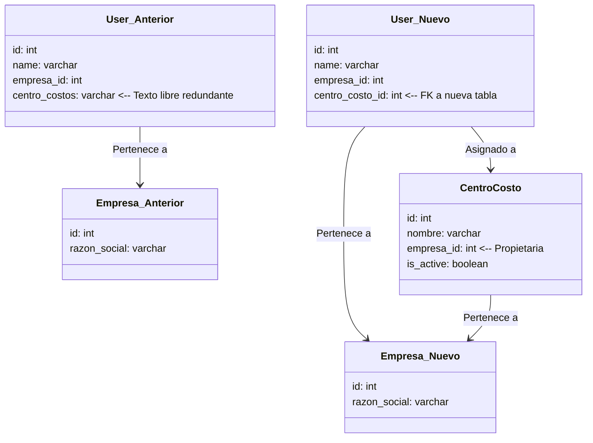

# Especificación de Diseño Técnico: Migración y Normalización de Centros de Costo por Empresa

> [!NOTE]
> **Estado del Documento:** Propuesta de Diseño / Planificación de Arquitectura  
> **Fecha:** 29 de mayo de 2026  
> **Modulo Afectado:** Users, Auth (Multi-Tenancy), Analytics, Cierres Mensuales (Counters)  
> **Diseño Propuesto:** Antigravity AI Architect

---

## 1. Justificación del Cambio (¿Por qué se hace?)

El modelo actual de la base de datos almacena el "Centro de Costos" de los usuarios de impresora como un simple campo de texto libre (`centro_costos VARCHAR(100)`) directamente en la tabla `users`. 

Esto introduce tres problemas fundamentales que limitan la escalabilidad, la robustez y la consistencia del sistema:

### A. Inconsistencia de Datos y Errores Tipográficos
Al no estar restringido por un catálogo normalizado, el ingreso de datos es libre. Esto resulta en inconsistencias críticas para la facturación y los reportes:
* Un usuario puede pertenecer a `"Contabilidad"`, otro a `"contabilidad"` (minúscula), otro a `"CONTABILIDAD"` (mayúsculas) y otro a `"Contabilidad "`.
* Para la base de datos y la API de reportes, estos representan cuatro centros de costo diferentes, desorganizando los gráficos y agrupaciones tridimensionales de Analytics y las comparaciones de cierres mensuales.

### B. Vinculación Estructural y Multi-Tenancy (Regla de Negocio)
Los centros de costo no existen en el vacío; pertenecen jerárquicamente a una organización o **Empresa**. 
* En un entorno multitenant, la **Empresa A** puede tener un centro de costos llamado `"Administración"` y la **Empresa B** también.
* Aunque el nombre coincide, representan entidades financieras completamente distintas con presupuestos, políticas de color e impresoras asignadas diferentes.
* El esquema actual no valida esta relación, haciendo posible que a un usuario de la Empresa A se le asigne por error de digitación un centro de costos conceptualmente correspondiente a la Empresa B.

### C. Escalabilidad del Negocio
En fases futuras, la plataforma requerirá de características avanzadas tales como:
* **Límites de consumo y cuotas** por centro de costos.
* **Catálogos de selección** en la UI para que los administradores seleccionen de un dropdown limpio en lugar de escribir texto a mano.
* **Asociación de impresoras** directamente a centros de costo.
Estas características son imposibles de implementar de forma limpia si el centro de costos no es una entidad de primer nivel en la base de datos.

---

## 2. Descripción de la Solución (¿Qué se va a hacer?)

Implementaremos una **migración y refactorización no disruptiva**. Esto significa que normalizaremos el backend y la base de datos al 100%, pero **mantendremos compatibilidad absoluta hacia atrás con el frontend (React) y las APIs existentes** para evitar la necesidad de reescribir la interfaz de usuario en esta sesión de trabajo.

### Diagrama de Relaciones (Antes y Después)



---

## 3. Plan Detallado de Implementación

### Capa 1: Base de Datos y Script de Migración
Se diseñará un script SQL (`014_normalizar_centros_costo.sql`) estructurado de la siguiente forma:

1. **Creación de la Tabla `centro_costos`:**
   * Contiene clave primaria `id`, `nombre` del centro, clave foránea `empresa_id` y control de estado `is_active`.
   * **Restricción de unicidad multitenant:** `UNIQUE (empresa_id, nombre)`. Esto impide duplicados del mismo centro en una sola empresa, pero permite nombres iguales entre distintas empresas.
2. **Creación de Clave Foránea en `users`:**
   * Agregar la columna `centro_id` o `centro_costo_id` en la tabla `users` que referencie a `centro_costos(id)`.
3. **Migración e Integridad de Datos Existentes (DML):**
   * El script buscará todos los valores de `centro_costos` de los usuarios actuales agrupándolos por su `empresa_id` correspondiente.
   * Insertará cada combinación única en la nueva tabla `centro_costos`.
   * Ejecutará un `UPDATE` masivo en `users` para asignar a cada usuario el ID del centro de costos recién creado que corresponda a su texto anterior y a su empresa.
4. **Limpieza estructural:**
   * Se elimina la columna de texto vieja `centro_costos` de `users` para garantizar que la base de datos quede perfectamente normalizada en la tercera forma normal (3NF).

### Capa 2: Modelos ORM (SQLAlchemy)
Para no romper el frontend ni las queries existentes que consumen el string, utilizaremos las capacidades de propiedades dinámicas de SQLAlchemy:

```python
# db/models.py
class CentroCosto(Base):
    __tablename__ = "centro_costos"
    id = Column(Integer, primary_key=True)
    nombre = Column(String(100), nullable=False)
    empresa_id = Column(Integer, ForeignKey("empresas.id"))
    
    empresa = relationship("Empresa", back_populates="centros_costo")
    users = relationship("User", back_populates="centro_costo_rel")

# En db/models.py dentro de User
class User(Base):
    ...
    centro_costo_id = Column(Integer, ForeignKey("centro_costos.id"))
    centro_costo_rel = relationship("CentroCosto", back_populates="users")
    
    @property
    def centro_costos(self) -> Optional[str]:
        """
        Retorna el string de texto para mantener compatibilidad hacia atrás.
        Evita tener que refactorizar los componentes visuales de React.
        """
        return self.centro_costo_rel.nombre if self.centro_costo_rel else None
```

### Capa 3: Repositorio e Ingesta de Datos (`UserRepository`)
Se modificará el backend para resolver o crear el centro de costos dinámicamente cuando el frontend o las tareas programadas realicen escrituras:

* Al llamar a `UserRepository.create(...)` o `update(...)`, si se provee el string `centro_costos`:
  1. Se verifica la empresa asignada al usuario.
  2. Se consulta si ya existe el `CentroCosto` con ese nombre para esa empresa.
  3. Si existe, se vincula al usuario mediante `centro_costo_id`.
  4. Si no existe, se crea dinámicamente el registro en `centro_costos` para esa empresa y luego se vincula al usuario.
* Esto asegura que las peticiones existentes del frontend y la sincronización de Ricoh sigan operando sin colapsar y normalicen los datos de forma automática.

### Capa 4: Endpoints de Consulta y Reportes
Adaptaremos las queries analíticas de SQL para usar joins con la tabla `centro_costos` en lugar de acceder a la columna directa:
* **Analytics (`api/analytics.py`):** Modificar la query de consumo tridimensional de usuarios para hacer un join con `centro_costos` y retornar `cc.nombre as centro_costos`.
* **Cierres Mensuales / Buscador (`api/counters.py`):** Modificar la búsqueda y filtrado de usuarios por centro de costos para usar la relación de SQLAlchemy `User.centro_costo_rel.has(...)` o mediante join explícito.

---

## 4. Análisis de Impacto y Mitigación de Riesgos

| Riesgo Identificado | Severidad | Plan de Mitigación |
|---|---|---|
| **Pérdida de datos históricos en producción:** Que un usuario quede sin centro de costo tras la migración. | 🔴 Alta | El script de migración contiene un script DML explícito que mapea registros basados en la relación actual. Se probará localmente en el contenedor antes de aplicarse en producción. |
| **Inconsistencias por usuarios sin empresa_id:** Si un usuario tiene centro de costos pero no empresa asociada. | 🟡 Media | La regla de negocio indica que cada usuario activo debe tener contrato y empresa asociada. Para mitigar, el script de migración creará el centro de costos en una empresa por defecto o bien ignorará los valores vacíos, manteniendo la robustez del sistema. |
| **Rotura de endpoints de Analytics:** Que el frontend muestre errores al renderizar gráficos por no encontrar la propiedad `centro_costos`. | 🔴 Alta | Mitigado completamente gracias a la propiedad `@property` en SQLAlchemy y la resolución de nombres en las consultas del backend. El frontend seguirá recibiendo un JSON idéntico al de antes. |

---

*Documento de especificación de diseño técnico y continuidad de desarrollo.*  
*Fecha de vigencia: 29 de mayo de 2026.*
