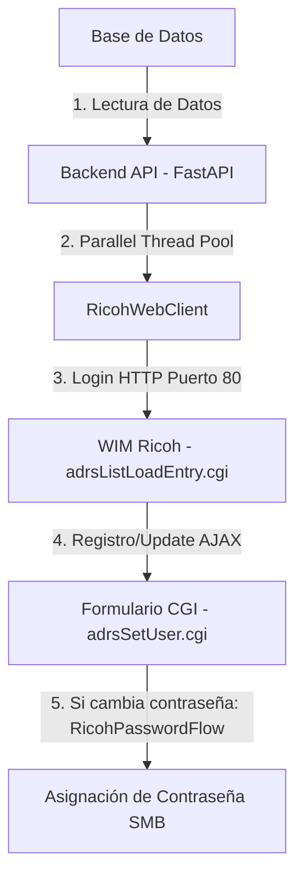

# Análisis y Plan de Optimización de la Gestión de Usuarios — Sistema vs. Impresoras

Este documento analiza el flujo actual de aprovisionamiento y gestión de usuarios desde nuestra base de datos hacia las impresoras físicas Ricoh, evalúa sus limitaciones y propone estrategias de optimización cruzando la información con los puertos y servicios abiertos identificados.

---

## 1. Mapeo del Flujo de Gestión de Usuarios Actual

El ciclo de vida del usuario (creación, edición de permisos y desactivación/eliminación) sigue esta ruta técnica:

### Detalle de Datos Transferidos:
1.  **Datos Básicos:** Nombre del usuario y código numérico de usuario (ID de acceso al panel físico).
2.  **Permisos de Función (Flags Booleanos):** Copiadora, Escáner, Impresora, Servidor de Documentos, Navegador, Fax.
3.  **Destino de Escaneo (Carpeta SMB):**
    *   Ruta UNC del servidor: `\\192.168.91.131\escaneos\nombre_usuario`
    *   Credenciales de Dominio individuales del usuario (nombre de usuario de red y contraseña de dominio cifrada en base de datos).

---

## 2. Limitaciones e Ineficiencias del Flujo Actual

Tras la auditoría de puertos y código, se identifican tres puntos críticos de ineficiencia y riesgo:

### A. Complejidad y Riesgo por Credenciales de Red Individuales
*   **Problema:** Para que el escaneo por SMB funcione, el sistema debe almacenar en la base de datos la contraseña de red de cada usuario de forma encriptada. Si el usuario cambia su contraseña de red corporativa, el sistema debe enterarse, actualizar la base de datos y desencadenar un proceso de sincronización física a cada impresora en paralelo (llamando al complejo `RicohPasswordFlow`).
*   **Vulnerabilidad:** Si una sincronización falla o un equipo está ocupado, las credenciales quedan desfasadas, bloqueando la función de escaneo para ese usuario en esa máquina específica.

### B. Sobrecarga de Peticiones HTTP en Puerto 80
*   **Problema:** Cada modificación o creación requiere múltiples peticiones HTTP por cada equipo (Login -> Buscar slot libre/existente -> Guardar perfil -> Guardar contraseña). Aunque se paralelice con hilos y se use caché de lotes, sigue siendo un proceso pesado expuesto a tiempos de espera (*timeouts*) de red.
*   **Vulnerabilidad a Cambios de Firmware:** Al depender del raspado HTML (scraping) de formularios CGI, cualquier actualización de firmware en las impresoras que altere la estructura de `adrsSetUser.cgi` romperá la automatización.

### C. Dependencia del Protocolo SMBv1
*   **Problema:** Modelos antiguos de impresoras Ricoh (como algunas MP C4503 no actualizadas) solo soportan la versión 1 del protocolo SMB (SMBv1). Este protocolo está descontinuado por motivos de seguridad en servidores Windows/Linux modernos. Mantener SMBv1 activo en el servidor central expone la red local a ataques informáticos.

---

## 3. Propuestas de Optimización Cruzada con Puertos Abiertos

Aprovechando los puertos **21 (FTP)**, **22 (SFTP de salida en la impresora)** y **9100/631 (Impresión)**, proponemos el siguiente esquema de optimización:

### 🚀 Optimización 1: Canal Unificado de Transmisión vía SFTP (Escaneo Seguro)
*   **Estrategia:** Reemplazar el escaneo individual por SMB por el protocolo **SFTP** (aprovechando que la impresora tiene `sftp: Activo` y el servidor `192.168.91.131` ejecuta SSH/SFTP).
*   **Flujo Rediseñado:**
    1.  Se define una **única cuenta de servicio SFTP** en el servidor central (ej: `printer_scan_service`).
    2.  Al aprovisionar un usuario en la impresora, su ruta de carpeta se configura como `sftp://192.168.91.131/home/escaneos/codigo_usuario`.
    3.  La contraseña configurada es **siempre la misma credencial del servicio de impresión**, administrada internamente por el sistema.
*   **Beneficios Directos:**
    *   **Cero Almacenamiento de Contraseñas de Usuario:** Nuestro sistema ya no necesita recopilar ni guardar las contraseñas de red personales de los empleados.
    *   **Simplificación Radical del Código:** Se elimina por completo el complejo y propenso a fallas `RicohPasswordFlow`. Configurar un usuario en la impresora pasa a ser una sola petición AJAX estándar, sin subflujos de contraseña.
    *   **Seguridad:** Toda la información escaneada viaja encriptada (SFTP) y no se expone ninguna contraseña personal.

### 🚀 Optimización 2: Sincronización Masiva vía FTP (Puerto 21)
*   **Estrategia:** En lugar de realizar peticiones HTTP iterativas a `adrsSetUser.cgi` para aprovisionar decenas de usuarios (lo cual satura el puerto 80), usar la funcionalidad de exportación/importación de la libreta de direcciones a través del puerto FTP de la impresora.
*   **Flujo Rediseñado:**
    1.  El backend genera el archivo de contactos de la libreta de direcciones (CSV o formato UDF nativo de Ricoh) con el delta de usuarios nuevos.
    2.  Sube el archivo a la impresora vía FTP o mediante una petición POST de restauración del sistema.
*   **Beneficios Directos:**
    *   Aprovisionamiento masivo instantáneo (segundos en lugar de minutos).
    *   Menor tasa de fallos por conexiones intermitentes.

### 🚀 Optimización 3: Asociación de Impresión y Control mediante Spooler IPP (Puerto 631)
*   **Estrategia:** Actualmente los usuarios imprimen enviando los trabajos directo al puerto 9100 de la impresora, y el backend lee contadores posteriormente de forma desconectada.
*   **Flujo Rediseñado:**
    1.  El servidor `192.168.91.131` intercepta los trabajos de impresión en el puerto 631 (actuando como cola centralizada).
    2.  Valida si el usuario tiene permisos en la base de datos antes de reenviar el trabajo físico a la impresora en el puerto 9100.
*   **Beneficios Directos:**
    *   Control proactivo de cuotas de impresión (impedir imprimir antes de que se gaste el papel).
    *   Asociación exacta de cada trabajo impreso con la cuenta del usuario en nuestra base de datos.
