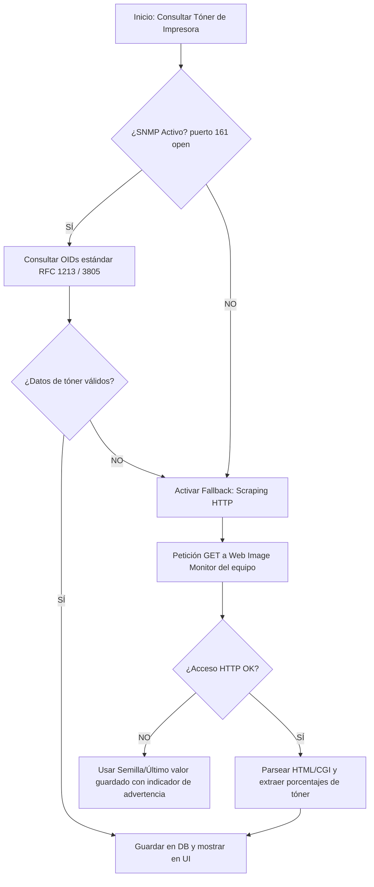

# Plan de Expansión del Dashboard y Extracción de Datos de Tóner (SNMP / HTTP)

Este documento contiene la planeación técnica y de diseño para complementar y expandir el dashboard principal (`OverviewDashboard.tsx`), integrando nuevos widgets premium, corrigiendo la inicialización de endpoints en el backend y añadiendo validaciones de hardware avanzadas para la lectura de niveles de tóner (SNMP vs. Scraping HTTP Web Image Monitor).

---

## 📋 1. Objetivos del Plan
1. **Premium Dashboard Extension:** Dotar a la pantalla de "Resumen" con analíticas históricas de consumo (6 meses) e indicadores de sostenibilidad ecológica y control operacional en tiempo real.
2. **Corrección de Estabilidad:** Solucionar un fallo `NameError: Printer` en el endpoint `/toner-alertas` agregando la importación correcta en el backend.
3. **Validación y Robustez de Suministros (SNMP/HTTP):** Validar si la impresora tiene el protocolo SNMP activo y, en caso contrario, proveer un mecanismo de extracción de respaldo mediante Web Scraping directo de la interfaz HTTP (Web Image Monitor).

---

## 🛠️ 2. Plan de Trabajo Técnico

### Paso 1: Importación de Modelos en el Backend
*   **Archivo:** [backend/api/dashboard.py](file:///c:/Users/juan.lizarazo/Desktop/ricoh/backend/api/dashboard.py)
*   **Acción:** Agregar al inicio del archivo la importación del modelo ORM de impresoras:
    ```python
    from db.models import Printer
    ```

### Paso 2: Validación de SNMP y Fallback HTTP para Tóner
Actualmente, los niveles de tóner se extraen en el descubrimiento o consulta activa del hardware a través de SNMP. Sin embargo, en redes corporativas con SNMP deshabilitado o puertos `161` bloqueados, requerimos un canal alterno robusto.

#### A. Flujo de Extracción de Tóner


#### B. Especificación OID para SNMP (Tóner)
Las impresoras Ricoh implementan la MIB estándar de impresora (RFC 3805). Los OIDs para consultar la capacidad y nivel remanente de los tóneres son:
*   **Tóner Negro (K):** `1.3.6.1.2.1.43.11.1.1.9.1.1` (Nivel actual) y `1.3.6.1.2.1.43.11.1.1.8.1.1` (Capacidad máxima).
*   **Tóner Cian (C):** `1.3.6.1.2.1.43.11.1.1.9.1.2` y `1.3.6.1.2.1.43.11.1.1.8.1.2`
*   **Tóner Magenta (M):** `1.3.6.1.2.1.43.11.1.1.9.1.3` y `1.3.6.1.2.1.43.11.1.1.8.1.3`
*   **Tóner Amarillo (Y):** `1.3.6.1.2.1.43.11.1.1.9.1.4` y `1.3.6.1.2.1.43.11.1.1.8.1.4`

**Fórmula de porcentaje:** `(Nivel Actual / Capacidad Máxima) * 100`.

#### C. Estrategia de Fallback: Web Scraping de Web Image Monitor (HTTP)
Si el puerto `161` está cerrado o SNMP no responde, la API de Ricoh consultará los niveles mediante raspado web en las siguientes rutas conocidas de Ricoh:
1.  **Ruta XML de Estado:** `http://<ip_impresora>/web/guest/es/websys/status/getDeviceStatus.cgi` o `/status.xml`
    *   *Mecanismo:* Retorna un documento XML o JSON estructurado. Buscaremos las etiquetas `<toner_c>`, `<toner_m>`, `<toner_y>`, `<toner_k>` o equivalentes.
2.  **Ruta HTML de Configuración:** `http://<ip_impresora>/web/guest/es/websys/status/configuration.cgi`
    *   *Mecanismo:* Carga la página de configuración del sistema. Utilizaremos `BeautifulSoup` y expresiones regulares en Python para buscar imágenes representativas de nivel (por ejemplo, `c_toner.gif`, `m_toner.gif`, etc.) o bloques JavaScript que declaren variables de consumibles:
        ```javascript
        var tonerBlack = 85;
        var tonerCyan = 60;
        ```

---

## 🎨 3. Nuevos Componentes Visuales del Dashboard

Complementamos la interfaz del frontend (`OverviewDashboard.tsx`) en el grid inferior de la página:

### A. Gráfico de Evolución Histórica de Páginas
*   **Visual:** Un gráfico de área suave (`AreaChart`) de `recharts` con un degradado en tonos cyan/indigo translúcido, ejes flotantes y un tooltip personalizado que muestra las páginas por mes.
*   **Datos:** Se obtienen llamando al hook `useEvolutionData` que consume `/api/v1/analytics/evolution?meses=6`.

### B. Módulo de Sostenibilidad e Impacto Ambiental (Ricoh Green)
*   **Estética:** Diseño tipo tarjeta de vidrio (glassmorphism) con un sutil gradiente verde esmeralda y desenfoque de fondo.
*   **Métricas Dinámicas Calculadas:**
    *   **Árboles Preservados:** `Páginas Totales * 0.00012` árboles.
    *   **CO2 Evitado:** `Páginas Totales * 0.0036` kg de CO2 (reducción en huella de carbono).
    *   **Agua Conservada:** `Páginas Totales * 0.4` Litros de agua salvada en el proceso productivo de celulosa.
*   **Iconografía:** Hojas, gotas de agua y nubes que vibran sutilmente al hacer hover (`hover:scale-105 transition-transform`).

### C. Fleet Operations Desk (Centro de Diagnósticos de Red)
*   Un widget interactivo arriba del grid de tóneres que analiza la flota de impresoras en el cliente:
    *   **Diagnóstico de Conectividad:** Lista las impresoras offline con una advertencia interactiva (ej. *"⚠️ Impresora de Bodega (192.168.1.50) no responde a ping de red."*).
    *   **Diagnóstico de Suministros:** Lista consumibles críticos por debajo del 15% con enlace de acción rápida para reponer (ej. *"🚨 Tóner Amarillo bajo (8%) en Recepción. Solicitar consumible."*).
    *   **Diagnóstico de SNMP:** Indica si el equipo tiene SNMP activo o está leyendo mediante fallback de Web Image Monitor HTTP (ej. *"📡 Monitoreado vía HTTP (SNMP Inactivo)"*).
    *   **Acciones Rápidas:** Enlaces con botones de `lucide-react` para ir directo a la asignación de usuarios o contadores.

---

## 📊 4. Plan de Verificación de Calidad (QA)

### Pruebas de Compilación
*   Asegurar que el compilador de TypeScript finalice con cero errores o advertencias antes de concluir el desarrollo:
    ```powershell
    npm run build
    ```

### Pruebas en Vivo
1.  **Verificación de Importación:** Navegar al Dashboard y comprobar que la carga de `/api/v1/dashboard/toner-alertas` no genere ningún error 500 en la consola web ni en la terminal del backend.
2.  **Verificación de Fallback de Lectura:** Utilizar el simulador de hardware o modificar momentáneamente la respuesta de SNMP para simular un fallo en el puerto 161 y corroborar que el parser HTTP de Web Image Monitor asigne correctamente los contadores y porcentajes.
3.  **Inspección del Dashboard:** Certificar que los nuevos paneles ecológicos y de evolución histórica respeten la estética responsive y de alta fidelidad estética (Inter font, bordes redondeados `rounded-xl` / `rounded-2xl` y micro-animaciones en CSS).
